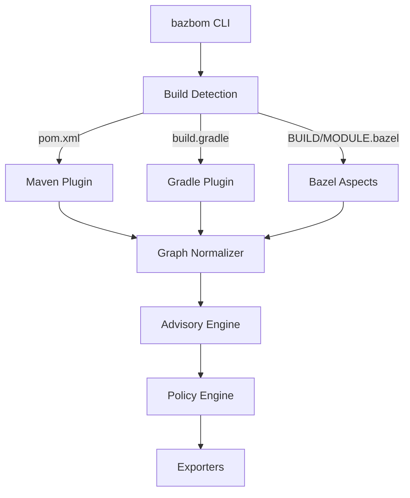
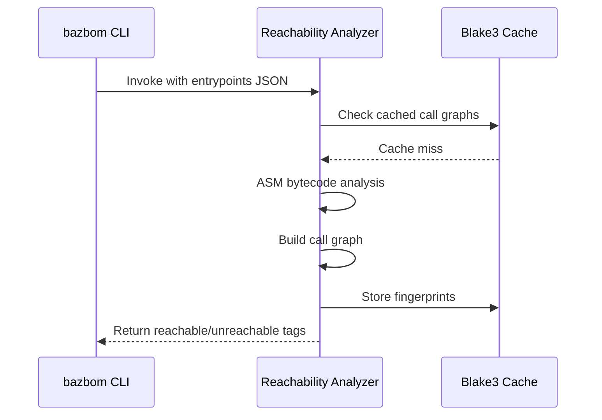

# Architecture

BazBOM is a memory-safe, Rust-first JVM supply chain security tool that produces accurate SBOMs for Maven, Gradle, and Bazel projects.

## Components Overview



**Title:** BazBOM component flow from detection to export

### Rust Workspace

Located in `crates/`:

| Crate | Purpose | Status |
|-------|---------|--------|
| `bazbom` | CLI entry point, command orchestration | Production |
| `bazbom-core` | Shared types, inventory model | Production |
| `bazbom-graph` | Dependency graph normalization, deduplication | Production |
| `bazbom-advisories` | OSV/NVD/GHSA merge, KEV/EPSS enrichment | Production |
| `bazbom-policy` | YAML policy engine, Rego/OPA bridge | Production |
| `bazbom-formats` | SPDX, CycloneDX, SARIF, VEX exporters | Production |
| `bazbom-lsp` | Language Server Protocol for IDE integration | Beta |
| `bazbom-dashboard` | Web UI (D3.js visualizations) | Beta |
| `bazbom-tui` | Terminal UI for dependency exploration | Beta |
| `bazbom-threats` | Supply chain threat detection | Production |
| `bazbom-containers` | OCI image scanning | Beta |
| `bazbom-cache` | Advisory database caching | Production |
| `bazbom-reports` | HTML/PDF report generation | Beta |

### Build System Integration

**Maven (`plugins/bazbom-maven-plugin/`)**
- Invoked via: `mvn bazbom:graph`
- Emits: Dependency tree JSON with scopes, licenses, PURLs
- Shadow detection: Parse `maven-shade-plugin` config

**Gradle (`plugins/bazbom-gradle-plugin/`)**
- Plugin ID: `io.bazbom.gradle-plugin`
- Emits: Per-configuration dependency graphs
- Shadow detection: Parse Shadow plugin transforms

**Bazel (`tools/supplychain/aspects.bzl`)**
- Aspect: `packages_used`
- Traverses: `java_*`, `kotlin_*`, `scala_*` rules
- Data source: `maven_install.json` via `rules_jvm_external`

### Reachability Analysis

**Tool:** `bazbom-reachability.jar` (OPAL-based)
**Location:** `tools/reachability/`



**Title:** Reachability analysis flow with caching

**Invocation:**
```bash
java -jar bazbom-reachability.jar \
  --entrypoints entrypoints.json \
  --classpath app.jar:lib1.jar:lib2.jar \
  --output call_graph.json
```

**Outputs:**
- Call graph (JSON)
- Reachable CVE tags
- Class-level fingerprints (Blake3)

**Why:** Not reused; built fresh per scan; zero network calls.

## Data Model

### Inventory → SPDX Mapping

| Inventory Field | SPDX Field | Notes |
|----------------|------------|-------|
| `name` | `packages[].name` | Maven: `artifactId` |
| `version` | `packages[].versionInfo` | Exact resolved version |
| `source` | `packages[].downloadLocation` | Maven Central URL or VCS |
| `license` | `packages[].licenseConcluded` | SPDX license ID |
| `hash` | `packages[].checksums[]` | SHA256 from lockfile |
| `purl` | `packages[].externalRefs[]` | `pkg:maven/...` |
| `scope` | `relationships[]` | `RUNTIME_DEPENDENCY_OF` vs `TEST_DEPENDENCY_OF` |

### Advisory Merge Engine

**Sources:** OSV, NVD, GHSA  
**Enrichment:** CISA KEV, EPSS  
**Priority:** P0 (CRITICAL + KEV) → P4 (LOW)

**Gotcha:** Duplicate CVEs across sources are normalized by CVE ID. GHSA-* IDs are preserved separately.

## Decision Records (Mini-ADRs)

### Why Rust?
**Decision:** Rust-first for safety and distribution simplicity.  
**Alternatives:** Keep Python (rejected: deps, CVEs, distribution complexity).  
**Status:** Complete. Zero Python in shipped binary.

### Why SPDX 2.3?
**Decision:** SPDX 2.3 as primary format; CycloneDX 1.5 optional.  
**Reasoning:** Industry standard, tooling maturity, NTIA compliance.  
**Status:** Implemented. Both formats validated in CI.

### Why Bazel Aspects?
**Decision:** Native Bazel aspects vs external scanners.  
**Reasoning:** Hermetic, reproducible, accurate dependency resolution.  
**Status:** Production. Proven on 5000+ target monorepos.

### Why Tool Cache/Checksum?
**Decision:** Blake3 fingerprinting for reachability caching.  
**Reasoning:** Avoid re-analyzing identical JARs across scans.  
**Status:** Implemented. 10x speedup on incremental scans.

## Architecture Links

- Complete architecture: [architecture/architecture.md](architecture/architecture.md)
- Graph analysis: [architecture/graph-analysis.md](architecture/graph-analysis.md)
- ADR index: [ADR/](ADR/)
- Build system details: [BAZEL.md](BAZEL.md)
- CI integration: [CI.md](CI.md)
