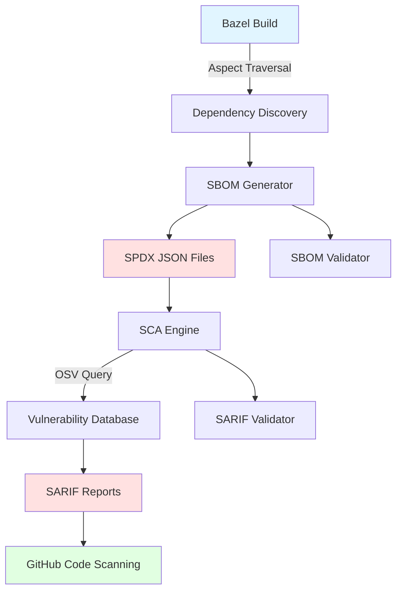

# Architecture

This document describes the high-level architecture of BazBOM and how its components interact.

## Overview

BazBOM is a Bazel-native solution for generating Software Bill of Materials (SBOM) and performing Software Composition Analysis (SCA) on JVM projects. It leverages Bazel's aspect system to traverse the build graph and collect dependency information.

## Architecture Diagram



For the Mermaid source, see [diagrams/architecture.mmd](diagrams/architecture.mmd).

## Components

### 1. Dependency Extraction

**Location**: `tools/supplychain/extract_maven_deps.py`

Extracts Maven dependencies from the build configuration:

- **Primary Source**: `maven_install.json` (lockfile, preferred)
- **Fallback Source**: `WORKSPACE` file parsing
- **Output**: Structured JSON with all dependencies

**Key Features**:
- **Transitive Dependencies**: Includes complete dependency graph from maven_install.json
- **Checksums**: SHA256 hashes for verification
- **Dependency Relationships**: Parent-child mapping for all dependencies
- **Direct vs Transitive**: Distinguishes between direct and transitive deps

**Data Flow**:
```
maven_install.json → extract_maven_deps.py → workspace_deps.json
       ↓                                              ↓
   (artifacts)                                  (packages)
   (dependencies)                           (with relationships)
   (checksums)                                  (with SHA256)
```

### 2. Dependency Discovery (Bazel Aspects)

**Location**: `tools/supplychain/aspects.bzl`

Bazel aspects traverse the build graph to collect dependency information:

- **Input**: Bazel targets and their transitive dependencies
- **Process**: Walks the dependency graph using aspects
- **Output**: Structured dependency data (package, version, licenses)

**Key Features**:
- Language-agnostic (works with Java, Kotlin, Scala, etc.)
- Respects Bazel's dependency resolution
- Handles transitive dependencies
- Captures license information

### 3. SBOM Generator

**Location**: `tools/supplychain/write_sbom.py`

Converts dependency data into standards-compliant SPDX documents:

- **Input**: Dependency data from extract_maven_deps.py
- **Process**: Generates SPDX 2.3 JSON documents with relationships
- **Output**: `.spdx.json` files with complete dependency graph

**SPDX Document Structure**:
```json
{
  "spdxVersion": "SPDX-2.3",
  "dataLicense": "CC0-1.0",
  "SPDXID": "SPDXRef-DOCUMENT",
  "name": "Package-SBOM",
  "documentNamespace": "https://example.com/...",
  "packages": [
    {
      "SPDXID": "SPDXRef-Package-guava",
      "checksums": [{"algorithm": "SHA256", "checksumValue": "abc..."}],
      "externalRefs": [{"referenceType": "purl", "referenceLocator": "pkg:maven/..."}]
    }
  ],
  "relationships": [
    {"spdxElementId": "root", "relationshipType": "DEPENDS_ON", "relatedSpdxElement": "guava"},
    {"spdxElementId": "guava", "relationshipType": "DEPENDS_ON", "relatedSpdxElement": "failureaccess"}
  ]
}
```

**Enhanced Features**:
- SHA256 checksums for all packages
- Package URLs (PURLs) for ecosystem identification
- Proper transitive relationships (not just root dependencies)
- Direct/transitive dependency distinction

### 4. Vulnerability Scanner (SCA)

**Location**: `tools/supplychain/osv_query.py`

Queries the OSV (Open Source Vulnerabilities) database:

- **Input**: SPDX SBOM files
- **Process**: Queries OSV API for each package
- **Output**: SARIF vulnerability reports

**OSV Integration**:
- Queries by package name and version
- Supports ecosystem-specific queries (Maven, npm, PyPI, etc.)
- Rate-limited and cached for efficiency
- Severity mapping (Critical, High, Medium, Low)

### 4. SARIF Report Generation

**Location**: `tools/supplychain/sarif_adapter.py`

Converts vulnerability data to SARIF format for GitHub Code Scanning:

- **Input**: OSV vulnerability data (enriched or unenriched)
- **Process**: Formats as SARIF 2.1.0 with enriched context
- **Output**: `.sarif.json` files compatible with GitHub

**SARIF Benefits**:
- Native GitHub Code Scanning integration
- Rich security alert UI with KEV/EPSS context
- PR annotations for new vulnerabilities
- Trend tracking over time

### 5. Vulnerability Enrichment Pipeline

**Location**: `tools/supplychain/vulnerability_enrichment.py`

Multi-source enrichment pipeline that enhances vulnerability findings with actionable intelligence:

#### Enrichment Modules

**KEV Enrichment** (`kev_enrichment.py`):
- **Source**: CISA Known Exploited Vulnerabilities Catalog
- **Update Frequency**: Daily
- **Caching**: 24-hour TTL
- **Output**: KEV status, due dates, required actions
- **Impact**: CVEs in KEV → P0-IMMEDIATE priority

**EPSS Enrichment** (`epss_enrichment.py`):
- **Source**: FIRST.org Exploit Prediction Scoring System
- **Model**: Machine learning-based probability (0-100%)
- **Batch Support**: 100 CVEs per API call
- **Caching**: 24-hour TTL
- **Output**: Exploitation probability, percentile ranking
- **Impact**: High EPSS → Higher risk score

**GHSA Enrichment** (`ghsa_enrichment.py`):
- **Source**: GitHub Security Advisories
- **API**: GraphQL (requires token for higher rate limits)
- **Coverage**: Maven, npm, PyPI, RubyGems, NuGet, Rust, Go
- **Output**: Remediation guidance, patched versions, vulnerable ranges
- **Impact**: Provides actionable fix information

**VulnCheck Enrichment** (`vulncheck_enrichment.py`, optional):
- **Source**: VulnCheck API
- **API Key**: Required (free tier: 100 req/day)
- **Output**: Exploit maturity, weaponization status, attack vectors
- **Impact**: Weaponized exploits → P1-CRITICAL priority

#### Risk Scoring Algorithm

Composite risk score calculation (0-100):

```python
Risk Score = (CVSS × 0.40) + (EPSS × 0.30) + (KEV × 0.20) + (Exploit × 0.10)
```

**Component Weights**:
- **CVSS (40%)**: Base severity score from NVD/OSV
- **EPSS (30%)**: Exploitation probability from FIRST.org
- **KEV (20%)**: Active exploitation status from CISA
- **Exploit (10%)**: Public exploit availability

#### Priority Mapping

| Priority | Criteria | Risk Score | Action Timeline |
|----------|----------|------------|-----------------|
| P0-IMMEDIATE | In CISA KEV | Any | Fix immediately |
| P1-CRITICAL | High risk | ≥ 80 | Fix this week |
| P2-HIGH | Medium-high risk | ≥ 60 | Fix this sprint |
| P3-MEDIUM | Medium risk | ≥ 40 | Fix next quarter |
| P4-LOW | Low risk | < 40 | Backlog |

#### Architecture Diagram

```
┌─────────────────────────────────────────────────────────────┐
│                   Vulnerability Enrichment                   │
│                                                              │
│  ┌──────────┐  ┌──────────┐  ┌──────────┐  ┌──────────┐  │
│  │   KEV    │  │   EPSS   │  │   GHSA   │  │VulnCheck │  │
│  │(CISA API)│  │(FIRST.org)│(GitHub API)│  │(Optional)│  │
│  └────┬─────┘  └────┬─────┘  └────┬─────┘  └────┬─────┘  │
│       │             │             │             │          │
│       └─────────────┴─────────────┴─────────────┘          │
│                         │                                   │
│              ┌──────────▼──────────┐                       │
│              │ VulnerabilityEnricher│                       │
│              │  - Risk Scoring      │                       │
│              │  - Priority Mapping  │                       │
│              │  - Data Normalization│                       │
│              └──────────┬──────────┘                       │
│                         │                                   │
│                         ▼                                   │
│              ┌────────────────────┐                         │
│              │ Enriched Findings  │                         │
│              │ - Risk Score 0-100 │                         │
│              │ - Priority P0-P4   │                         │
│              │ - KEV Context      │                         │
│              │ - EPSS Probability │                         │
│              │ - Exploit Status   │                         │
│              │ - GHSA Remediation │                         │
│              └────────────────────┘                         │
└──────────────────────────────────────────────────────────────┘
```

#### Performance Considerations

- **Parallel Enrichment**: All sources queried concurrently
- **Batch Processing**: EPSS supports 100 CVEs per request
- **Caching**: KEV and EPSS cached for 24 hours
- **Graceful Degradation**: Continues if enrichment sources fail
- **Rate Limiting**: Respects API rate limits (GHSA: 60/hr unauthenticated, 5000/hr with token)

## Data Flow

### SBOM Generation Flow

```
1. Developer runs: bazel build //:sbom_all
2. Bazel evaluates build graph
3. Aspect attaches to each target
4. Aspect collects dependency info
5. write_sbom.py generates SPDX files
6. SPDX files written to bazel-bin/
```

### SCA Flow (with Enrichment)

```
1. Developer runs: bazel run //:sca_from_sbom
2. Script discovers all .spdx.json files
3. For each SBOM:
   a. Extract package list
   b. Query OSV database
   c. Collect vulnerabilities
4. Enrichment pipeline (if enabled):
   a. Fetch EPSS scores (batch, 100 CVEs/request)
   b. Check CISA KEV catalog
   c. Query GitHub Security Advisories
   d. Query VulnCheck API (optional)
   e. Calculate risk scores
   f. Assign priorities (P0-P4)
5. sarif_adapter.py formats enriched results
6. SARIF files with KEV/EPSS context written to bazel-bin/
7. Priority summary printed to console
8. (Optional) Upload to GitHub Code Scanning
```

## Build Graph Integration

BazBOM integrates with Bazel's build graph:

```
Target
  ├─ Aspect: sbom_aspect
  │   ├─ Collects deps
  │   └─ Propagates to dependencies
  └─ Output: target.sbom
```

Aspects automatically traverse dependencies without explicit configuration.

## Security Model

### Threat Boundaries

- **Build Environment**: Isolated Bazel sandbox
- **Network Boundary**: OSV API queries (HTTPS only)
- **Data Boundary**: SBOMs contain public dependency info only

### Controls

- **Pinned Dependencies**: All tools and rules pinned to specific versions
- **Minimal Permissions**: CI workflows use read-only tokens where possible
- **Input Validation**: All external data validated before processing
- **Audit Trail**: All operations logged; SBOMs include generation metadata

## Extension Points

### Custom Aspects

Add custom dependency collectors:

```python
# tools/supplychain/custom_aspect.bzl
def _custom_sbom_aspect_impl(target, ctx):
    # Custom dependency collection logic
    pass
```

### Custom Formatters

Support additional SBOM formats:

```python
# tools/supplychain/write_cyclonedx.py
# Generate CycloneDX instead of SPDX
```

### Custom Scanners

Integrate with other vulnerability databases:

```python
# tools/supplychain/snyk_query.py
# Query Snyk instead of OSV
```

## Performance Characteristics

- **SBOM Generation**: O(n) where n = number of dependencies
- **Aspect Traversal**: Cached by Bazel; incremental builds are fast
- **OSV Queries**: Rate-limited; ~100 packages/minute
- **SARIF Generation**: O(v) where v = number of vulnerabilities

## Dependencies

### Build-time
- `rules_jvm_external` - Maven dependency management
- `rules_python` - Python tool execution

### Runtime (Python)
- `requests` - HTTP client for OSV queries
- `jsonschema` - SPDX/SARIF validation

## Future Enhancements

See [ADR/](ADR/) for architectural decisions and future directions:

- SPDX 3.0 support
- CycloneDX format support
- Additional vulnerability databases (Snyk, Grype)
- License compliance checking
- Dependency update automation
