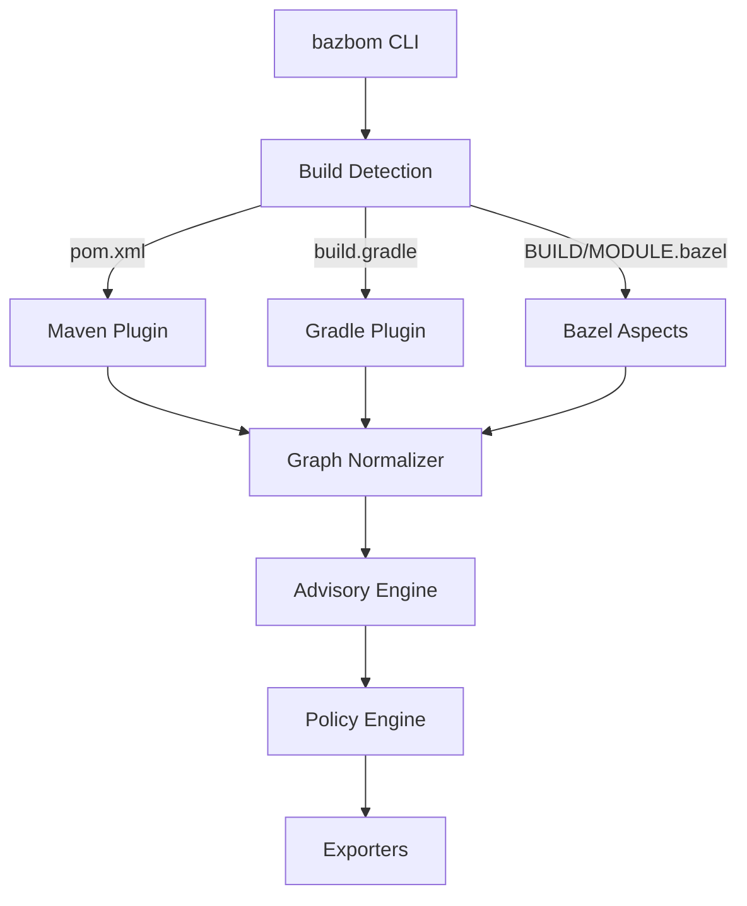
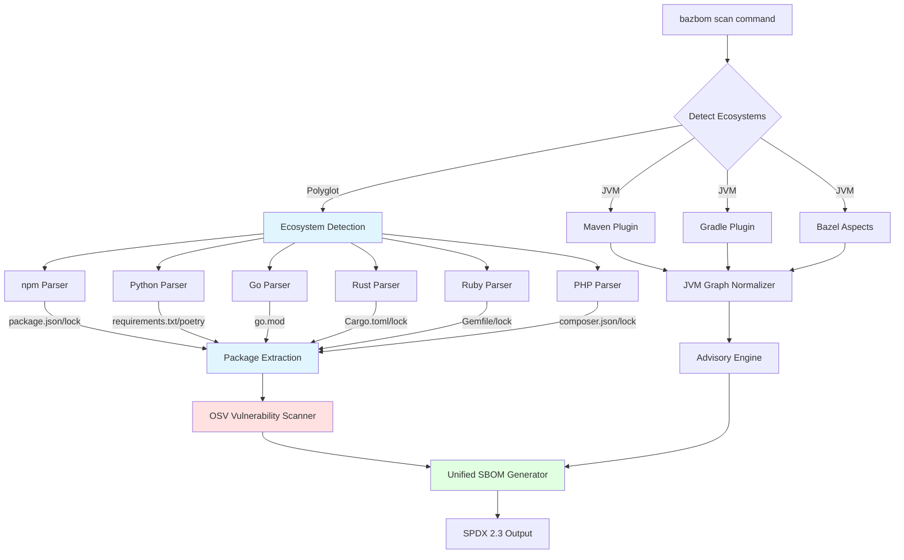
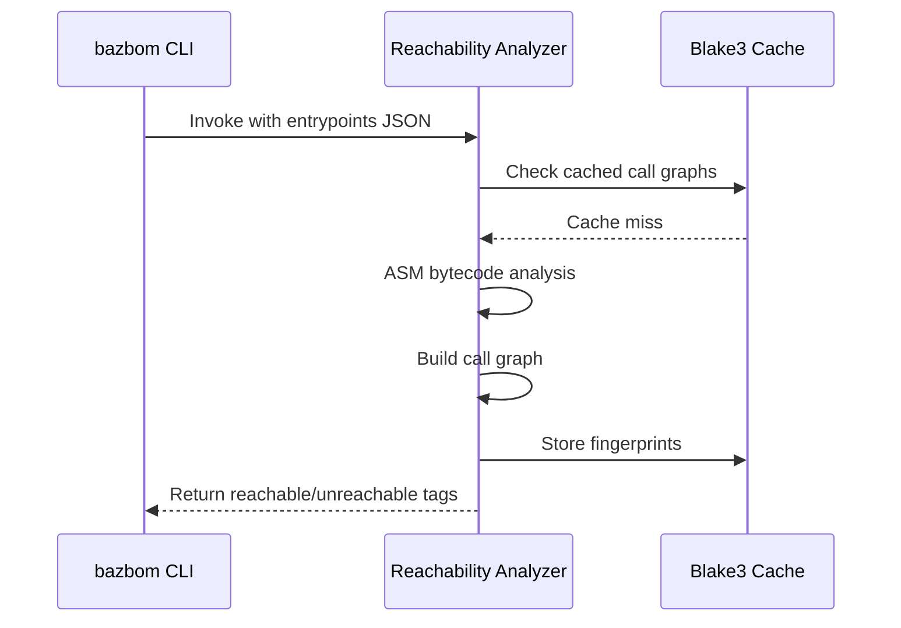
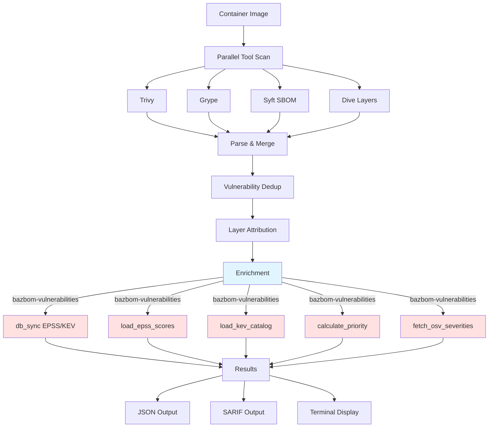

# Architecture

BazBOM is a memory-safe, Rust-first JVM supply chain security tool that produces accurate SBOMs for Maven, Gradle, and Bazel projects.

## Components Overview



**Title:** BazBOM component flow from detection to export

### Rust Workspace

Located in `crates/`:

| Crate | Purpose | Status |
|-------|---------|--------|
| `bazbom` | CLI entry point, command orchestration | Production |
| `bazbom-core` | Shared types, inventory model | Production |
| `bazbom-graph` | Dependency graph normalization, deduplication | Production |
| `bazbom-vulnerabilities` | OSV/NVD/GHSA merge, KEV/EPSS enrichment | Production |
| `bazbom-policy` | YAML policy engine, Rego/OPA bridge | Production |
| `bazbom-formats` | SPDX, CycloneDX, SARIF, VEX exporters | Production |
| `bazbom-lsp` | Language Server Protocol for IDE integration | Production |
| `bazbom-dashboard` | Web UI (Axum 0.8 + Tokio) | Production |
| `bazbom-tui` | Terminal UI (Ratatui 0.29) for dependency exploration | Production |
| `bazbom-threats` | Supply chain threat detection | Production |
| `bazbom-containers` | OCI image scanning with layer attribution | Production |
| `bazbom-cache` | Advisory database caching | Production |
| `bazbom-reports` | HTML/PDF report generation | Production |
| `bazbom-scanner` | Multi-language ecosystem support (npm, Python, Go, Rust, Ruby, PHP, Maven, Gradle) | Production |
| `bazbom-orchestrator` | Parallel ecosystem scanning with progress tracking | Production |
| `bazbom-reachability` | Multi-language call graph analysis (JavaScript, TypeScript, Python, Go, Rust, Ruby, PHP, Java) | Production |
| `bazbom-upgrade-analyzer` | Breaking change detection & migration intelligence | Production |
| `bazbom-depsdev` | deps.dev API client | Production |
| `bazbom-ml` | ML-based risk scoring & anomaly detection | Production |
| `bazbom-operator` | Kubernetes operator for automated scanning | Production |
| `bazbom-verify` | Binary verification utilities | Production |
| `bazbom-tool-verify` | Installation verification tool | Production |
| `bazbom-auth` | JWT authentication & RBAC (v7.0) | Beta |
| `bazbom-crypto` | Cryptographic primitives (v7.0) | Beta |

### Build System Integration

**Maven (`plugins/bazbom-maven-plugin/`)**
- Invoked via: `mvn bazbom:graph`
- Emits: Dependency tree JSON with scopes, licenses, PURLs
- Shadow detection: Parse `maven-shade-plugin` config

**Gradle (`plugins/bazbom-gradle-plugin/`)**
- Plugin ID: `io.bazbom.gradle-plugin`
- Emits: Per-configuration dependency graphs
- Shadow detection: Parse Shadow plugin transforms

**Bazel (`tools/supplychain/aspects.bzl`)**
- Aspect: `packages_used`
- Traverses: `java_*`, `kotlin_*`, `scala_*` rules
- Data source: `maven_install.json` via `rules_jvm_external`

### Polyglot Ecosystem Support (NEW in 6.0)

**Location:** `crates/bazbom-scanner/`



**Title:** Unified JVM + Polyglot architecture in BazBOM 6.0

**Ecosystem Detection Strategy:**
1. Recursive directory walk with `walkdir`
2. `filter_entry()` to skip build artifacts (node_modules, target, .git, dist, etc.)
3. Manifest file detection (package.json, Gemfile, go.mod, etc.)
4. Lockfile preference over manifest for exact versions
5. Parallel parsing of detected ecosystems
6. Unified SBOM generation with cross-ecosystem PURLs

**Parser Architecture:**
Each parser implements:
- **Lockfile parsing** (primary): Exact versions with full dependency tree
- **Manifest fallback** (secondary): When lockfile unavailable
- **Version normalization**: Strip operators (^, ~, >=, v prefix, etc.)
- **Namespace extraction**: Registry/organization mapping
- **OSV mapping**: Ecosystem name for vulnerability queries

**Supported File Formats:**
| Ecosystem | Lockfile | Manifest | Parser Lines | Tests |
|-----------|----------|----------|--------------|-------|
| npm | package-lock.json (v6, v7) | package.json | 300 | 3 |
| Python | poetry.lock, Pipfile.lock | requirements.txt, pyproject.toml | 290 | 3 |
| Go | go.sum | go.mod | 282 | 3 |
| Rust | Cargo.lock | Cargo.toml | 240 | 3 |
| Ruby | Gemfile.lock | Gemfile | 290 | 3 |
| PHP | composer.lock | composer.json | 300 | 3 |

See [Polyglot Support Documentation](polyglot/README.md) for detailed guide.

### Reachability Analysis

**Tool:** `bazbom-reachability.jar` (OPAL-based)
**Location:** `tools/reachability/`



**Title:** Reachability analysis flow with caching

**Invocation:**
```bash
java -jar bazbom-reachability.jar \
  --entrypoints entrypoints.json \
  --classpath app.jar:lib1.jar:lib2.jar \
  --output call_graph.json
```

**Outputs:**
- Call graph (JSON)
- Reachable CVE tags
- Class-level fingerprints (Blake3)

**Why:** Not reused; built fresh per scan; zero network calls.

## Data Model

### Inventory → SPDX Mapping

| Inventory Field | SPDX Field | Notes |
|----------------|------------|-------|
| `name` | `packages[].name` | Maven: `artifactId` |
| `version` | `packages[].versionInfo` | Exact resolved version |
| `source` | `packages[].downloadLocation` | Maven Central URL or VCS |
| `license` | `packages[].licenseConcluded` | SPDX license ID |
| `hash` | `packages[].checksums[]` | SHA256 from lockfile |
| `purl` | `packages[].externalRefs[]` | `pkg:maven/...` |
| `scope` | `relationships[]` | `RUNTIME_DEPENDENCY_OF` vs `TEST_DEPENDENCY_OF` |

### Advisory Merge Engine

**Sources:** OSV, NVD, GHSA
**Enrichment:** CISA KEV, EPSS
**Priority:** P0 (CRITICAL + KEV) → P4 (LOW)

**Gotcha:** Duplicate CVEs across sources are normalized by CVE ID. GHSA-* IDs are preserved separately.

## Shared Infrastructure

BazBOM uses a layered crate architecture where functionality is pushed down to shared crates to avoid duplication. Each crate has a clear responsibility:

### Core Utilities (`bazbom-core`)

**Location:** `crates/bazbom-core/`

| Function | Description |
|----------|-------------|
| `cache_dir()` | Returns `~/.cache/bazbom`, creating if needed |
| `cache_subdir(name)` | Returns subdirectory within cache (e.g., `advisories`) |
| `detect_build_system()` | Identifies Maven/Gradle/Bazel/Ant/Sbt/Buildr |
| `version()` | Returns BazBOM version string |

**Usage:** All crates should use `bazbom_core::cache_dir()` instead of defining their own cache paths.

### Vulnerability Intelligence (`bazbom-vulnerabilities`)

**Location:** `crates/bazbom-vulnerabilities/`

| Function | Description |
|----------|-------------|
| `db_sync()` | Downloads/caches EPSS, KEV, OSV, NVD, GHSA databases |
| `load_epss_scores()` | Loads full EPSS CSV (~3MB, 200K+ CVEs) |
| `load_kev_catalog()` | Loads CISA KEV JSON catalog |
| `calculate_priority()` | P0-P4 scoring from Severity/KEV/EPSS |
| `fetch_osv_severities()` | OSV API fallback for UNKNOWN severity |
| `query_package_vulnerabilities()` | OSV batch queries |

**Priority Scoring Logic (P0-P4):**
```rust
// P0: Critical - KEV with high CVSS, CVSS >= 9.0, or EPSS >= 0.9
// P1: High - CVSS >= 7.0 AND (KEV OR EPSS >= 0.5)
// P2: Medium-High - CVSS >= 7.0 OR (CVSS >= 4.0 AND EPSS >= 0.1)
// P3: Medium - CVSS >= 4.0
// P4: Low - CVSS < 4.0 or unknown
```

### Upgrade Intelligence (`bazbom-upgrade-analyzer`)

**Location:** `crates/bazbom-upgrade-analyzer/`

| Function | Description |
|----------|-------------|
| `detect_ecosystem_from_package()` | **Canonical** ecosystem detection from package name |
| `detect_ecosystem_with_confidence()` | Returns (System, confidence 0.0-1.0) |
| `UpgradeAnalyzer` | Recursive breaking change analysis |
| `config::detect_config_migrations()` | Spring Boot/Log4j config migrations |

**Ecosystem Detection:** The `detect_ecosystem_from_package()` function is the canonical implementation for all of BazBOM. It returns `bazbom_depsdev::System` for use with the deps.dev API. Container scanning wraps this and adds PHP detection (since deps.dev doesn't support Packagist).

### Output Formats (`bazbom-formats`)

**Location:** `crates/bazbom-formats/`

| Module | Description |
|--------|-------------|
| `spdx` | SPDX 2.3 JSON generation |
| `cyclonedx` | CycloneDX 1.5 JSON generation |
| `sarif` | SARIF 2.1.0 for vulnerability reporting |
| `findings` | Tool aggregation for multi-scanner results |

## Container Scanning Architecture

**Location:** `crates/bazbom/src/commands/container_scan/`

Container scanning uses external tools (Trivy, Grype, Syft, Dive) with BazBOM's shared infrastructure for enrichment:



**Title:** Container scanning flow with shared infrastructure

### Module Structure

| Module | Purpose |
|--------|---------|
| `handler.rs` | Main scan orchestration, tool invocation |
| `types.rs` | `ContainerScanResults`, `VulnerabilityInfo`, `LayerInfo` |
| `enrichment.rs` | EPSS/KEV enrichment via shared crates |
| `display.rs` | Terminal output, baseline comparison |

### Key Design Decisions

1. **Shared Cache:** Uses `bazbom_core::cache_dir()` for all cached data
2. **Shared Enrichment:** Uses `bazbom_vulnerabilities::db_sync()` for EPSS/KEV downloads
3. **Shared Priority:** Uses `bazbom_vulnerabilities::calculate_priority()` for P0-P4 scoring
4. **SARIF Output:** Uses `bazbom_formats::sarif` for standard vulnerability reporting

### Container-Specific Features

Features that remain in the container-scan module (not shared):
- Layer attribution (Dive integration)
- Difficulty scoring (remediation effort estimation)
- Framework migration guides
- Quick win detection
- Image comparison and baseline

## Decision Records (Mini-ADRs)

### Why Rust?
**Decision:** Rust-first for safety and distribution simplicity.  
**Alternatives:** Keep Python (rejected: deps, CVEs, distribution complexity).  
**Status:** Complete. Zero Python in shipped binary.

### Why SPDX 2.3?
**Decision:** SPDX 2.3 as primary format; CycloneDX 1.5 optional.  
**Reasoning:** Industry standard, tooling maturity, NTIA compliance.  
**Status:** Implemented. Both formats validated in CI.

### Why Bazel Aspects?
**Decision:** Native Bazel aspects vs external scanners.  
**Reasoning:** Hermetic, reproducible, accurate dependency resolution.  
**Status:** Production. Proven on 5000+ target monorepos.

### Why Tool Cache/Checksum?
**Decision:** Blake3 fingerprinting for reachability caching.  
**Reasoning:** Avoid re-analyzing identical JARs across scans.  
**Status:** Implemented. 10x speedup on incremental scans.

## Architecture Links

- Complete architecture: [architecture/architecture.md](architecture/architecture.md)
- Graph analysis: [architecture/graph-analysis.md](architecture/graph-analysis.md)
- ADR index: [ADR/](ADR/)
- Build system details: [BAZEL.md](BAZEL.md)
- CI integration: [CI.md](CI.md)
