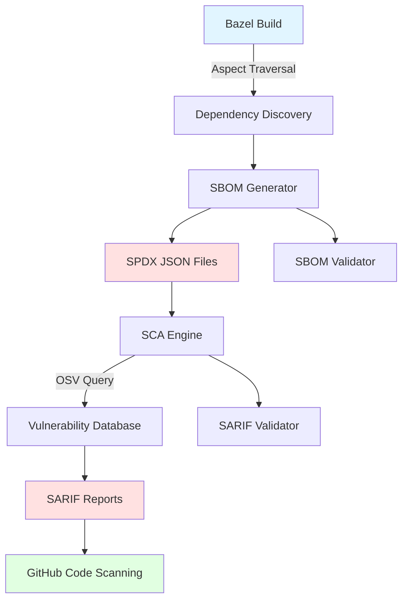

# Architecture

This document describes the high-level architecture of BazBOM and how its components interact.

## Overview

BazBOM is a Bazel-native solution for generating Software Bill of Materials (SBOM) and performing Software Composition Analysis (SCA) on JVM projects. It leverages Bazel's aspect system to traverse the build graph and collect dependency information.

## Architecture Diagram



For the Mermaid source, see [diagrams/architecture.mmd](diagrams/architecture.mmd).

## Components

### 1. Dependency Discovery (Bazel Aspects)

**Location**: `tools/supplychain/aspects.bzl`

Bazel aspects traverse the build graph to collect dependency information:

- **Input**: Bazel targets and their transitive dependencies
- **Process**: Walks the dependency graph using aspects
- **Output**: Structured dependency data (package, version, licenses)

**Key Features**:
- Language-agnostic (works with Java, Kotlin, Scala, etc.)
- Respects Bazel's dependency resolution
- Handles transitive dependencies
- Captures license information

### 2. SBOM Generator

**Location**: `tools/supplychain/write_sbom.py`

Converts dependency data into standards-compliant SPDX documents:

- **Input**: Dependency data from aspects
- **Process**: Generates SPDX 2.3 JSON documents
- **Output**: `.spdx.json` files

**SPDX Document Structure**:
```json
{
  "spdxVersion": "SPDX-2.3",
  "dataLicense": "CC0-1.0",
  "SPDXID": "SPDXRef-DOCUMENT",
  "name": "Package-SBOM",
  "documentNamespace": "https://example.com/...",
  "packages": [...],
  "relationships": [...]
}
```

### 3. Vulnerability Scanner (SCA)

**Location**: `tools/supplychain/osv_query.py`

Queries the OSV (Open Source Vulnerabilities) database:

- **Input**: SPDX SBOM files
- **Process**: Queries OSV API for each package
- **Output**: SARIF vulnerability reports

**OSV Integration**:
- Queries by package name and version
- Supports ecosystem-specific queries (Maven, npm, PyPI, etc.)
- Rate-limited and cached for efficiency
- Severity mapping (Critical, High, Medium, Low)

### 4. SARIF Report Generation

**Location**: `tools/supplychain/sarif_adapter.py`

Converts vulnerability data to SARIF format for GitHub Code Scanning:

- **Input**: OSV vulnerability data
- **Process**: Formats as SARIF 2.1.0
- **Output**: `.sarif.json` files compatible with GitHub

**SARIF Benefits**:
- Native GitHub Code Scanning integration
- Rich security alert UI
- PR annotations for new vulnerabilities
- Trend tracking over time

## Data Flow

### SBOM Generation Flow

```
1. Developer runs: bazel build //:sbom_all
2. Bazel evaluates build graph
3. Aspect attaches to each target
4. Aspect collects dependency info
5. write_sbom.py generates SPDX files
6. SPDX files written to bazel-bin/
```

### SCA Flow

```
1. Developer runs: bazel run //:sca_from_sbom
2. Script discovers all .spdx.json files
3. For each SBOM:
   a. Extract package list
   b. Query OSV database
   c. Collect vulnerabilities
4. sarif_adapter.py formats results
5. SARIF files written to bazel-bin/
6. (Optional) Upload to GitHub Code Scanning
```

## Build Graph Integration

BazBOM integrates with Bazel's build graph:

```
Target
  ├─ Aspect: sbom_aspect
  │   ├─ Collects deps
  │   └─ Propagates to dependencies
  └─ Output: target.sbom
```

Aspects automatically traverse dependencies without explicit configuration.

## Security Model

### Threat Boundaries

- **Build Environment**: Isolated Bazel sandbox
- **Network Boundary**: OSV API queries (HTTPS only)
- **Data Boundary**: SBOMs contain public dependency info only

### Controls

- **Pinned Dependencies**: All tools and rules pinned to specific versions
- **Minimal Permissions**: CI workflows use read-only tokens where possible
- **Input Validation**: All external data validated before processing
- **Audit Trail**: All operations logged; SBOMs include generation metadata

## Extension Points

### Custom Aspects

Add custom dependency collectors:

```python
# tools/supplychain/custom_aspect.bzl
def _custom_sbom_aspect_impl(target, ctx):
    # Custom dependency collection logic
    pass
```

### Custom Formatters

Support additional SBOM formats:

```python
# tools/supplychain/write_cyclonedx.py
# Generate CycloneDX instead of SPDX
```

### Custom Scanners

Integrate with other vulnerability databases:

```python
# tools/supplychain/snyk_query.py
# Query Snyk instead of OSV
```

## Performance Characteristics

- **SBOM Generation**: O(n) where n = number of dependencies
- **Aspect Traversal**: Cached by Bazel; incremental builds are fast
- **OSV Queries**: Rate-limited; ~100 packages/minute
- **SARIF Generation**: O(v) where v = number of vulnerabilities

## Dependencies

### Build-time
- `rules_jvm_external` - Maven dependency management
- `rules_python` - Python tool execution

### Runtime (Python)
- `requests` - HTTP client for OSV queries
- `jsonschema` - SPDX/SARIF validation

## Future Enhancements

See [ADR/](ADR/) for architectural decisions and future directions:

- SPDX 3.0 support
- CycloneDX format support
- Additional vulnerability databases (Snyk, Grype)
- License compliance checking
- Dependency update automation
