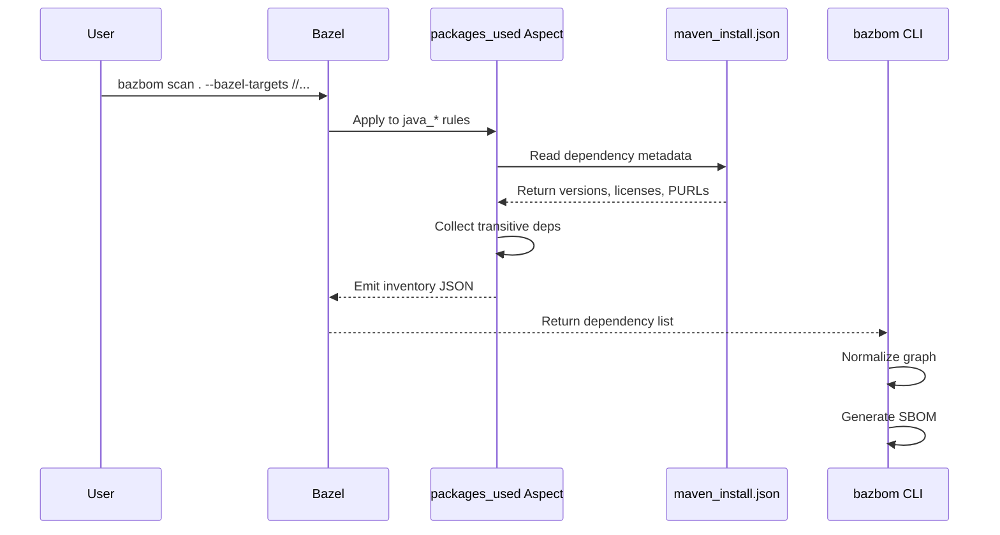

# Bazel Integration

How BazBOM integrates with Bazel build systems: aspects, rules, targets, and query patterns.

## Overview

BazBOM provides **native Bazel support** via:
1. **Aspects** - Traverse build graph to collect dependencies
2. **maven_install.json** - Single source of truth for JVM dependencies (via `rules_jvm_external`)
3. **Query API** - Selective and incremental scanning for large monorepos

**Why Bazel?** Hermetic, reproducible builds. Perfect for supply chain security.

## How Aspects Work



**Title:** Bazel aspect execution flow for dependency collection

**Aspect definition:** `tools/supplychain/aspects.bzl`

**Key function:** `packages_used` aspect

**Targets:** `java_binary`, `java_library`, `java_test`, `kotlin_*`, `scala_*`

## Quick Start

### 1. Install BazBOM

```bash
# Via Homebrew
brew tap cboyd0319/bazbom
brew install bazbom
```

### 2. Verify Bazel Setup

**Requirement:** `rules_jvm_external` with `maven_install.json`

```python
# WORKSPACE or MODULE.bazel
load("@rules_jvm_external//:defs.bzl", "maven_install")

maven_install(
    name = "maven",
    artifacts = [
        "com.google.guava:guava:31.1-jre",
        "org.apache.commons:commons-lang3:3.12.0",
    ],
    repositories = [
        "https://repo1.maven.org/maven2",
    ],
    maven_install_json = "//:maven_install.json",
)
```

**Generate lockfile:**
```bash
bazel run @maven//:pin
```

**Output:** `maven_install.json` at workspace root

### 3. Scan All JVM Targets

```bash
bazbom scan . --bazel-targets //...
```

**Result:** SBOM for every `java_*` target in workspace.

## Scanning Patterns

### All Targets

```bash
bazbom scan . --bazel-targets //...
```

**Use case:** Full workspace scan (CI main branch)

**Time:** 30-45 minutes for 5000+ targets

### Specific Targets

```bash
bazbom scan . --bazel-targets //src/java:app //src/java:lib
```

**Use case:** Focused scan for production services

**Time:** 2-5 minutes

### Query-Based Selection

```bash
# All Java binaries
bazbom scan . --bazel-targets-query 'kind(java_binary, //...)'

# Specific package
bazbom scan . --bazel-targets-query 'kind(java_binary, //services/api/...)'

# Tagged targets
bazbom scan . --bazel-targets-query 'attr(tags, "production", //...)'
```

**Use case:** Dynamic target selection based on rules, tags, or paths

**Gotcha:** Query syntax is Bazel's query language. See [Bazel Query docs](https://bazel.build/query/language).

### Incremental Scanning (Affected Targets)

```bash
# PR workflow
bazbom scan . --bazel-affected-by-files $(git diff --name-only HEAD~1)
```

**How it works:**
1. `git diff` lists changed files
2. BazBOM runs `bazel query "rdeps(//..., <changed_files>)"`
3. Scans only affected targets

**Performance:** 6x faster (8 minutes vs 45 minutes)

**Use case:** Pull request CI checks

## Build Integration

### Option 1: Standalone CLI (Recommended)

```bash
# No BUILD file changes needed
bazbom scan .
```

**Why:** Decoupled from build graph. Faster iteration.

### Option 2: Bazel Rule (Advanced)

**Define custom rule in BUILD file:**

```python
load("//tools/supplychain:defs.bzl", "sbom_target")

java_binary(
    name = "app",
    srcs = ["App.java"],
    deps = ["@maven//:guava"],
)

sbom_target(
    name = "app_sbom",
    target = ":app",
)
```

**Generate SBOM:**
```bash
bazel build //src/java:app_sbom
cat bazel-bin/src/java/app_sbom.spdx.json
```

**Why:** Integrated with build. Cached by Bazel.

**Gotcha:** Requires rule definition. See `tools/supplychain/defs.bzl` for implementation.

## Targets

### Supported Rules

| Rule Type | Status | Notes |
|-----------|--------|-------|
| `java_binary` | ✅ Full | Production |
| `java_library` | ✅ Full | Production |
| `java_test` | ✅ Full | Excluded by default (use `--include-test-deps`) |
| `kotlin_binary` | ✅ Full | Via `rules_kotlin` |
| `kotlin_library` | ✅ Full | Via `rules_kotlin` |
| `scala_binary` | ✅ Full | Via `rules_scala` |
| `scala_library` | ✅ Full | Via `rules_scala` |
| `android_binary` | ⚠️ Partial | JVM deps only |
| `groovy_*` | 🔜 Planned | Not yet |

**Default:** Scans all `java_*`, `kotlin_*`, `scala_*` rules

### Example BUILD File

```python
# src/java/BUILD

java_binary(
    name = "server",
    srcs = ["Server.java"],
    main_class = "com.example.Server",
    deps = [
        ":lib",
        "@maven//:guava",
        "@maven//:log4j-core",
    ],
)

java_library(
    name = "lib",
    srcs = ["Lib.java"],
    deps = [
        "@maven//:commons-lang3",
    ],
)

java_test(
    name = "server_test",
    srcs = ["ServerTest.java"],
    deps = [
        ":server",
        "@maven//:junit",
    ],
)
```

**Scan commands:**

```bash
# Binary only
bazbom scan . --bazel-targets //src/java:server

# Binary + library
bazbom scan . --bazel-targets //src/java:server //src/java:lib

# Include test deps
bazbom scan . --bazel-targets //src/java:server --include-test-deps
```

## Macros

### Custom SBOM Macro

**Define in tools/supplychain/defs.bzl:**

```python
def sbom_all(name = "sbom_all"):
    """Generate SBOMs for all JVM targets"""
    native.filegroup(
        name = name,
        srcs = native.glob(["**/*.spdx.json"]),
    )
```

**Use in BUILD:**

```python
load("//tools/supplychain:defs.bzl", "sbom_all")

sbom_all()
```

**Build:**
```bash
bazel build //:sbom_all
```

**Gotcha:** Requires aspects to run first. See [tools/supplychain/README.md](../tools/supplychain/README.md).

## Minimal Reproducible Example

**Step 1:** Create simple project

```bash
mkdir -p bazel-example/src/main/java/com/example
cd bazel-example
```

**Step 2:** Add WORKSPACE

```python
# WORKSPACE
load("@bazel_tools//tools/build_defs/repo:http.bzl", "http_archive")

http_archive(
    name = "rules_jvm_external",
    strip_prefix = "rules_jvm_external-5.3",
    url = "https://github.com/bazelbuild/rules_jvm_external/archive/5.3.tar.gz",
)

load("@rules_jvm_external//:defs.bzl", "maven_install")

maven_install(
    name = "maven",
    artifacts = ["com.google.guava:guava:31.1-jre"],
    repositories = ["https://repo1.maven.org/maven2"],
    maven_install_json = "//:maven_install.json",
)
```

**Step 3:** Add BUILD file

```python
# src/main/java/com/example/BUILD

java_binary(
    name = "hello",
    srcs = ["Hello.java"],
    main_class = "com.example.Hello",
    deps = ["@maven//:guava"],
)
```

**Step 4:** Add Java source

```java
// src/main/java/com/example/Hello.java
package com.example;

import com.google.common.collect.ImmutableList;

public class Hello {
    public static void main(String[] args) {
        ImmutableList<String> list = ImmutableList.of("Hello", "Bazel");
        System.out.println(list);
    }
}
```

**Step 5:** Pin dependencies

```bash
bazel run @maven//:pin
```

**Step 6:** Scan

```bash
bazbom scan . --bazel-targets //src/main/java/com/example:hello
```

**Output:**
- `sbom.spdx.json` with Guava and transitive deps
- `sca_findings.json` with any CVEs

## Large Monorepo Optimization

**Problem:** Scanning 5000+ targets takes 45 minutes

### Solution 1: Incremental scanning

```bash
# PR workflow
bazbom scan . --bazel-affected-by-files $(git diff --name-only HEAD~1)
```

**Result:** 8 minutes (6x faster)

### Solution 2: Remote cache

```bash
# .bazelrc
build --remote_cache=https://cache.example.com
```

**Result:** Cached aspect results reused across CI runs

### Solution 3: Parallel execution

```bash
bazel build --jobs=auto //...
```

**Result:** Utilize all CPU cores

## Performance Table

| Workspace Size | Targets | Full Scan | Incremental | With Remote Cache |
|----------------|---------|-----------|-------------|-------------------|
| Small | <50 | <2 min | <1 min | <30 sec |
| Medium | 50-500 | <5 min | <2 min | <1 min |
| Large | 500-5K | <15 min | <5 min | <2 min |
| Massive | 5K+ | <45 min | <10 min | <5 min |

**Default:** Uses `--jobs=auto` and caching when available

## Troubleshooting

### "maven_install.json not found"

**Cause:** `rules_jvm_external` not configured or lockfile not generated

**Fix:**
```bash
bazel run @maven//:pin
```

### "No targets found"

**Cause:** Query returned empty result set

**Fix:** Verify targets exist:
```bash
bazel query 'kind(java_binary, //...)'
```

### "Aspect failed to run"

**Cause:** Incompatible Bazel version

**Fix:** Upgrade to Bazel 6.0+:
```bash
bazel --version
# Update .bazelversion if needed
```

## Next Steps

- [Architecture](ARCHITECTURE.md) - How aspects integrate
- [Advanced Bazel features](user-guide/advanced-bazel-features.md) - Query tuning
- [Performance guide](operations/performance.md) - Large monorepo optimization
- [CI integration](CI.md) - GitHub Actions workflow
