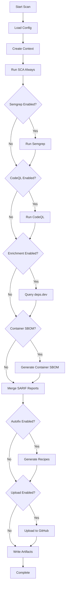

# BazBOM Orchestrated Scan

BazBOM provides a comprehensive "single button" security scan that orchestrates multiple analysis tools, enrichment sources, and autofix workflows into a unified pipeline.

## Overview

The orchestrated scan produces:

- **SBOM**: SPDX 2.3 (always) + CycloneDX 1.5 (optional)
- **SCA Findings**: OSV/NVD/GHSA vulnerability matching
- **SAST Findings**: Semgrep (pattern-based) + CodeQL (dataflow/taint)
- **Enrichment**: deps.dev license and versioning intelligence
- **Autofix**: OpenRewrite recipes with safe allowlisting
- **Unified Output**: Single SARIF 2.1.0 for GitHub Code Scanning

## Quick Start

### Minimal Scan (SBOM + SCA only)

```bash
bazbom scan .
```

Outputs:
- `sbom/spdx.json` - SPDX 2.3 SBOM
- `findings/sca.sarif` - SCA findings
- `findings/merged.sarif` - Combined SARIF

### Full Scan (All Features)

```bash
bazbom scan . \
  --cyclonedx \
  --with-semgrep \
  --with-codeql security-extended \
  --autofix dry-run \
  --out-dir ./bazbom-output
```

## Output Structure

```
bazbom-output/
├── sbom/
│   ├── spdx.json              # SPDX 2.3 SBOM (always)
│   └── cyclonedx.json         # CycloneDX 1.5 SBOM (--cyclonedx)
├── findings/
│   ├── sca.sarif              # SCA findings from OSV/NVD/GHSA
│   ├── semgrep.sarif          # Semgrep findings (--with-semgrep)
│   ├── codeql.sarif           # CodeQL findings (--with-codeql)
│   └── merged.sarif           # All findings merged (SARIF 2.1.0)
├── enrich/
│   └── depsdev.json           # deps.dev enrichment data
└── fixes/
    ├── openrewrite-recipes.json  # Generated fix recipes
    └── *.patch                    # Dry-run patches (--autofix dry-run)
```

## CLI Options

### Analysis Toggles

```bash
# Enable CycloneDX SBOM (in addition to SPDX)
--cyclonedx

# Enable Semgrep with curated JVM ruleset
--with-semgrep

# Enable CodeQL with specified suite
--with-codeql default             # Default suite (faster)
--with-codeql security-extended   # Security-extended suite (thorough)

# Enable autofix recipe generation
--autofix off                     # No fixes (default)
--autofix dry-run                 # Generate patches, don't apply
--autofix pr                      # Apply fixes and open PR (planned)

# Container SBOM strategy
--containers auto                 # Auto-select best strategy
--containers syft                 # Use Syft explicitly
--containers bazbom               # Use BazBOM (when ready)

# Target specific module (for large mono-repos)
--target my-module

# Skip GitHub Code Scanning upload
--no-upload
```

### Output Control

```bash
# Specify output directory
--out-dir ./custom-output

# Default is current directory
--out-dir .
```

## Configuration File (bazbom.toml)

Place a `bazbom.toml` in your repository root to set defaults:

```toml
[analysis]
cyclonedx = true
semgrep = { enabled = true, ruleset = "curated-jvm@sha256:..." }
codeql = { enabled = false, suite = "default" }

[enrich]
depsdev = true

[autofix]
mode = "dry-run"
recipe_allowlist = ["commons-io", "jackson", "log4j", "spring-core", "commons-"]

[containers]
strategy = "auto"

[publish]
github_code_scanning = true
artifact = true
```

With this config, simply run:

```bash
bazbom scan .
```

CLI flags override config file settings.

## Orchestration Flow



## Analyzer Details

### 1. SCA (Software Composition Analysis)

**Always Enabled**

Matches dependencies from SBOM against:
- **OSV** (Open Source Vulnerabilities)
- **NVD** (National Vulnerability Database)
- **GHSA** (GitHub Security Advisories)

Output: `findings/sca.sarif`

### 2. Semgrep

**Optional** (`--with-semgrep`)

Pattern-based security scanning with curated JVM ruleset:
- Insecure API usage
- Deserialization vulnerabilities
- SQL injection patterns
- Path traversal risks
- Hardcoded secrets

Ruleset: `rules/semgrep/semgrep-jvm.yml` (pinned SHA256)

Output: `findings/semgrep.sarif`

Execution time: ~2-5 minutes

### 3. CodeQL

**Optional** (`--with-codeql [suite]`)

Dataflow and taint analysis:
- **default suite**: Core security queries (~5-10 min)
- **security-extended suite**: Comprehensive security queries (~10-20 min)

Supported build systems:
- Maven: Autobuild
- Gradle: Autobuild
- Bazel: Manual DB creation (via `bazbom codeql create-db`)

Output: `findings/codeql.sarif`

### 4. Enrichment (deps.dev)

**Optional** (config: `enrich.depsdev = true`)

Queries [deps.dev](https://deps.dev) API for:
- License information
- Latest versions
- Popularity metrics
- Version history
- Repository links
- **Breaking changes information** (NEW)
  - Semantic version analysis
  - Changelog URLs
  - Migration guide links
  - Advisory details

The deps.dev enrichment now provides breaking changes information when remediation
suggestions are generated. This helps developers understand:
- Whether an upgrade involves major version changes
- What breaking changes to expect
- Where to find migration guides and changelogs
- Specific compatibility concerns

Output: `enrich/depsdev.json`

#### Breaking Changes Integration

When generating remediation suggestions, BazBOM now:

1. **Queries deps.dev** for the target version
2. **Analyzes semantic versions** to detect major version changes
3. **Extracts advisories** that mention breaking changes
4. **Finds changelog URLs** from package links
5. **Includes migration guides** when available

Example breaking changes warning:

```
 Major version upgrade (2.11.0 → 3.0.0)

This is a major version upgrade which may include breaking changes:
- API changes: Methods may be removed, renamed, or have different signatures
- Deprecated features: Previously deprecated APIs may be removed
- Behavioral changes: Existing functionality may behave differently

Breaking changes details:
  - Removed deprecated method XYZ
  - Changed return type of ABC

Changelog: https://github.com/example/project/releases/tag/v3.0.0
Migration guide: https://github.com/example/project/wiki/v3-migration

Recommended actions before upgrading:
1. Review the library's changelog and migration guide
2. Run all unit and integration tests
3. Test in a staging environment first
4. Have a rollback plan ready
```

### 5. Autofix (OpenRewrite)

**Optional** (`--autofix [mode]`)

Generates OpenRewrite recipes for:
- Dependency upgrades
- Artifact replacements
- Vulnerability remediation

Modes:
- `off`: No fixes (default)
- `dry-run`: Generate patches to `fixes/` directory
- `pr`: Apply fixes and open PR (planned)

**Safety Rails:**
- Allowlist-based: Only allowed artifacts get recipes
- Default allowlist: `commons-io`, `jackson`, `log4j`, `spring-core`, `commons-*`
- Requires passing builds before applying
- Never mass-edit across modules without verification

Output:
- `fixes/openrewrite-recipes.json`
- `fixes/*.patch` (dry-run mode)

## SARIF 2.1.0 Compliance

All findings are merged into `findings/merged.sarif` with:

- **Version**: `2.1.0`
- **Schema**: `https://json.schemastore.org/sarif-2.1.0.json`
- **Multiple runs**: One per tool (SCA, Semgrep, CodeQL)
- **Distinct `automationDetails`**: For GitHub integration
- **Results**: With locations, levels, properties

Upload to GitHub Code Scanning:

```yaml
- uses: github/codeql-action/upload-sarif@v3
  with:
    sarif_file: bazbom-output/findings/merged.sarif
```

## Performance

### PR Mode (Fast)
- SBOM + SCA: ~1-2 minutes
- + Semgrep: ~3-5 minutes total

### Main Branch Mode (Comprehensive)
- SBOM + SCA + Semgrep: ~5 minutes
- + CodeQL (default): ~10-15 minutes total
- + CodeQL (security-extended): ~15-25 minutes total

### Optimization Strategies

1. **Scope by change**: Use `--target` for changed modules only
2. **Cache**: Tool binaries cached in `.bazbom/tools/`
3. **Parallel**: SCA and Semgrep run concurrently
4. **Incremental**: Skip CodeQL on PRs, run on main only

## Error Handling

Analyzers fail gracefully:
- SCA failure: Continue with empty report
- Semgrep not found: Log warning, skip
- CodeQL not found: Log warning, skip
- Network errors: Retry with backoff (planned)

The scan always produces valid output, even if some analyzers fail.

## GitHub Actions Integration

See `examples/github-actions/` for complete workflows:

- **PR Mode**: Fast scan (SBOM + SCA + Semgrep)
- **Main Branch**: Comprehensive (+ CodeQL + autofix)
- **Scheduled**: Weekly deep scan

## Examples

### Example 1: Maven Project

```bash
cd my-maven-project
bazbom scan . --with-semgrep
```

### Example 2: Gradle Multi-Module

```bash
cd my-gradle-project
bazbom scan . --with-semgrep --target my-module
```

### Example 3: Bazel Monorepo

```bash
cd my-bazel-monorepo
bazbom scan . \
  --with-semgrep \
  --with-codeql default \
  --bazel-targets //my-module/...
```

### Example 4: Container Image

```bash
bazbom scan . --containers syft
```

## Troubleshooting

### SARIF Upload Fails

**Symptoms**: GitHub Code Scanning rejects SARIF

**Solutions**:
1. Validate SARIF: `jq . bazbom-output/findings/merged.sarif`
2. Check file size < 10 MB (GitHub limit)
3. Verify SARIF 2.1.0 compliance

### Tools Not Found

**Semgrep**:
```bash
pipx install semgrep
# Or: brew install semgrep (macOS)
```

**CodeQL**:
```bash
CODEQL_VERSION=2.19.4
curl -sL https://github.com/github/codeql-cli-binaries/releases/download/v${CODEQL_VERSION}/codeql-linux64.zip -o codeql.zip
unzip codeql.zip && export PATH="$PWD/codeql:$PATH"
```

### Timeouts on Large Repositories

1. Use `--target` to limit scope
2. Separate Semgrep and CodeQL into different jobs
3. Increase timeout in CI

### Memory Issues with CodeQL

For large codebases:
```bash
export CODEQL_RAM=8192  # 8GB
bazbom scan . --with-codeql default
```

## Advanced Topics

### Custom Semgrep Ruleset

Replace `rules/semgrep/semgrep-jvm.yml` with your own:

```yaml
# rules/semgrep/custom-rules.yml
rules:
  - id: custom-rule
    pattern: $X.exec($Y)
    message: Avoid direct exec calls
    severity: WARNING
    languages: [java]
```

### CodeQL Custom Queries

Create custom query pack:

```bash
codeql pack create my-queries
bazbom scan . --with-codeql my-queries
```

### Allowlist Custom Artifacts

```toml
[autofix]
recipe_allowlist = [
  "com.mycompany.mylib",
  "org.apache.commons-",  # Prefix match
]
```

## API (Programmatic Usage)

```rust
use bazbom::scan_orchestrator::ScanOrchestrator;
use std::path::PathBuf;

let orchestrator = ScanOrchestrator::new(
    PathBuf::from("."),           // workspace
    PathBuf::from("./output"),    // output dir
    true,                          // cyclonedx
    true,                          // with_semgrep
    None,                          // with_codeql
    None,                          // autofix
    None,                          // containers
    false,                         // no_upload
    None,                          // target
)?;

orchestrator.run()?;
```

## References

- [Integration Plan](./copilot/BAZBOM_INTEGRATION_PLAN.md)
- [GitHub Actions Examples](../examples/github-actions/)
- [SARIF 2.1.0 Spec](https://docs.oasis-open.org/sarif/sarif/v2.1.0/)
- [deps.dev API](https://docs.deps.dev/)
- [OpenRewrite](https://docs.openrewrite.org/)
