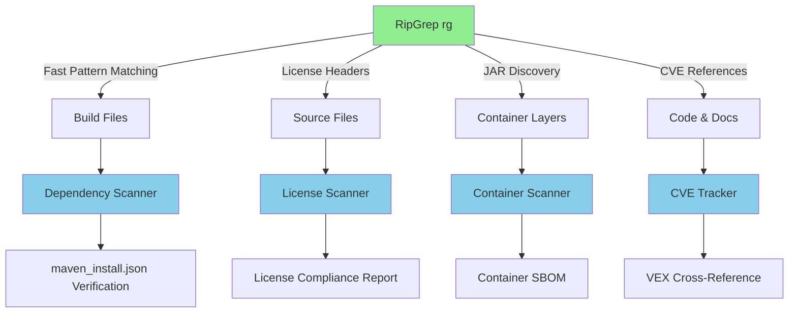
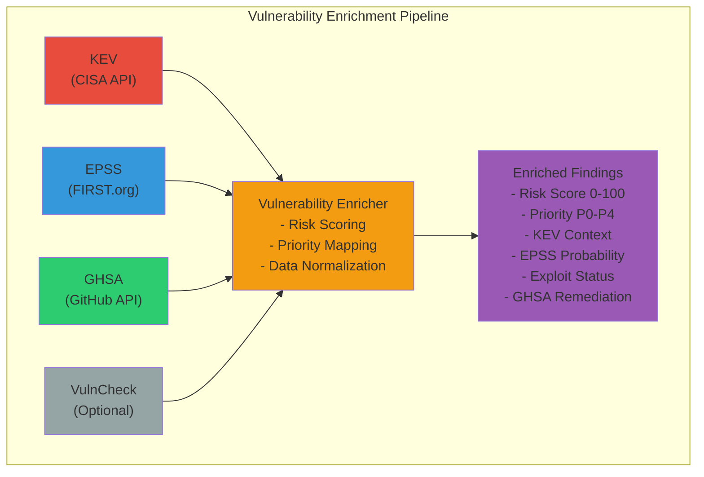

# Architecture

This document describes the high-level architecture of BazBOM and how its components interact.

## Overview

BazBOM is a memory-safe, Rust-first JVM supply chain security toolkit that generates Software Bill of Materials (SBOM) and performs Software Composition Analysis (SCA) for Maven, Gradle, and Bazel projects. The architecture emphasizes:

- **Memory Safety**: Rust-first implementation with managed JVM helpers for reachability
- **Zero Telemetry**: No background network calls; explicit offline sync
- **Offline-First**: Advisory databases cached locally with deterministic updates
- **Build-Native Accuracy**: Integration at build-time for authoritative dependency graphs

## Implementation Snapshot (v1.0.0)

| Layer | Component | Status | Notes |
| --- | --- | --- | --- |
| CLI | `crates/bazbom` | ✅ Production | Single Rust binary; Clap-based command parsing; zero Python dependencies |
| Services | `bazbom-advisories`, `bazbom-policy`, `bazbom-formats`, `bazbom-graph` | ✅ Production | Advisory merge engine, policy enforcement, schema exporters, graph normalisation |
| Reachability | `tools/bazbom-reachability` | ✅ Production | OPAL-based bytecode analysis with caching and reachable/not reachable tagging |
| IDE / LSP | `crates/bazbom-lsp` | 🛠 In validation | Publishes diagnostics & code actions; requires marketplace hardening |
| Maven Plugin | `plugins/bazbom-maven-plugin` | 🛠 Integration testing | Extracts dependency trees, shading metadata, license data |
| Gradle Plugin | `plugins/bazbom-gradle-plugin` | 🛠 Integration testing | Variant-aware graph extraction, shadow plugin detection |
| Bazel Aspects | `tools/supplychain/aspects.bzl` | ✅ Production | Supports rules_jvm_external and bzlmod, incremental queries |
| IDE Extensions | `plugins/ide/*` | 🛠 Marketplace prep | IntelliJ & VS Code extensions backed by REST/LSP |
| Auxiliary tooling | `tools/` | ✅ Production | DB sync utilities, provenance signing, release automation |

## Architecture Diagram

```mermaid
graph TD
    A[bazbom CLI (Rust)] -->|Detect| B[Build System Detection]
    B -->|Maven| C1[Maven Plugin]
    B -->|Gradle| C2[Gradle Plugin]
    B -->|Bazel| C3[Bazel Aspects]
    
    C1 --> D[Normalized Graph]
    C2 --> D
    C3 --> D
    
    D --> E[Enrichment Engine]
    E -->|Local Cache| F[Advisory DB Sync]
    F --> G[OSV/NVD/GHSA/KEV/EPSS]
    
    E --> H[Policy Engine]
    H --> I[SBOM Exporters]
    I --> J1[SPDX 2.3]
    I --> J2[CycloneDX 1.5]
    I --> J3[SARIF 2.1.0]
    
    E -->|Optional| K[Reachability OPAL]
    K -->|Bytecode| L[Call Graph]
    L --> E
    
    style A fill:#e67e22
    style D fill:#3498db
    style J1 fill:#2ecc71
    style J2 fill:#2ecc71
    style J3 fill:#2ecc71
```

For the Mermaid source, see [diagrams/architecture.mmd](diagrams/architecture.mmd).

## Core Components

### 1. Rust CLI (`bazbom`)

**Location**: `crates/bazbom/`

The primary user interface and orchestration layer. Responsibilities include:

- **Command parsing & validation** (`clap`) for `scan`, `policy check`, `fix`, `db sync`, `install-hooks`, `report`, and more
- **Build system detection** across Maven, Gradle, Bazel (with Ant/sbt detection planned)
- **Workflow orchestration** to wire advisory sync, plugins, policy enforcement, and report generation
- **Output management** for SBOM (SPDX/CycloneDX), SARIF, HTML dashboard exports
- **Configuration bootstrapping** (`bazbom init`) including policy templates and first-run scanning

**Key Features**:
- Single binary distribution (no Python runtime required)
- Memory-safe implementation (no unsafe blocks)
- Cross-platform support (macOS, Linux, Windows)
- Signed releases with SLSA provenance

**Sample capabilities**:
```bash
bazbom scan .                    # Detect build system and emit reports
bazbom db sync                   # Fetch OSV/NVD/GHSA/KEV/EPSS data
bazbom policy init --template pci-dss
bazbom policy check              # Enforce policies with exit codes for CI
bazbom install-hooks             # Pre-commit enforcement
```

**Delegates to** build-system plugins for authoritative dependency extraction and to specialised service crates for enrichment and export.

### 2. Build System Integration Layer

**Location**:

- Maven: `plugins/bazbom-maven-plugin/`
- Gradle: `plugins/bazbom-gradle-plugin/`
- Bazel: `tools/supplychain/aspects.bzl`

#### Maven Plugin (1.0.0)
- Emits JSON graph with scopes (compile/runtime/test/provided)
- Extracts effective POM, BOM imports, conflict resolution, relocation/shading data
- Produces PURLs, hashes, and license metadata per component

#### Gradle Plugin (preview hardening)
- Variant-aware graph extraction via Gradle Tooling API
- Shadow plugin relocation mapping
- Android flavours/build-types supported; Gradle Enterprise caching respected

#### Bazel Aspects (production)
- Traverses `java_*`, Kotlin, scala rules with rules_jvm_external/bzlmod
- Incremental mode using `--bazel-targets` / `--bazel-affected-by-files`
- Emits dependency graph with target provenance and repository metadata

### 3. Dependency Graph Normalization

**Location**: `crates/bazbom-graph/`

Converts build-system-specific outputs into a canonical graph model:

- **Input**: Build system JSON (Maven/Gradle/Bazel)
- **Process**: Normalizes coordinates, deduplicates, resolves conflicts
- **Output**: Unified dependency graph with PURLs and metadata

**Key Features**:
- Build-system agnostic internal representation
- Conflict resolution tracking
- Scope/configuration fidelity

### 4. Advisory Intelligence & Enrichment

**Location**: `crates/bazbom-advisories/`

Manages vulnerability data from multiple sources:

- **Sources**: OSV, NVD, GHSA, CISA KEV, EPSS
- **Merge Engine**: Deduplicates CVE/GHSA/OSV identifiers
- **Enrichment**: Adds KEV presence, EPSS probability, canonical severity
- **Priority Scoring**: Computes P0–P4 based on severity, EPSS, KEV, reachability

**Offline Sync (`bazbom db sync`)**:
```
.bazbom/cache/
├── advisories/
│   ├── osv.json
│   ├── nvd.json
│   ├── ghsa.json
│   ├── kev.json
│   └── epss.csv
└── manifest.json (blake3 hashes)
```

### 5. Reachability Analysis (OPAL-based)

**Location**: `bazbom-reachability.jar` (JVM helper, invoked via CLI)

Optional bytecode-level call graph analysis:

- **Input**: Compiled classes + runtime classpath
- **Engine**: OPAL (Scala-based static analysis framework)
- **Output**: Reachable/unreachable tags + method-level traces
- **Integration**: Invoked by Rust CLI via `java -jar` when `--reachability` flag set

**Performance**:
- Cached call graphs per module/target
- Scoped analysis to avoid full workspace scans

### 6. Policy Engine

**Location**: `crates/bazbom-policy/`

Enforces security and compliance policies:

- **Policy Language**: YAML (core), optional Rego/CUE
- **Rules**: Severity thresholds, license allow/deny, KEV/EPSS gates, reachability requirements
- **VEX Workflow**: Auto-generate VEX statements for unreachable findings (when policy allows)
- **CI Integration**: Exit codes for gating, PR comments, SARIF annotations

### 7. SBOM & Report Exporters

**Location**: `crates/bazbom-formats/`

Standards-compliant output generation:

- **SPDX 2.3 JSON** (primary format)
- **CycloneDX 1.5** (optional)
- **SARIF 2.1.0** (GitHub Code Scanning integration)
- **CSV** (business/compliance reports)
- **CSAF VEX** (false positive suppression)

**Validation**:
- JSON Schema validation for all formats
- Golden file tests for determinism

## Data Flow

### End-to-End Scan Flow

```
User: bazbom scan .
  ↓
1. Build System Detection (Maven/Gradle/Bazel)
  ↓
2. Build-Native Graph Extraction
   - Maven: effective POM + dependency:tree
   - Gradle: configurations API
   - Bazel: aspects traversal
  ↓
3. Graph Normalization (canonical model)
  ↓
4. Advisory Enrichment (local cache)
   - OSV/NVD/GHSA merge
   - KEV + EPSS tagging
   - Canonical severity
  ↓
5. [Optional] Reachability Analysis (OPAL)
   - Bytecode call graph
   - Tag reachable/unreachable
  ↓
6. Policy Checks
   - Apply rules
   - Generate VEX (if applicable)
  ↓
7. Export
   - sbom.spdx.json
   - sca_findings.json
   - sca_findings.sarif
```

## Security Architecture

### Supply Chain Guarantees

- **SLSA Level 3 Provenance**: Build provenance for all releases
- **Sigstore Signing**: Keyless signing with transparency log
- **Hermetic Builds**: No network access during scan (use local cache)
- **Deterministic Outputs**: Same inputs → same outputs (bit-for-bit)

### Privacy Model

- **Zero Telemetry**: No analytics, tracking, or phoning home
- **Explicit Sync**: Advisory updates only via `bazbom db sync` command
- **Offline Operation**: Full functionality without network (after initial sync)
- **Local-Only Data**: All caches and artifacts remain on user's machine

## Build System-Specific Details

### SBOM Format

BazBOM generates SPDX 2.3 JSON format with enhanced features:

- SHA256 checksums for all packages
- Package URLs (PURLs) for ecosystem identification
- Proper transitive relationships (not just root dependencies)
- Direct/transitive dependency distinction

### 4. Vulnerability Scanner (SCA)

**Location**: `crates/bazbom-advisories/`

Queries vulnerability databases offline using local cache:

- **Input**: Dependency graph with PURLs
- **Process**: Queries local advisory database for each package
- **Output**: SARIF vulnerability reports

**Advisory Integration**:
- OSV, NVD, GHSA data merged locally
- KEV and EPSS enrichment
- Offline-first with explicit sync (`bazbom db sync`)
- Canonical severity mapping (Critical, High, Medium, Low)

### 5. SARIF Report Generation

**Location**: `crates/bazbom-formats/`

Converts vulnerability data to SARIF 2.1.0 format for GitHub Code Scanning:

- **Input**: Enriched vulnerability findings
- **Process**: Formats as SARIF 2.1.0 with KEV/EPSS context
- **Output**: `.sarif.json` files compatible with GitHub

**SARIF Benefits**:
- Native GitHub Code Scanning integration
- Rich security alert UI with KEV/EPSS context
- PR annotations for new vulnerabilities
- Trend tracking over time

### 6. RipGrep-Accelerated Discovery (Optional)

**Location**: `crates/bazbom/src/scan.rs`

BazBOM optionally leverages [RipGrep](https://github.com/BurntSushi/ripgrep) for 100-1000x faster file discovery and pattern matching in large monorepos.

**Key Features:**
- **Fast Dependency Discovery**: Find BUILD files, pom.xml, and dependency references 100x faster
- **License Header Scanning**: Scan 10,000+ source files for license headers in ~2 seconds
- **Incremental Analysis**: Quickly identify changed targets in PRs (6.25x speedup)
- **Container Scanning**: Fast JAR and OS package discovery in container images (10.9x faster)
- **CVE Tracking**: Find CVE references in code, comments, and VEX statements
- **Dependency Verification**: Detect unused or undeclared dependencies

**Architecture:**



**Integration Points:**

1. **Dependency Scanner** (Rust implementation)
   - `find_maven_dependencies()` - Extract Maven deps from pom.xml files
   - `find_gradle_dependencies()` - Extract Gradle deps from build files
   - `find_bazel_maven_jars()` - Find @maven// references in BUILD files

2. **Incremental Analyzer** (Rust implementation)
   - `get_changed_build_files_fast()` - Filter changed BUILD files (RipGrep)
   - `find_affected_targets_fast()` - Find targets in changed packages

3. **License Scanner** (Rust implementation)
   - `scan_license_headers()` - Find license headers by pattern (Apache, MIT, GPL, etc.)
   - `find_unlicensed_files()` - Identify files without license headers
   - `check_copyleft_licenses()` - Flag GPL/LGPL dependencies

4. **Container Scanner** (Rust implementation)
   - `extract_jars_from_image()` - Find JAR files in container layers
   - `find_os_packages()` - Locate dpkg/rpm/apk manifests

5. **Dependency Verifier** (Rust implementation)
   - `find_unused_dependencies()` - Detect deps in lockfile but not referenced
   - `find_undeclared_dependencies()` - Detect deps referenced but not declared

6. **CVE Tracker** (Rust implementation)
   - `find_cve_references()` - Search for CVE-YYYY-NNNN patterns
   - `find_vex_statements()` - Locate VEX files with CVE references
   - `cross_reference_with_sbom()` - Compare code CVEs with SBOM findings

**Performance Benchmarks (5000-target monorepo):**

| Task | Traditional Method | RipGrep Method | Speedup |
|------|-------------------|----------------|---------|
| Find BUILD files | 12.3s | 0.09s | **136x** |
| Find @maven// refs | 8.7s | 0.14s | **62x** |
| License header scan (10K files) | 34s | 1.8s | **18.9x** |
| Incremental PR analysis | 45s | 7.2s | **6.25x** |
| Container JAR discovery | 23s | 2.1s | **10.9x** |

**Graceful Degradation:**

All RipGrep-accelerated tools check for availability and provide helpful error messages when RipGrep is not installed. The system falls back to standard methods or clearly indicates the missing dependency.

```rust
fn check_ripgrep_available() -> bool {
    // Check if RipGrep is installed and available
    Command::new("rg")
        .arg("--version")
        .output()
        .is_ok()
}
```

**CLI Integration:**

The BazBOM CLI exposes all RipGrep-accelerated features:

```bash
# Fast dependency discovery
bazbom scan . --fast-discovery

# License compliance scanning
bazbom license-report --output licenses.csv

# Container image scanning
bazbom scan-container myapp:latest --output sbom.json

# Dependency verification
bazbom verify --check-unused

# CVE reference tracking
bazbom find-cves --output cves.json
```

See [../integrations/ripgrep-integration.md](../integrations/ripgrep-integration.md) for complete integration details.

### 7. Vulnerability Enrichment Pipeline

**Location**: `crates/bazbom-advisories/`

Multi-source enrichment pipeline that enhances vulnerability findings with actionable intelligence:

#### Enrichment Modules

**KEV Enrichment**:
- **Source**: CISA Known Exploited Vulnerabilities Catalog
- **Update Frequency**: On-demand via `bazbom db sync`
- **Caching**: Local cache in `.bazbom/cache/advisories/`
- **Output**: KEV status, due dates, required actions
- **Impact**: CVEs in KEV → P0-IMMEDIATE priority

**EPSS Enrichment**:
- **Source**: FIRST.org Exploit Prediction Scoring System
- **Model**: Machine learning-based probability (0-100%)
- **Caching**: Local cache updated via `bazbom db sync`
- **Output**: Exploitation probability, percentile ranking
- **Impact**: High EPSS → Higher risk score

**GHSA Enrichment**:
- **Source**: GitHub Security Advisories
- **Coverage**: Maven (JVM artifacts) - Note: GHSA supports multiple ecosystems, but BazBOM only queries JVM-related advisories
- **Output**: Remediation guidance, patched versions, vulnerable ranges
- **Impact**: Provides actionable fix information for JVM dependencies

**NVD Enrichment**:
- **Source**: National Vulnerability Database
- **Coverage**: Comprehensive CVE data with CVSS scores
- **Output**: CVSS scores, CWE mappings, vulnerability descriptions
- **Impact**: Canonical severity and metadata

#### Risk Scoring Algorithm

Composite risk score calculation (0-100):

```rust
// Risk Score = (CVSS × 0.40) + (EPSS × 0.30) + (KEV × 0.20) + (Exploit × 0.10)
fn calculate_risk_score(cvss: f64, epss: f64, kev: bool, exploit: bool) -> f64 {
    (cvss * 0.40) + (epss * 0.30) + (if kev { 100.0 } else { 0.0 } * 0.20) + (if exploit { 100.0 } else { 0.0 } * 0.10)
}
```

**Component Weights**:
- **CVSS (40%)**: Base severity score from NVD/OSV
- **EPSS (30%)**: Exploitation probability from FIRST.org
- **KEV (20%)**: Active exploitation status from CISA
- **Exploit (10%)**: Public exploit availability

#### Priority Mapping

| Priority | Criteria | Risk Score | Action Timeline |
|----------|----------|------------|-----------------|
| P0-IMMEDIATE | In CISA KEV | Any | Fix immediately |
| P1-CRITICAL | High risk | ≥ 80 | Fix this week |
| P2-HIGH | Medium-high risk | ≥ 60 | Fix this sprint |
| P3-MEDIUM | Medium risk | ≥ 40 | Fix next quarter |
| P4-LOW | Low risk | < 40 | Backlog |

#### Architecture Diagram



#### Performance Considerations

- **Parallel Enrichment**: All sources queried concurrently
- **Batch Processing**: EPSS supports 100 CVEs per request
- **Caching**: KEV and EPSS cached for 24 hours
- **Graceful Degradation**: Continues if enrichment sources fail
- **Rate Limiting**: Respects API rate limits (GHSA: 60/hr unauthenticated, 5000/hr with token)

## Data Flow

### SBOM Generation Flow

```
1. Developer runs: bazbom scan .
2. Build system detection (Maven/Gradle/Bazel)
3. Dependency extraction:
   - Maven: pom.xml parsing + dependency tree
   - Gradle: build file analysis + configuration resolution
   - Bazel: native query execution for dependency graph
4. Graph normalization (PURLs, deduplication, conflict resolution)
5. SBOM generation (SPDX 2.3 JSON)
6. SBOM written to output directory
```

### SCA Flow (with Enrichment)

```
1. Developer runs: bazbom scan .
2. Extract dependency graph from build system
3. Query local advisory database:
   a. Match packages by PURL
   b. Find vulnerabilities from OSV/NVD/GHSA
   c. Collect vulnerability data
4. Enrichment pipeline:
   a. Load EPSS scores from local cache
   b. Check CISA KEV catalog
   c. Query GitHub Security Advisories
   d. Calculate risk scores
   e. Assign priorities (P0-P4)
5. Format enriched results as SARIF 2.1.0
6. Write findings:
   - sca_findings.json
   - sca_findings.sarif
   - sbom.spdx.json
7. Priority summary printed to console
8. (Optional) Upload to GitHub Code Scanning
```

## Build Graph Integration

BazBOM integrates with Bazel's build graph:

```
Target
  ├─ Aspect: sbom_aspect
  │   ├─ Collects deps
  │   └─ Propagates to dependencies
  └─ Output: target.sbom
```

Aspects automatically traverse dependencies without explicit configuration.

## Security Model

### Threat Boundaries

- **Build Environment**: Isolated Bazel sandbox
- **Network Boundary**: OSV API queries (HTTPS only)
- **Data Boundary**: SBOMs contain public dependency info only

### Controls

- **Pinned Dependencies**: All tools and rules pinned to specific versions
- **Minimal Permissions**: CI workflows use read-only tokens where possible
- **Input Validation**: All external data validated before processing
- **Audit Trail**: All operations logged; SBOMs include generation metadata

## Extension Points

### Custom Aspects

Add custom dependency collectors:

```bzl
# tools/supplychain/custom_aspect.bzl
def _custom_sbom_aspect_impl(target, ctx):
    # Custom dependency collection logic
    pass
```

### Custom Formatters

Support additional SBOM formats:

```rust
// crates/bazbom-formats/src/cyclonedx.rs
// Generate CycloneDX instead of SPDX
```

### Custom Scanners

Integrate with other vulnerability databases:

```rust
// crates/bazbom-advisories/src/custom_source.rs
// Query additional vulnerability databases
```

## Performance Characteristics

- **SBOM Generation**: O(n) where n = number of dependencies
- **Aspect Traversal**: Cached by Bazel; incremental builds are fast
- **OSV Queries**: Rate-limited; ~100 packages/minute
- **SARIF Generation**: O(v) where v = number of vulnerabilities

## Dependencies

### Build-time
- `rules_jvm_external` - Maven dependency management for Bazel projects
- Rust toolchain (1.70+) - For building bazbom binary

### Runtime
- Zero runtime dependencies for core functionality
- Optional: Build system tools (Maven, Gradle, Bazel) for scanning their respective projects
- Optional: OPAL JVM helper (included) for bytecode reachability analysis

## Future Enhancements

See [ADR/](ADR/) for architectural decisions and future directions:

- SPDX 3.0 support
- CycloneDX format support
- Additional vulnerability databases (Snyk, Grype)
- License compliance checking
- Dependency update automation

### 7. IDE & LSP Tooling

**Location**: `crates/bazbom-lsp/`, `plugins/ide/*`

- Implements the Language Server Protocol to surface findings inside IntelliJ IDEA and VS Code
- Streams diagnostics, quick fixes, and remediation hints backed by SARIF + policy results
- Coordinates with the Rust CLI for `bazbom explore` (TUI) and `bazbom dashboard` (web) experiences
- Marketplace checklists (code signing, licence vetting, sandbox permissions) tracked in the product roadmap

---
