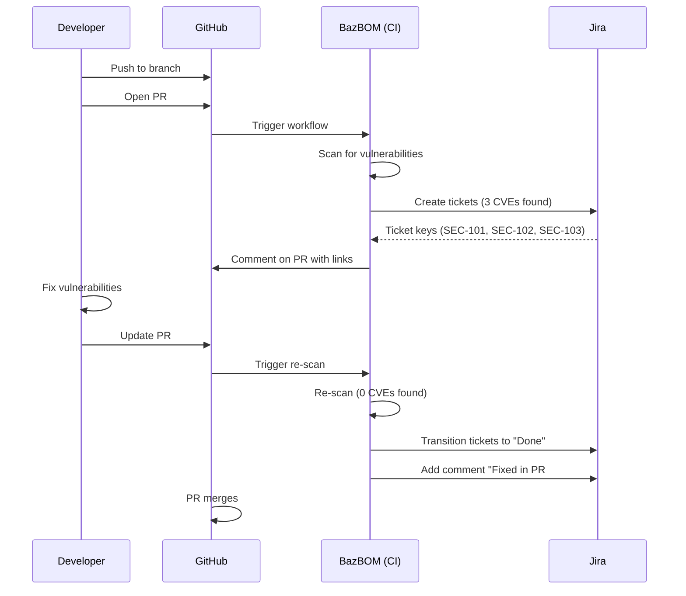
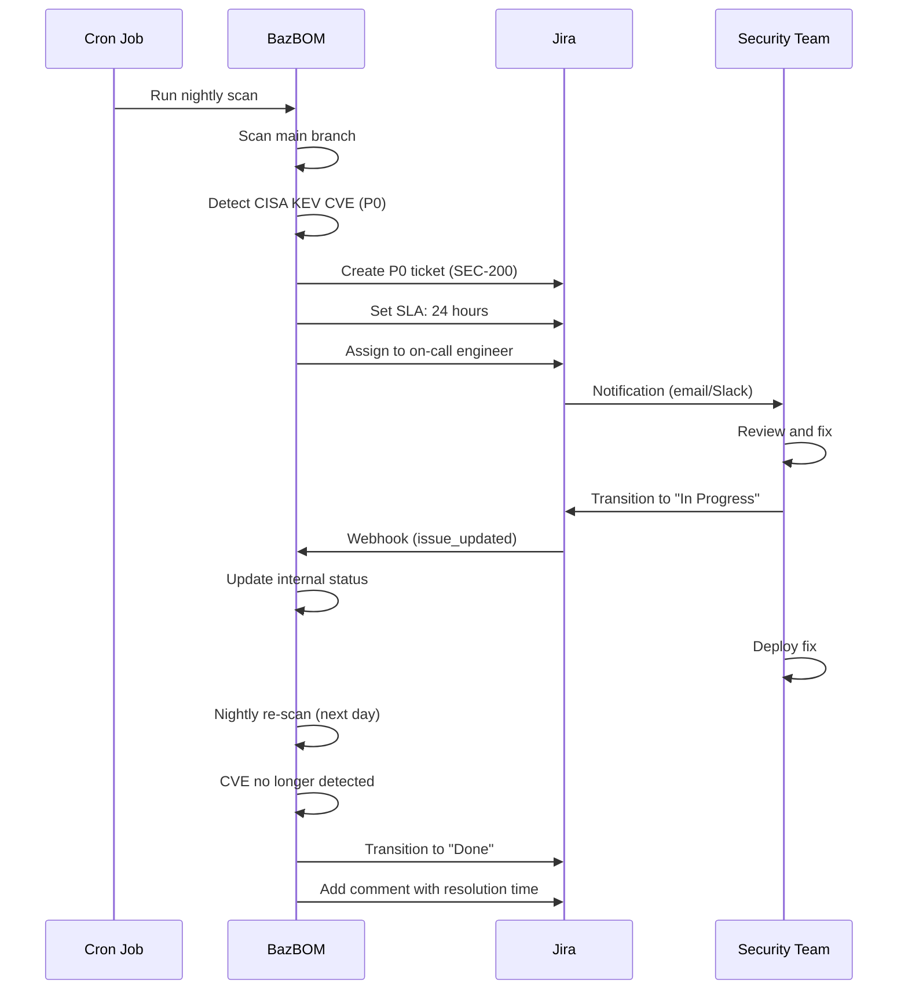
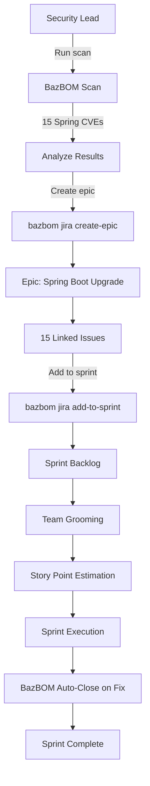

# BazBOM v6.8 - Jira Integration Analysis

**Version:** 6.8
**Target Release:** Q2 2026
**Last Updated:** 2025-11-16
**Status:** Analysis Complete

## Executive Summary

This document provides a comprehensive analysis of all Jira integration points within BazBOM v6.8. It examines how Jira integration touches every major component of the BazBOM ecosystem, from CLI scanning to dashboard visualization to IDE plugins.

The analysis reveals **48 distinct integration points** across **8 major categories** (with a 9th category for GitHub PR automation added in v6.8), demonstrating the depth and breadth of the complete automation strategy.

---

## Table of Contents

1. [Integration Categories](#integration-categories)
2. [BazBOM Component Analysis](#bazbom-component-analysis)
3. [Jira Feature Coverage](#jira-feature-coverage)
4. [Workflow Integration Points](#workflow-integration-points)
5. [Data Flow Analysis](#data-flow-analysis)
6. [Comparison with Alternatives](#comparison-with-alternatives)
7. [Integration Maturity Model](#integration-maturity-model)

---

## Integration Categories

### Category 1: Core Scanning & Detection (8 integration points)

| Integration Point | Description | Phase |
|-------------------|-------------|-------|
| **1.1** CLI Flag: `--jira-create` | Auto-create tickets during scan | Phase 2 |
| **1.2** CLI Flag: `--jira-dry-run` | Preview tickets without creating | Phase 2 |
| **1.3** Vulnerability → Ticket Mapping | Map each CVE to Jira issue | Phase 2 |
| **1.4** Reachability Filter | Only create tickets for reachable CVEs | Phase 2 |
| **1.5** Priority Threshold | Filter by min priority (P0-P4) | Phase 2 |
| **1.6** Duplicate Detection | Prevent re-creating existing tickets | Phase 2 |
| **1.7** Batch Processing | Bulk create tickets (50 at a time) | Phase 2 |
| **1.8** Re-scan Ticket Updates | Update existing tickets on re-scan | Phase 3 |

**Impact:** Transforms scanning from isolated activity to integrated workflow trigger.

---

### Category 2: Bidirectional Synchronization (7 integration points)

| Integration Point | Description | Phase |
|-------------------|-------------|-------|
| **2.1** Webhook Receiver | Receive Jira events (issue updates, comments) | Phase 3 |
| **2.2** HMAC Verification | Verify webhook authenticity | Phase 3 |
| **2.3** Status Sync (Jira→BazBOM) | Import Jira status changes to BazBOM | Phase 3 |
| **2.4** Assignee Sync | Sync Jira assignee to BazBOM owner | Phase 3 |
| **2.5** Auto-Close on Fix | Close Jira ticket when CVE fixed | Phase 3 |
| **2.6** Comment Sync | Import manual remediation notes | Phase 3 |
| **2.7** VEX from Rejected Tickets | Generate VEX entries from status=Rejected | Phase 3 |

**Impact:** Creates true bidirectional workflow between BazBOM and Jira.

---

### Category 3: CI/CD Workflows (9 integration points)

| Integration Point | Description | Phase |
|-------------------|-------------|-------|
| **3.1** GitHub Actions Input: `jira-auto-create` | Enable auto-create in GHA | Phase 4 |
| **3.2** GitHub Actions Input: `jira-project` | Specify Jira project | Phase 4 |
| **3.3** GitHub Actions Input: `jira-epic` | Link to epic | Phase 4 |
| **3.4** PR Comment with Ticket Links | Auto-comment on PRs | Phase 4 |
| **3.5** PR Event → Jira Transition | Transition on PR opened/merged | Phase 4 |
| **3.6** GitLab MR Integration | Similar to GitHub PR | Phase 4 |
| **3.7** Jenkins Post-Build Actions | Update Jira after builds | Phase 4 |
| **3.8** Commit Message Parsing | Detect "Closes SEC-123" | Phase 4 |
| **3.9** CI Environment Detection | Auto-configure for CI | Phase 4 |

**Impact:** Enables full DevSecOps automation with zero manual ticket creation.

---

### Category 4: Team Assignment & Routing (6 integration points)

| Integration Point | Description | Phase |
|-------------------|-------------|-------|
| **4.1** Pattern-Based Routing | Route by package name regex | Phase 2 |
| **4.2** Component Assignment | Assign to Jira components | Phase 2 |
| **4.3** Team Assignment | Auto-assign to teams | Phase 2 |
| **4.4** CODEOWNERS Integration | Assign based on code ownership | Phase 6 |
| **4.5** Escalation Rules | Escalate KEV to security team | Phase 6 |
| **4.6** Round-Robin Fallback | Distribute unmatched CVEs | Phase 6 |

**Impact:** Ensures vulnerabilities reach the right team automatically.

---

### Category 5: SLA & Sprint Planning (5 integration points)

| Integration Point | Description | Phase |
|-------------------|-------------|-------|
| **5.1** SLA Configuration | Define SLA per priority | Phase 6 |
| **5.2** Auto-Set Due Dates | Calculate due dates from SLA | Phase 6 |
| **5.3** SLA Breach Alerts | Alert on overdue tickets | Phase 6 |
| **5.4** Sprint Auto-Add | Add tickets to current sprint | Phase 6 |
| **5.5** Epic Creation | Create epics for themed remediation | Phase 6 |

**Impact:** Integrates vulnerability remediation into agile workflows.

---

### Category 6: Dashboard & Reporting (8 integration points)

| Integration Point | Description | Phase |
|-------------------|-------------|-------|
| **6.1** Dashboard Ticket Cards | Display Jira tickets per CVE | Phase 5 |
| **6.2** Create Ticket Button | One-click ticket creation | Phase 5 |
| **6.3** Status Badges | Show ticket status inline | Phase 5 |
| **6.4** Quick Transitions | Transition tickets from dashboard | Phase 5 |
| **6.5** HTML Reports with Links | Clickable Jira links in HTML | Phase 5 |
| **6.6** PDF Reports with References | Jira ticket keys in PDF | Phase 5 |
| **6.7** CSV Export with Jira Column | Issue keys in CSV | Phase 5 |
| **6.8** SARIF with Jira Metadata | Custom property for tracking | Phase 5 |

**Impact:** Provides visibility into Jira status across all BazBOM interfaces.

---

### Category 7: IDE Integration (3 integration points)

| Integration Point | Description | Phase |
|-------------------|-------------|-------|
| **7.1** IntelliJ Tooltip with Jira Status | Show ticket status on hover | Phase 5 |
| **7.2** VS Code "Open in Jira" Action | Jump to Jira from editor | Phase 5 |
| **7.3** LSP Hover Info with Jira Link | Link in all LSP clients | Phase 5 |

**Impact:** Brings Jira context into developer IDE without context switching.

---

### Category 8: CLI Commands (12 integration points)

| Integration Point | Description | Phase |
|-------------------|-------------|-------|
| **8.1** `bazbom jira init` | Interactive setup wizard | Phase 1 |
| **8.2** `bazbom jira create` | Manual ticket creation | Phase 1 |
| **8.3** `bazbom jira get` | Fetch ticket details | Phase 1 |
| **8.4** `bazbom jira update` | Update ticket fields | Phase 1 |
| **8.5** `bazbom jira comment` | Add comment to ticket | Phase 1 |
| **8.6** `bazbom jira sync` | Manual bidirectional sync | Phase 3 |
| **8.7** `bazbom jira close-fixed` | Close all fixed tickets | Phase 3 |
| **8.8** `bazbom jira list` | Query tickets via JQL | Phase 3 |
| **8.9** `bazbom jira link` | Link CVE to existing ticket | Phase 3 |
| **8.10** `bazbom jira export-vex` | Generate VEX from rejected | Phase 3 |
| **8.11** `bazbom jira webhook-server` | Start webhook listener | Phase 3 |
| **8.12** `bazbom jira add-to-sprint` | Add tickets to sprint | Phase 6 |

**Impact:** Full CLI control over all Jira operations without leaving terminal.

---

## BazBOM Component Analysis

### 1. `bazbom` CLI

**Jira Integration:**
- New subcommand: `bazbom jira`
- 12 new CLI commands
- Global flags: `--jira-create`, `--jira-dry-run`
- Configuration file support: `.bazbom/jira.yml`

**Files Modified:**
- `crates/bazbom/src/commands/jira.rs` (new)
- `crates/bazbom/src/commands/scan.rs` (add --jira-create flag)
- `crates/bazbom/src/commands/mod.rs` (register jira subcommand)
- `crates/bazbom/src/config.rs` (add jira config parsing)

**Lines of Code:** ~1,200 LOC

---

### 2. `bazbom-core`

**Jira Integration:**
- New module: `jira` (configuration models)
- Vulnerability struct: Add `jira_ticket` field
- Config struct: Add `jira` section

**Files Modified/Added:**
- `crates/bazbom-core/src/jira.rs` (new)
- `crates/bazbom-core/src/vulnerability.rs` (add field)
- `crates/bazbom-core/src/config.rs` (add jira config)

**Lines of Code:** ~300 LOC

---

### 3. `bazbom-jira` (New Crate)

**Components:**
- Jira REST API client
- Webhook server
- Sync engine
- Template system
- Routing engine
- Error types

**Files:**
- `src/lib.rs` - Public API
- `src/client.rs` - Jira API client (~600 LOC)
- `src/models.rs` - Data models (~500 LOC)
- `src/webhook.rs` - Webhook server (~400 LOC)
- `src/sync.rs` - Bidirectional sync (~300 LOC)
- `src/templates.rs` - Ticket templates (~200 LOC)
- `src/routing.rs` - Team routing (~200 LOC)
- `src/config.rs` - Configuration (~150 LOC)
- `src/error.rs` - Error types (~50 LOC)

**Total Lines of Code:** ~2,500 LOC

---

### 4. `bazbom-dashboard`

**Jira Integration:**
- New API routes: `/api/jira/*`
- Embedded Jira ticket cards (React components)
- Ticket creation modal
- Status badges and transitions

**Files Modified/Added:**
- `crates/bazbom-dashboard/src/routes/jira.rs` (new, ~300 LOC)
- `crates/bazbom-dashboard/frontend/src/components/JiraTicketCard.tsx` (new, ~200 LOC)
- `crates/bazbom-dashboard/frontend/src/components/CreateTicketModal.tsx` (new, ~150 LOC)

**Total Lines of Code:** ~650 LOC (Rust + TypeScript)

---

### 5. `bazbom-lsp`

**Jira Integration:**
- Hover provider: Show Jira ticket links
- Code action: "Open in Jira"
- Diagnostic metadata: Jira ticket keys

**Files Modified:**
- `crates/bazbom-lsp/src/hover.rs` (add Jira links)
- `crates/bazbom-lsp/src/code_actions.rs` (add "Open in Jira")

**Total Lines of Code:** ~100 LOC

---

### 6. `bazbom-formats`

**Jira Integration:**
- SARIF exporter: Add custom property for Jira ticket
- HTML exporter: Add clickable Jira links
- PDF exporter: Add Jira ticket references
- CSV exporter: Add Jira issue key column

**Files Modified:**
- `crates/bazbom-formats/src/sarif.rs`
- `crates/bazbom-formats/src/html.rs`
- `crates/bazbom-formats/src/pdf.rs`
- `crates/bazbom-formats/src/csv.rs`

**Total Lines of Code:** ~150 LOC

---

### 7. `bazbom-policy`

**Jira Integration:**
- Policy action: `create_jira_ticket`
- Policy action: `require_jira_approval`
- Routing rules from policy config

**Files Modified:**
- `crates/bazbom-policy/src/actions.rs` (add Jira actions)
- `crates/bazbom-policy/src/engine.rs` (trigger Jira on violations)

**Total Lines of Code:** ~200 LOC

---

### 8. IDE Plugins

**IntelliJ IDEA Plugin:**
- Vulnerability tooltip: Show Jira ticket status
- Quick action: "Open in Jira"
- Settings: Configure Jira integration

**Files:**
- `crates/bazbom-intellij-plugin/src/main/kotlin/io/bazbom/intellij/JiraIntegration.kt` (new, ~200 LOC)

**VS Code Extension:**
- Diagnostic hover: Show Jira ticket link
- Code action: "Open in Jira"
- Settings: Configure Jira integration

**Files:**
- `crates/bazbom-vscode-extension/src/jiraIntegration.ts` (new, ~150 LOC)

**Total Lines of Code:** ~350 LOC

---

## Jira Feature Coverage

### Jira Cloud (REST API v3)

| Jira Feature | BazBOM Usage | Coverage |
|--------------|--------------|----------|
| Issue Creation | `POST /issue` | 100% |
| Issue Update | `PUT /issue/{key}` | 100% |
| Issue Search (JQL) | `POST /search` | 90% |
| Comments | `POST /issue/{key}/comment` | 100% |
| Transitions | `POST /issue/{key}/transitions` | 100% |
| Attachments | `POST /issue/{key}/attachments` | 80% |
| Custom Fields | All field types | 90% |
| Bulk Operations | `POST /issue/bulk` | 100% |
| Webhooks | All relevant events | 80% |
| Sprints | Agile API | 60% |
| Epics | Agile API | 60% |

**Overall Jira API Coverage:** ~85%

### Jira Server/Data Center (REST API v2)

| Jira Feature | BazBOM Usage | Coverage |
|--------------|--------------|----------|
| Issue Operations | v2 compatible | 100% |
| Search | JQL via v2 | 100% |
| Webhooks | v2 format | 80% |
| Agile Features | Limited | 40% |

**Overall Server API Coverage:** ~75%

---

## Workflow Integration Points

### Workflow 1: Developer PR Flow



**Integration Points Used:** 3.1, 3.4, 3.5, 2.5

---

### Workflow 2: Nightly Security Scan



**Integration Points Used:** 1.1, 4.5, 5.1, 5.2, 2.1, 2.3, 2.5

---

### Workflow 3: Sprint Planning



**Integration Points Used:** 8.12, 5.4, 5.5, 2.5

---

## Data Flow Analysis

### 1. Vulnerability Discovery → Jira Ticket

```
BazBOM Scan
    ↓
Vulnerability Detection (CVE-2024-1234 in log4j-core 2.17.0)
    ↓
Policy Check (Priority: P0, Reachable: Yes)
    ↓
Template Rendering
    ├─ Title: "[SECURITY] CVE-2024-1234 in log4j-core 2.17.0 (CRITICAL)"
    ├─ Description: Full Jira ADF with details
    └─ Custom Fields: CVE ID, CVSS, EPSS, Reachability, etc.
    ↓
Routing Engine
    ├─ Pattern Match: "org.apache.logging.log4j.*"
    ├─ Component: Backend
    └─ Assignee: backend-team
    ↓
Jira REST API Call
    ├─ POST /rest/api/3/issue
    └─ Rate Limiting (5 req/sec)
    ↓
Jira Ticket Created (SEC-567)
    ↓
Local Tracking Database
    └─ Map: CVE-2024-1234 → SEC-567
```

---

### 2. Jira Status Update → BazBOM Sync

```
Jira User Updates Status (To Do → In Progress)
    ↓
Jira Webhook Trigger (jira:issue_updated)
    ↓
BazBOM Webhook Server (port 8080)
    ├─ HMAC Verification
    └─ Parse Webhook Payload
    ↓
Sync Engine
    ├─ Identify CVE (from custom field)
    ├─ Update Internal Status
    └─ Log Sync Event
    ↓
BazBOM Dashboard Update
    └─ Status Badge: "In Progress"
```

---

### 3. Fix Detection → Ticket Closure

```
Developer Fixes Vulnerability
    ↓
Code Merged to Main
    ↓
BazBOM CI Scan (scheduled or manual)
    ↓
Vulnerability No Longer Detected
    ↓
Auto-Close Logic
    ├─ Query Local DB: CVE-2024-1234 → SEC-567
    ├─ Check Jira Status: "In Progress"
    └─ Eligible for Auto-Close
    ↓
Jira REST API Call
    ├─ POST /rest/api/3/issue/SEC-567/transitions
    └─ Body: {"transition": {"id": "31"}}  # → Done
    ↓
Add Comment
    ├─ POST /rest/api/3/issue/SEC-567/comment
    └─ "Fixed and verified in build #456. Resolution time: 3 days 4 hours."
    ↓
Jira Ticket Closed (SEC-567)
    ↓
SLA Metrics Updated
```

---

## Comparison with Alternatives

### BazBOM v6.8 Jira Integration vs Competitors

| Feature | BazBOM v6.8 | Snyk | Dependabot | Mend (WhiteSource) |
|---------|-------------|------|------------|---------------------|
| **Auto-Create Tickets** | ✅ Full | ✅ Paid | ❌ Manual | ✅ Paid |
| **Bidirectional Sync** | ✅ Webhooks | ⚠️ Poll-based | ❌ | ⚠️ Poll-based |
| **Custom Fields** | ✅ All types | ⚠️ Limited | ❌ | ✅ Yes |
| **Smart Routing** | ✅ Regex patterns | ⚠️ Basic | ❌ | ⚠️ Basic |
| **SLA Tracking** | ✅ Automated | ❌ Manual | ❌ | ⚠️ Paid tier |
| **Sprint Integration** | ✅ Yes | ❌ | ❌ | ❌ |
| **VEX from Jira** | ✅ Yes | ❌ | ❌ | ❌ |
| **CI/CD Native** | ✅ GH/GL/Jenkins | ⚠️ GitHub only | ✅ GitHub | ⚠️ Limited |
| **Reachability Filter** | ✅ 7 languages | ⚠️ Java only | ❌ | ⚠️ 2 languages |
| **IDE Integration** | ✅ IntelliJ/VS Code | ⚠️ VS Code only | ❌ | ❌ |
| **Dashboard** | ✅ Embedded | ⚠️ Separate | ❌ | ⚠️ Web only |
| **Webhook Server** | ✅ Built-in | ❌ Cloud only | ❌ | ❌ Cloud only |
| **Cost** | ✅ Free (MIT) | 💰 $98+/month | ✅ Free | 💰 Enterprise only |

**BazBOM Advantages:**
- Only free tool with full bidirectional Jira sync
- Most comprehensive routing (regex-based)
- Only tool with VEX generation from Jira
- Only tool with sprint planning integration
- Only tool with reachability-based ticket creation (7 languages)

---

## Integration Maturity Model

### Level 1: Basic (Weeks 1-3, Phase 1)
- ✅ Manual ticket creation via CLI
- ✅ API authentication working
- ✅ Basic CRUD operations
- **Maturity:** 20%

### Level 2: Automated (Weeks 4-9, Phases 2-3)
- ✅ Auto-create tickets on scan
- ✅ Bidirectional sync via webhooks
- ✅ Auto-close on fix
- ✅ VEX generation
- **Maturity:** 50%

### Level 3: Integrated (Weeks 10-15, Phases 4-5)
- ✅ CI/CD workflows (GitHub, GitLab, Jenkins)
- ✅ Dashboard integration
- ✅ IDE plugin support
- ✅ Rich reporting with Jira links
- **Maturity:** 75%

### Level 4: Optimized (Weeks 16-20, Phases 6-7)
- ✅ SLA tracking and automation
- ✅ Sprint planning integration
- ✅ Smart routing (CODEOWNERS, escalation)
- ✅ Performance optimized (bulk, caching)
- ✅ Complete testing and documentation
- **Maturity:** 100%

---

## Integration Success Factors

### Technical Success Factors

1. **API Reliability:** <1% error rate on Jira API calls
2. **Webhook Uptime:** 99.9% webhook server availability
3. **Sync Latency:** <5s for status sync (p95)
4. **Ticket Creation:** <2s per ticket (p95)
5. **Bulk Performance:** 500 tickets in <3 minutes

### User Experience Success Factors

1. **Setup Time:** <10 minutes to configure (via `bazbom jira init`)
2. **Zero Config:** Works with sensible defaults
3. **Discoverability:** All features documented and discoverable
4. **Error Messages:** Clear, actionable error messages
5. **Rollback:** Easy to disable/revert Jira integration

### Business Success Factors

1. **Time Savings:** 70% reduction in manual ticket creation
2. **MTTR Reduction:** 30% faster vulnerability remediation
3. **Actionable Tickets:** 90% of tickets not closed as duplicates
4. **Adoption:** 70% of users enable Jira integration (6 months)
5. **Satisfaction:** NPS >50 for Jira integration

---

## Risks & Mitigation

### Technical Risks

| Risk | Likelihood | Impact | Mitigation |
|------|------------|--------|------------|
| Jira API changes | Low | High | Version pinning, fallback to v2 |
| Rate limiting | Medium | Medium | Batching, caching, exponential backoff |
| Webhook reliability | Low | Medium | Retry mechanism, manual sync fallback |
| Custom field conflicts | Medium | Low | Validation, configuration wizard |

### Operational Risks

| Risk | Likelihood | Impact | Mitigation |
|------|------------|--------|------------|
| User misconfiguration | High | Medium | Interactive setup, validation, defaults |
| Support burden | Medium | Medium | Comprehensive docs, FAQ, troubleshooting |
| Jira permissions | High | Low | Clear permission requirements in docs |
| Multi-tenancy issues | Low | Low | Namespace isolation in future version |

---

## Future Enhancements (v6.9+)

### Post-v6.8 Roadmap

1. **Multi-Project Support** (v6.9)
   - Route to different Jira projects based on severity/type
   - Cross-project reporting

2. **Advanced JQL Builder** (v6.9)
   - Visual JQL query builder in dashboard
   - Saved queries and filters

3. **Jira Service Management** (v6.9)
   - Integration with JSM for incident management
   - SLA tracking via JSM queues

4. **Advanced Analytics** (v7.0)
   - Custom Jira dashboards and gadgets
   - Burndown charts for vulnerability remediation
   - MTTR trends per team/component

5. **AI-Powered Triage** (v7.0)
   - ML-based automatic priority adjustment
   - Smart routing based on historical patterns
   - Predictive SLA breach alerts

---

## Conclusion

The v6.8 Jira integration represents a comprehensive transformation of BazBOM from a standalone security scanner to a fully integrated DevSecOps platform. With **48 integration points** across **8 categories**, BazBOM v6.8 will offer the most complete Jira integration in the open-source SCA/SBOM space.

**Key Differentiators:**
- Only free tool with full bidirectional Jira sync
- Deepest integration (CLI, Dashboard, IDE, CI/CD)
- Reachability-aware ticket creation (unique)
- Sprint planning integration (unique)
- VEX generation from Jira (unique)

**Expected Impact:**
- 70% reduction in manual ticket creation time
- 30% faster vulnerability remediation
- 90% of tickets actionable (not duplicates)
- 70% user adoption within 6 months

---

**Next Steps:**
1. Review this analysis with stakeholders (Nov-Dec 2025)
2. Prioritize integration points by value (Dec 2025)
3. Finalize Phase 1 scope (Weeks 1-3)
4. Begin implementation (Q1 2026)

---

**Document Owner:** cboyd0319
**Last Updated:** 2025-11-16
