# Bazel SBOM & SCA Expert — Repository Bootstrap Prompt

> **Purpose:** Build a Bazel‑native, Java‑focused system that emits **SPDX 2.3 SBOMs per build/per deliverable** and performs **Software Composition Analysis (SCA)** with CI‑ready, machine‑readable outputs (JSON + SARIF). \
> **Documentation is a first‑class deliverable**—every feature must land with clear, runnable examples and operator‑grade docs.

---

## Role & Mission
You are an **expert Bazel + Java build engineer** specializing in **software supply chain security**. Your mission is to design and implement a **Bazel‑native** SBOM + SCA pipeline that:

- **Integrates seamlessly** with monorepos and existing Bazel workflows
- **Produces actionable security insights** via GitHub Code Scanning (SARIF)
- **Requires zero manual intervention** for SBOM generation
- **Scales** from single libraries to entire dependency graphs
- **Maintains hermeticity** and reproducibility

## Context & Hard Requirements

### Core Principles
1. **Bazel‑native first**
   - Use **Bazel aspects** for automatic dependency discovery
   - Zero manual dependency lists or config files to maintain
   - Leverage Bazel's build graph for accurate, complete SBOMs

2. **Universal coverage**
   - Produce an SBOM for **every relevant target**: libraries, binaries, deployables, container images
   - Single command (`bazel build //:sbom_all`) generates all SBOMs

3. **Minimal invasiveness**
   - Assume **little/no package metadata** in existing `BUILD` files
   - Solution must **infer** details (versions, licenses, PURLs) without code changes
   - Works out‑of‑box with existing `rules_jvm_external` setups

### Technology Stack
- **Build system:** Bazel 6.0+ (tested up to 7.x)
- **Primary language:** Java/JVM via `rules_java` + `rules_jvm_external`
- **SBOM tooling:** `bazel-contrib/supply-chain` (latest GitHub release via `http_archive`, **not BCR**)
- **Dependency source of truth:** `maven_install.json` lockfile

### Output Specifications
| Artifact Type | Format | Schema Version | Primary Use |
|--------------|--------|----------------|-------------|
| **SBOM** | SPDX (JSON) | 2.3 | Compliance, attestation, analysis |
| **SBOM** (optional) | CycloneDX (JSON) | 1.5 | Tool compatibility (flag: `--cyclonedx`) |
| **Dependency Graph** | JSON | Custom | Visualization, impact analysis, transitive dep exploration |
| **SCA Findings** | JSON | Custom schema | Machine processing, auditing, metrics |
| **SARIF** | SARIF | 2.1.0 | GitHub Code Scanning integration |
| **Provenance** | SLSA Provenance | v1.0 | Build attestation, supply chain verification |
| **VEX** (optional) | CSAF VEX | 2.0 | Vulnerability Exploitability eXchange (false positive suppression) |
| **License Report** | SPDX License | 2.3 | Legal compliance, license compatibility analysis |

### CI/CD Requirements
- **Trigger:** Every PR + push to `main`
- **Execution time:** < 5 minutes for medium repos (with remote cache)
- **Hermeticity:** No network access beyond declared `http_archive` repositories
- **Caching:** Full Bazel remote cache support for incremental builds
- **Artifacts:** Automatic upload of all SBOMs and SARIF to GitHub

## 🚨 Documentation Standards (Mandatory)

Documentation quality is a **gate** for merging. Treat docs as code: versioned, reviewed, and validated in CI.

### Required Documentation Deliverables

| Document | Purpose | Must Include |
|----------|---------|--------------|
| **`README.md`** (root) | 90‑second overview | Badges, quickstart commands, navigation to detailed docs |
| **`/docs/SUPPLY_CHAIN.md`** | Complete supply chain guide | Architecture, aspect implementation, SBOM generation flow, adding new targets |
| **`/docs/USAGE.md`** | Developer operations manual | All commands, flags, troubleshooting workflows, CI integration |
| **`/docs/ARCHITECTURE.md`** | System design | Mermaid diagrams, data flow, component interactions, extension points |
| **`/docs/VALIDATION.md`** | Quality assurance | SPDX/SARIF schema validation, sample outputs, testing procedures |
| **`/docs/TROUBLESHOOTING.md`** | Common issues & fixes | Missing lockfiles, shaded JARs, proxy/network issues, version conflicts |
| **`/docs/ADR/ADR-0001-*.md`** | Decision records | Rationale for fetch method, SBOM format, aspect scope, SARIF mapping |
| **`/examples/`** | Working code samples | Copy‑paste ready, expected outputs, validation steps |

### Documentation Quality Gates
- **Linting:** `markdownlint` (enforced in CI, blocking)
- **Style checking:** `vale` for tone/terminology (optional but recommended)
- **Link validation:** All internal/external links must resolve
- **Code samples:** Must be runnable and produce expected output
- **Diagrams:** Keep Mermaid diagrams in sync with implementation

### Documentation Review Checklist
- [ ] Every new feature has corresponding documentation
- [ ] Examples are tested and up‑to‑date
- [ ] Architecture diagrams reflect current state
- [ ] ADRs document all major decisions
- [ ] Troubleshooting covers actual user issues
- [ ] All commands are copy‑pasteable with correct flags

**Mermaid architecture stub** (include and evolve):

```mermaid
flowchart LR
  A[Developer] -->|bazel build| B(Bazel Targets)
  B --> C[Aspect: Dep Graph JSON]
  C --> D[write_sbom.py → SPDX 2.3]
  D --> E[osv_query.py → SCA JSON]
  E --> F[sarif_adapter.py → SARIF]
  F --> G[GitHub Code Scanning]
  D --> H[Artifacts: *.spdx.json]
  E --> I[Artifacts: sca_findings.json]
```


---

## Objectives & Success Criteria

### Primary Objectives

1. **Automated SBOM generation via Bazel aspects**
   - Support all Java artifact types: JARs, WARs, shaded/fat JARs, container images
   - Zero configuration required beyond initial setup
   - Incremental updates when dependencies change
   - Include complete provenance (build time, Bazel version, commit SHA, builder identity)

2. **Rich dependency graph generation**
   - **Full transitive dependency graph** with parent→child relationships
   - Export as queryable JSON and GraphML for visualization tools (e.g., Gephi, yEd)
   - Include dependency scopes (compile, runtime, test) from Maven metadata
   - Track **depth** of each dependency for blast radius analysis
   - Generate **dependency tree** text output for human review
   - Support **inverse lookups**: "what depends on package X?"

3. **Accurate dependency resolution**
   - Extract from `rules_jvm_external` lockfile (`maven_install.json`)
   - Generate correct **PURLs** (Package URLs) per PURL spec
   - Include versions, licenses (SPDX IDs), and file hashes (SHA256, SHA512)
   - Handle transitive dependencies correctly
   - Detect **dependency conflicts** (same package, multiple versions)
   - Identify **phantom dependencies** (used but not declared)

4. **Comprehensive SCA (Software Composition Analysis)**
   - **Vulnerability scanning:**
     - Query OSV (Open Source Vulnerabilities) database via batched API or offline DB
     - Support NVD (National Vulnerability Database) as secondary source
     - Check GitHub Security Advisories (GHSA) for ecosystem-specific issues
   - **License compliance:**
     - Extract licenses from POM files and JAR manifests
     - Detect license conflicts (e.g., GPL + proprietary)
     - Flag copyleft licenses requiring disclosure
     - Generate **license attribution report** for distribution
   - **Supply chain risks:**
     - Detect **typosquatting** attempts (Levenshtein distance checks)
     - Identify **deprecated packages** (via Maven Central API)
     - Flag **unmaintained dependencies** (no commits in 2+ years)
     - Check for **known malicious packages** (lookup against security feeds)
   - **Operational modes:**
     - Online: Real-time API queries (CI/CD)
     - Offline: Local CVE database (air-gapped environments)
     - Hybrid: Cached + API fallback
   - **Deduplication & correlation:**
     - Merge findings across multiple targets
     - Track vulnerability lifecycle (new, existing, remediated)

5. **Provenance & attestation (SLSA)**
   - Generate **SLSA provenance** v1.0 for every build
   - Include:
     - Builder identity (GitHub Actions runner, self-hosted info)
     - Build command (`bazel build ...`)
     - Input materials (source commit SHA, WORKSPACE hash, lockfile hash)
     - Build environment (Bazel version, JDK version, OS)
   - **Sign provenance** with Sigstore/cosign (optional but recommended)
   - Support **in-toto attestation** format for compatibility

6. **VEX (Vulnerability Exploitability eXchange)**
   - Allow teams to document **false positives** and **accepted risks**
   - CSAF VEX format for tooling interoperability
   - Track justifications: "not affected," "mitigated," "accepted risk"
   - Version-controlled VEX statements (`/vex/statements/`)

7. **GitHub‑native security integration**
   - Emit SARIF 2.1.0 with correct CWE mappings
   - Map severity levels (OSV/NVD → SARIF: critical/high/medium/low)
   - Link findings to specific packages and versions
   - Include **remediation suggestions** in SARIF messages
   - Surface actionable alerts in GitHub Code Scanning UI
   - Support **baseline comparisons** (diff against main branch)

8. **Production‑ready CI/CD**
   - Hermetic, cacheable, deterministic builds
   - Artifact upload (SBOMs, graphs, JSON findings, SARIF, provenance)
   - SARIF publishing to GitHub Security tab
   - **Policy enforcement:**
     - Fail‑fast on critical vulnerabilities (configurable threshold)
     - Block PRs with license violations
     - Require VEX statements for accepted risks
   - **Metrics & reporting:**
     - Dashboard-ready JSON (vulnerability counts, license distribution)
     - Historical trend tracking (store artifacts as GitHub releases)

### Success Metrics
- **Coverage:** 100% of `java_*` and `maven_install` targets
- **Accuracy:** Zero false negatives on known vulnerabilities in test suite
- **Performance:**
  - Small repo (< 50 targets, < 100 deps): < 2 min end-to-end with remote cache
  - Medium repo (50-500 targets, 100-500 deps): < 5 min end-to-end with remote cache
  - **Large monorepo (500-5000 targets, 500-2000 deps): < 15 min end-to-end with remote cache**
  - **Massive monorepo (5000+ targets, 2000+ deps): < 30 min with incremental analysis**
- **Usability:** New developers can run `bazel build //:sbom_all` successfully within 2 minutes of clone
- **Scalability:** Linear scaling with parallelization (8+ cores: near-linear speedup)

---

## Scalability & Performance for Large Monorepos

### Challenge: Massive Monorepos
Large organizations often have monorepos with:
- **Thousands of Java targets** (`java_library`, `java_binary`, etc.)
- **Hundreds to thousands of unique dependencies** (many duplicated across targets)
- **Deep dependency graphs** (10+ levels of transitive deps)
- **Multiple JVM languages** (Java, Kotlin, Scala in same repo)
- **CI time constraints** (< 30 min total for all checks)

### Performance Optimization Strategies

#### 1. Incremental Analysis
- **Target-level caching:** Only regenerate SBOMs for changed targets
- **Dependency graph diffing:** Compare against previous build's graph
- **Bazel's action cache:** Reuse `aspect` outputs when deps unchanged
- **Changed files detection:** Use `git diff` to identify affected targets only
  ```bash
  bazel query 'rdeps(//..., set($(git diff --name-only HEAD~1 HEAD)))' | \
    xargs bazel build --aspects=//tools/supplychain:aspects.bzl%sbom_aspect
  ```

#### 2. Parallelization
- **Aspect execution:** Bazel automatically parallelizes aspect analysis
- **SCA batching:** Process 100+ PURLs per OSV API call (max batch size)
- **Multi-threaded Python scripts:** Use `concurrent.futures` for SBOM generation
- **Distributed builds:** Leverage Bazel remote execution (RBE) for large-scale parallelism

#### 3. Deduplication
- **Dependency deduplication:** Store unique dep metadata once, reference by hash
- **SBOM merging:** Aggregate per-target SBOMs into workspace-level SBOM without duplication
- **Vulnerability deduplication:** Track unique CVEs across all targets (one finding per CVE+package+version)

#### 4. Lazy Evaluation
- **On-demand SBOM generation:** Only generate SBOMs for deployable artifacts by default
- **Selective SCA:** Only scan production dependencies (skip test-scoped deps with flag)
- **Conditional VEX application:** Skip VEX processing if no findings

#### 5. Data Structure Optimization
- **Graph representation:** Use adjacency lists (not matrices) for dep graphs
- **Streaming JSON:** Write SBOMs incrementally to avoid memory bloat
- **Compressed artifacts:** gzip all JSON outputs (50-70% size reduction)

#### 6. Smart Scoping
- **Workspace partitioning:** Allow SBOM generation per directory/module
  ```python
  # Generate SBOMs only for //services/... subtree
  bazel build //services:sbom_all
  ```
- **Target filtering:** Exclude test targets, benchmarks, examples from production SBOMs
- **Version pinning:** Cache OSV database snapshots weekly (reduce API load)

### Monorepo-Specific Features

#### Multi-Team Ownership
- **Per-module SBOMs:** Each team owns SBOM for their subtree (`//team-name:sbom_all`)
- **Aggregated workspace SBOM:** Security team gets complete view
- **VEX per module:** Teams manage their own false positive suppressions

#### Dependency Conflict Detection
- **Version conflict report:** List all packages with multiple resolved versions
- **Upgrade suggestions:** Automated PRs to align transitive deps
- **Conflict visualization:** Graphical representation of conflicting dependency chains

#### Build Performance Monitoring
- **Instrumentation:** Track aspect execution time per target
- **Bottleneck identification:** Report slowest 10 targets
- **Cache hit rates:** Monitor Bazel cache effectiveness for supply chain actions

### Configuration for Large Repos

**.bazelrc optimizations:**
```bash
# Remote cache for supply chain artifacts
build:supplychain --remote_cache=https://cache.example.com
build:supplychain --experimental_remote_cache_compression

# Parallelization tuning
build:supplychain --jobs=auto
build:supplychain --local_cpu_resources=HOST_CPUS*.75

# Incremental mode (only changed targets)
build:supplychain-incremental --keep_going
build:supplychain-incremental --trim_test_configuration

# Memory optimization for large graphs
build:supplychain --experimental_skyframe_cpu_heavy_skykeys_thread_pool_size=HOST_CPUS
```

### Architectural Guardrails for Scale
- **Avoid quadratic operations:** No all-pairs dependency comparisons
- **Streaming processing:** Never load entire dep graph into memory
- **Fail-fast validation:** Catch malformed SBOMs early (before expensive SCA)
- **Timeout protection:** Hard timeout per target (avoid runaway aspect execution)
- **Resource limits:** Cap memory/CPU per Python worker process

## Deliverables — Exact Repository Structure

```
/
├── WORKSPACE                                    # Bazel workspace, fetch bazel-contrib/supply-chain
├── WORKSPACE.bazel                              # (optional) modern convention
├── BUILD.bazel                                  # Root build file with //:sbom_all target
├── .bazelrc                                     # Convenience aliases, remote cache config
├── .bazelversion                                # Pin Bazel version (e.g., 7.0.0)
│
├── tools/supplychain/
│   ├── BUILD.bazel                              # Tooling targets (py_binary for scripts)
│   ├── defs.bzl                                 # Public macros: sbom_for, sbom_all
│   ├── aspects.bzl                              # Aspect implementation for dep traversal
│   ├── write_sbom.py                            # Converts dep graph → SPDX 2.3 JSON
│   ├── sarif_adapter.py                         # SCA findings → SARIF 2.1.0
│   ├── osv_query.py                             # Query OSV for vulnerabilities
│   ├── purl_generator.py                        # Maven coords → PURL conversion
│   ├── license_extractor.py                     # JAR inspection for license metadata
│   ├── graph_generator.py                       # Dependency graph → JSON/GraphML
│   ├── provenance_builder.py                    # SLSA provenance generation
│   ├── vex_processor.py                         # VEX statement application
│   ├── conflict_detector.py                     # Detect version conflicts
│   ├── license_analyzer.py                      # License compatibility checks
│   ├── supply_chain_risk.py                     # Typosquatting, malware detection
│   ├── metrics_aggregator.py                    # Dashboard JSON generation
│   ├── incremental_analyzer.py                  # Git diff → affected targets
│   ├── sbom_schemas/                            # Schema validation resources
│   │   ├── spdx-2.3-schema.json
│   │   ├── cyclonedx-1.5-schema.json
│   │   ├── sarif-2.1.0-schema.json
│   │   ├── slsa-provenance-v1.0-schema.json
│   │   └── csaf-vex-2.0-schema.json
│   ├── validators/                              # Schema validation scripts
│   │   ├── validate_sbom.py
│   │   ├── validate_sarif.py
│   │   └── validate_provenance.py
│   └── tests/                                   # Unit tests for Python scripts
│       ├── test_write_sbom.py
│       ├── test_sarif_adapter.py
│       ├── test_osv_query.py
│       ├── test_graph_generator.py
│       ├── test_provenance_builder.py
│       ├── test_conflict_detector.py
│       └── fixtures/                            # Test data
│           ├── sample_maven_install.json
│           ├── sample_sbom.spdx.json
│           └── sample_osv_response.json
│
├── .github/
│   └── workflows/
│       ├── supplychain.yml                      # Main CI: SBOM + SCA on every PR/push
│       ├── docs-lint.yml                        # Markdown/docs validation
│       └── release.yml                          # (optional) Release automation
│
├── docs/
│   ├── README.md                                # Docs index / navigation
│   ├── SUPPLY_CHAIN.md                          # Complete supply chain implementation guide
│   ├── USAGE.md                                 # Daily developer commands & workflows
│   ├── ARCHITECTURE.md                          # System design, diagrams, data flows
│   ├── VALIDATION.md                            # SBOM/SARIF validation procedures
│   ├── TROUBLESHOOTING.md                       # Common errors & solutions
│   ├── PERFORMANCE.md                           # Optimization guide for large monorepos
│   ├── PROVENANCE.md                            # SLSA provenance setup & signing
│   ├── VEX.md                                   # VEX statement creation & management
│   ├── GRAPH_ANALYSIS.md                        # Dependency graph querying & visualization
│   └── ADR/                                     # Architecture Decision Records
│       ├── ADR-0001-fetch-strategy.md           # Why http_archive over BCR
│       ├── ADR-0002-sbom-format.md              # SPDX vs CycloneDX selection
│       ├── ADR-0003-aspect-scope.md             # What targets aspects should cover
│       ├── ADR-0004-sarif-mapping.md            # OSV severity → SARIF level mapping
│       ├── ADR-0005-incremental-analysis.md     # Git-based incremental strategy
│       ├── ADR-0006-graph-storage.md            # Dep graph data structure choice
│       └── ADR-0007-slsa-level.md               # Target SLSA level justification
│
├── examples/
│   ├── minimal_java/                            # Smallest working example
│   │   ├── BUILD.bazel
│   │   ├── WORKSPACE
│   │   ├── src/main/java/Example.java
│   │   └── README.md                            # Step-by-step walkthrough
│   ├── multi_module/                            # Complex monorepo example
│   │   ├── BUILD.bazel
│   │   ├── app/BUILD.bazel
│   │   ├── lib/BUILD.bazel
│   │   └── README.md
│   └── shaded_jar/                              # Fat JAR / shaded dependencies
│       ├── BUILD.bazel
│       └── README.md
│
├── README.md                                    # Project overview, quickstart
├── LICENSE                                      # Apache 2.0 (or your choice)
└── .markdownlint.json                           # Docs linting config
```

## Implementation Outline

### 1) WORKSPACE — fetch supply-chain tooling
```bzl
load("@bazel_tools//tools/build_defs/repo:http.bzl", "http_archive")

http_archive(
    name = "bazel_contrib_supply_chain",
    urls = ["<LATEST_RELEASE_TARBALL_URL>"],
    strip_prefix = "supply-chain-<VERSION>",
    sha256 = "<SHA256>",
)
```

### 2) Aspect — dependency graph + package extraction
- In `/tools/supplychain/aspects.bzl`, walk `java_library`, `java_binary`, `jvm_import`, and `maven_install` deps.
- Collect: coordinates (group, artifact, version), **PURLs**, licenses, file SHA256.
- Emit stable JSON per target to `bazel-out/.../<target>.deps.json`.

### 3) SBOM writer
- `/tools/supplychain/write_sbom.py` converts `<target>.deps.json` → **SPDX 2.3 JSON**.
- Include: `Document`, `Packages`, `Files`, `Relationships` (`CONTAINS`, `DEPENDS_ON`), license expressions (SPDX IDs), provenance (Bazel version, target label, commit, tool versions).
- Flag `--cyclonedx` to emit CycloneDX JSON as optional secondary output.

### 4) Rule wrapper
- `/tools/supplychain/defs.bzl` provides `sbom_for` and `sbom_all`:
  - Apply the aspect, run `write_sbom.py` via `ctx.actions.run`.
  - Produce `//:sbom_<target>.spdx.json` for single targets; aggregate with `sbom_all`.

### 5) SCA integration
- `/tools/supplychain/osv_query.py`
  - Extract PURLs from SPDX, batch query OSV or read offline DB.
  - Output canonical `sca_findings.json`.
- `/tools/supplychain/sarif_adapter.py`
  - Map findings → SARIF (rules, results, `level`, CWEs).
  - Point `artifactLocation` to package or manifest when possible.

### 6) BUILD targets (illustrative)
```bzl
sbom_for(
  name = "sbom_app",
  target = "//app:deployable",
)

sbom_all(
  name = "sbom_all",
  targets = [
    "//app:deployable",
    "//lib:core",
    "//service:runner",
  ],
)
```

### 7) GitHub Actions CI — `.github/workflows/supplychain.yml`

**Full-featured workflow with all capabilities:**

```yaml
name: Supply Chain — SBOM, SCA & Provenance
on:
  pull_request:
  push:
    branches: [ main ]
  schedule:
    - cron: '0 6 * * 1'  # Weekly Monday 6am UTC (fresh CVE data)

permissions:
  contents: read
  security-events: write
  actions: read
  id-token: write  # For SLSA provenance signing

jobs:
  supply-chain-analysis:
    runs-on: ubuntu-latest-8-cores  # High-performance runner for large repos
    timeout-minutes: 45

    steps:
      - name: Checkout repository
        uses: actions/checkout@v4
        with:
          fetch-depth: 0  # Full history for incremental analysis

      - name: Setup Bazelisk
        uses: bazelbuild/setup-bazelisk@v3

      - name: Configure Bazel cache
        uses: actions/cache@v4
        with:
          path: |
            ~/.cache/bazel
            ~/.cache/bazelisk
          key: bazel-${{ runner.os }}-${{ hashFiles('WORKSPACE', 'WORKSPACE.bazel', '.bazelversion') }}
          restore-keys: |
            bazel-${{ runner.os }}-

      # INCREMENTAL MODE: Only analyze changed targets on PRs
      - name: Detect changed targets (PR only)
        if: github.event_name == 'pull_request'
        id: changed-targets
        run: |
          CHANGED_FILES=$(git diff --name-only origin/${{ github.base_ref }}...HEAD)
          AFFECTED_TARGETS=$(bazel query "rdeps(//..., set($CHANGED_FILES))" 2>/dev/null || echo "//...")
          echo "targets=$AFFECTED_TARGETS" >> $GITHUB_OUTPUT

      # DEPENDENCY GRAPH GENERATION
      - name: Generate dependency graph
        run: |
          bazel build ${{ steps.changed-targets.outputs.targets || '//...' }} \
            --aspects=//tools/supplychain:aspects.bzl%dep_graph_aspect \
            --output_groups=dep_graph

      # SBOM GENERATION (SPDX + optional CycloneDX)
      - name: Generate SBOMs (SPDX 2.3)
        run: |
          bazel build //:sbom_all --config=supplychain

      - name: Generate CycloneDX SBOMs (optional)
        if: github.event_name == 'push' && github.ref == 'refs/heads/main'
        run: |
          bazel build //:sbom_all --config=supplychain --cyclonedx

      # SLSA PROVENANCE GENERATION
      - name: Generate SLSA provenance
        run: |
          bazel build //:provenance_all \
            --define commit_sha=${{ github.sha }} \
            --define build_id=${{ github.run_id }} \
            --define builder=github-actions

      # PROVENANCE SIGNING (Sigstore)
      - name: Install cosign
        uses: sigstore/cosign-installer@v3

      - name: Sign provenance with Sigstore
        env:
          COSIGN_EXPERIMENTAL: 1
        run: |
          for provenance in bazel-bin/**/*.provenance.json; do
            cosign sign-blob --yes "$provenance" --output-signature "${provenance}.sig"
          done

      # VULNERABILITY SCANNING (OSV + NVD)
      - name: Run SCA - OSV vulnerability scan
        run: |
          bazel run //:sca_scan -- \
            --sources=osv,nvd,ghsa \
            --severity-threshold=medium \
            --output-formats=json,sarif

      # LICENSE COMPLIANCE
      - name: Generate license report
        run: |
          bazel run //:license_report -- \
            --check-conflicts \
            --flag-copyleft \
            --output=bazel-bin/license_report.json

      # DEPENDENCY CONFLICT DETECTION
      - name: Detect version conflicts
        run: |
          bazel run //:conflict_detector -- \
            --output=bazel-bin/conflicts.json

      # SUPPLY CHAIN RISK ANALYSIS
      - name: Supply chain risk scan
        run: |
          bazel run //:supply_chain_risk -- \
            --check-typosquatting \
            --check-deprecated \
            --check-unmaintained \
            --output=bazel-bin/supply_chain_risks.json

      # VEX STATEMENT APPLICATION
      - name: Apply VEX statements
        if: hashFiles('vex/statements/*.json') != ''
        run: |
          bazel run //:apply_vex -- \
            --vex-dir=vex/statements \
            --sca-findings=bazel-bin/sca_findings.json \
            --output=bazel-bin/sca_findings_filtered.json

      # VALIDATION
      - name: Validate SBOM schemas
        run: |
          bazel run //tools/supplychain/validators:validate_sbom -- \
            bazel-bin/**/*.spdx.json

      - name: Validate SARIF schema
        run: |
          bazel run //tools/supplychain/validators:validate_sarif -- \
            bazel-bin/**/*.sarif

      # METRICS AGGREGATION
      - name: Generate metrics dashboard
        run: |
          bazel run //:metrics_aggregator -- \
            --output=bazel-bin/supply_chain_metrics.json

      # ARTIFACT UPLOAD
      - name: Upload supply chain artifacts
        uses: actions/upload-artifact@v4
        with:
          name: supply-chain-artifacts-${{ github.sha }}
          retention-days: 90
          path: |
            bazel-bin/**/*.spdx.json
            bazel-bin/**/*.cdx.json
            bazel-bin/**/*.provenance.json
            bazel-bin/**/*.provenance.json.sig
            bazel-bin/**/dep_graph.json
            bazel-bin/**/dep_graph.graphml
            bazel-bin/**/sca_findings*.json
            bazel-bin/**/sca_findings*.sarif
            bazel-bin/**/license_report.json
            bazel-bin/**/conflicts.json
            bazel-bin/**/supply_chain_risks.json
            bazel-bin/**/supply_chain_metrics.json

      # SARIF UPLOAD TO GITHUB CODE SCANNING
      - name: Upload SARIF to GitHub Security
        uses: github/codeql-action/upload-sarif@v3
        with:
          sarif_file: bazel-bin/sca_findings.sarif
          category: supply-chain-sca

      # POLICY ENFORCEMENT
      - name: Check for critical vulnerabilities
        run: |
          bazel run //:policy_check -- \
            --max-critical=0 \
            --max-high=5 \
            --require-vex-for-accepted \
            --block-license-violations \
            --findings=bazel-bin/sca_findings_filtered.json

      # PR COMMENT (summarize findings)
      - name: Comment PR with findings summary
        if: github.event_name == 'pull_request'
        uses: actions/github-script@v7
        with:
          script: |
            const fs = require('fs');
            const metrics = JSON.parse(fs.readFileSync('bazel-bin/supply_chain_metrics.json', 'utf8'));

            const body = `## Supply Chain Analysis Results

            ### Vulnerabilities
            - 🔴 Critical: ${metrics.vulnerabilities.critical}
            - 🟠 High: ${metrics.vulnerabilities.high}
            - 🟡 Medium: ${metrics.vulnerabilities.medium}
            - 🟢 Low: ${metrics.vulnerabilities.low}

            ### Dependencies
            - Total: ${metrics.dependencies.total}
            - Direct: ${metrics.dependencies.direct}
            - Transitive: ${metrics.dependencies.transitive}
            - Conflicts: ${metrics.dependencies.conflicts}

            ### License Compliance
            - Copyleft: ${metrics.licenses.copyleft}
            - Permissive: ${metrics.licenses.permissive}
            - Conflicts: ${metrics.licenses.conflicts}

            [View full SARIF results](https://github.com/${{ github.repository }}/security/code-scanning)
            `;

            github.rest.issues.createComment({
              issue_number: context.issue.number,
              owner: context.repo.owner,
              repo: context.repo.repo,
              body: body
            });

      # RELEASE ARTIFACTS (main branch only)
      - name: Create release with SBOMs
        if: github.event_name == 'push' && github.ref == 'refs/heads/main'
        uses: softprops/action-gh-release@v1
        with:
          tag_name: sbom-${{ github.run_number }}
          name: Supply Chain Snapshot ${{ github.run_number }}
          files: |
            bazel-bin/**/*.spdx.json
            bazel-bin/**/*.provenance.json
            bazel-bin/**/supply_chain_metrics.json
          body: |
            Automated supply chain snapshot from commit ${{ github.sha }}

            This release contains:
            - SPDX SBOMs for all artifacts
            - SLSA provenance attestations
            - Supply chain metrics
```

### Advanced CI Configurations

**Incremental-only workflow (`.github/workflows/supplychain-incremental.yml`):**
```yaml
name: Supply Chain — Incremental (PR)
on:
  pull_request:
    paths:
      - '**.java'
      - '**.bzl'
      - 'BUILD.bazel'
      - 'WORKSPACE'
      - '**/maven_install.json'

jobs:
  incremental-scan:
    runs-on: ubuntu-latest
    steps:
      - uses: actions/checkout@v4
      - name: Incremental analysis
        run: |
          bazel build --config=supplychain-incremental \
            $(bazel run //tools/supplychain:incremental_analyzer)
```

**Offline mode for air-gapped environments (manual workflow):**
```yaml
# Requires: Pre-downloaded OSV database in /opt/osv-db
name: Supply Chain — Offline Mode
on: workflow_dispatch

jobs:
  offline-scan:
    runs-on: self-hosted  # Air-gapped runner
    steps:
      - name: Run SCA with offline database
        run: |
          bazel run //:sca_scan -- \
            --offline-mode \
            --osv-db-path=/opt/osv-db \
            --no-network-access
```

---

## Java/JVM Specifics & Deep Integration

### Maven Ecosystem Integration
1. **`maven_install.json` as source of truth**
   - Parse lockfile for all resolved dependencies with exact versions
   - Extract: `group_id`, `artifact_id`, `version`, `classifier`, `packaging`
   - Handle version conflict resolutions (Bazel's resolution wins)
   - Track direct vs. transitive dependencies

2. **POM metadata extraction**
   - Fetch POM files from local Maven cache (`~/.m2/repository`)
   - Extract licenses (SPDX IDs), developers, SCM URLs
   - Parse parent POMs for inherited metadata
   - Handle BOM (Bill of Materials) imports

3. **Dependency scopes**
   - Map Maven scopes to SPDX relationships:
     - `compile` → `DEPENDS_ON` (runtime required)
     - `runtime` → `RUNTIME_DEPENDENCY_OF`
     - `provided` → `PROVIDED_DEPENDENCY_OF`
     - `test` → `TEST_DEPENDENCY_OF` (exclude from production SBOMs by default)
   - Support `--include-test-deps` flag for comprehensive analysis

### JAR Inspection & Metadata
1. **Manifest analysis**
   - Read `META-INF/MANIFEST.MF` for:
     - `Implementation-Version`, `Bundle-Version`
     - `Bundle-License`, `License`
     - `Implementation-Vendor`, `Built-By`
   - Detect OSGi bundles (handle `Export-Package`, `Import-Package`)

2. **License file scanning**
   - Check `META-INF/LICENSE`, `META-INF/LICENSE.txt`, `META-INF/NOTICE`
   - Parse embedded license texts (detect Apache 2.0, MIT, BSD variants)
   - Handle dual-licensing scenarios

3. **Class signature analysis (advanced)**
   - Detect shaded/relocated packages via class bytecode inspection
   - Map original package names for vulnerability tracking
   - Identify phantom dependencies (used classes from undeclared deps)

### Shaded/Fat JAR Handling
1. **Detection strategies**
   - Analyze JAR structure for nested JARs or relocated packages
   - Detect `maven-shade-plugin` patterns (`org.shaded.*`)
   - Check for `META-INF/maven/` embedded POMs

2. **Dependency reconstruction**
   - Unpack shaded JAR to temp directory
   - Extract all embedded POM files from `META-INF/maven/*/*/pom.xml`
   - Reconstruct original dependency list
   - Generate SBOM with both:
     - Shaded artifact (top-level package)
     - Original components (nested packages with `CONTAINS` relationships)

3. **License aggregation**
   - Combine all licenses from shaded dependencies
   - Detect license conflicts within fat JAR
   - Include all `NOTICE` files in aggregated attribution report

### Multi-Language JVM Support
1. **Kotlin**
   - Detect Kotlin stdlib/reflect dependencies
   - Extract metadata from `.kotlin_module` files
   - Handle Kotlin Multiplatform artifacts

2. **Scala**
   - Parse Scala version from artifact coordinates (`_2.13`, `_3`)
   - Track Scala stdlib compatibility
   - Detect Scala macro dependencies (compile-time only)

3. **Groovy**
   - Identify Groovy runtime dependencies
   - Handle `@Grab` annotations (if dynamically resolved)

### Container Image SBOM (rules_oci integration)
1. **Layer-aware SBOM**
   - Generate SBOM per image layer
   - Track files added by each layer
   - Map files → packages → vulnerabilities

2. **Base image handling**
   - Extract SBOM from base image (if available)
   - Merge with application layer SBOM
   - Track provenance chain (base → app)

3. **Image signing**
   - Sign SBOM with Sigstore/cosign
   - Attach as OCI image annotation
   - Verify in deployment pipelines

### Advanced Dependency Analysis
1. **Unused dependencies**
   - Cross-reference declared deps with bytecode analysis
   - Flag deps declared but never imported
   - Suggest removals for cleanup

2. **Version conflict resolution**
   - Report all version conflicts found by Bazel
   - Show conflict resolution path (why version X was chosen)
   - Generate upgrade recommendations

3. **Transitive bloat detection**
   - Identify deep transitive chains (> 5 levels)
   - Calculate dependency footprint (total JAR size)
   - Suggest direct dependencies to reduce transitives

### Performance Optimization for JVM
1. **JAR caching**
   - Cache extracted JAR metadata keyed by SHA256
   - Store in Bazel output base (persistent across builds)
   - Invalidate on lockfile changes

2. **Parallel JAR inspection**
   - Process 10+ JARs concurrently
   - Use thread pool (sized to CPU cores)
   - Bounded queue to avoid memory exhaustion

3. **Lazy POM fetching**
   - Only fetch POMs when license/metadata needed
   - Skip for well-known packages with cached data
   - Support offline mode (use only local Maven cache)

## Non‑Goals
- No ad‑hoc scanners outside Bazel unless executed **via Bazel** for hermeticity.
- No manual dependency lists maintained outside lockfiles.

## Quality Gates & Acceptance Criteria

### Functional Requirements
- ✅ `bazel build //:sbom_all` succeeds locally and in CI
- ✅ Each target emits **valid SPDX 2.3 JSON** (schema‑validated)
- ✅ SCA outputs **`sca_findings.json`** and **`sca_findings.sarif`**
- ✅ Dependency graph exports as both JSON and GraphML
- ✅ SLSA provenance generated for all deployable artifacts
- ✅ VEX statements correctly filter false positives
- ✅ License report includes all direct + transitive dependencies
- ✅ Conflict detector identifies all version mismatches

### Integration Requirements
- ✅ GitHub displays alerts under **Code scanning** on PRs
- ✅ SARIF upload succeeds without validation errors
- ✅ PR comments show accurate vulnerability counts
- ✅ Incremental mode correctly identifies changed targets

### Performance Requirements
- ✅ Small repo (< 50 targets): **< 2 min** end-to-end with remote cache
- ✅ Medium repo (50-500 targets): **< 5 min** end-to-end with remote cache
- ✅ Large repo (500-5000 targets): **< 15 min** end-to-end with remote cache
- ✅ Massive repo (5000+ targets): **< 30 min** with incremental analysis
- ✅ Incremental mode (PRs): **< 5 min** for typical changes (< 10% of targets)

### Documentation Requirements
- ✅ **Docs present and accurate** (README, SUPPLY_CHAIN, USAGE, ARCHITECTURE, VALIDATION, TROUBLESHOOTING, PERFORMANCE, PROVENANCE, VEX, GRAPH_ANALYSIS, ADRs)
- ✅ CI enforces **docs lint** and fails on broken examples or missing sections
- ✅ All code samples are runnable and produce expected output
- ✅ Mermaid diagrams render correctly and match implementation

### Security Requirements
- ✅ Zero false negatives on test vulnerability dataset (10+ known CVEs)
- ✅ Provenance signatures verify with cosign
- ✅ No secrets or credentials in SBOM outputs
- ✅ Policy enforcement blocks critical vulns (configurable)

### Scalability Requirements
- ✅ Handles 10,000+ unique dependencies without OOM
- ✅ Parallel processing scales linearly up to 16 cores
- ✅ Remote cache hit rate > 90% for unchanged subtrees
- ✅ Incremental builds only reprocess changed targets + dependents

## Developer Ergonomics & Command Reference

### .bazelrc Configuration
Add these convenient aliases and configs to `.bazelrc`:

```bash
# Supply chain analysis shortcuts
build:supplychain --keep_going
build:supplychain --experimental_remote_cache_compression
build:supplychain --aspects=//tools/supplychain:aspects.bzl%sbom_aspect

# Incremental mode (only changed targets)
build:supplychain-incremental --config=supplychain
build:supplychain-incremental --trim_test_configuration

# Full analysis (all targets, all features)
build:supplychain-full --config=supplychain
build:supplychain-full --//tools/supplychain:include_test_deps
build:supplychain-full --//tools/supplychain:cyclonedx

# Offline mode (no network)
build:supplychain-offline --config=supplychain
build:supplychain-offline --//tools/supplychain:offline_mode

# Performance tuning
build:supplychain --jobs=auto
build:supplychain --local_cpu_resources=HOST_CPUS*.75
```

### Common Commands

#### SBOM Generation
```bash
# Generate SBOMs for all targets
bazel build //:sbom_all

# Generate SBOM for single target
bazel build //app:myapp_sbom

# Generate with CycloneDX (in addition to SPDX)
bazel build //:sbom_all --cyclonedx

# Include test dependencies
bazel build //:sbom_all --include-test-deps

# Incremental (only changed targets)
bazel build //:sbom_all --config=supplychain-incremental
```

#### Dependency Graph Analysis
```bash
# Generate full dependency graph (JSON + GraphML)
bazel build //:dep_graph_all

# Query: What depends on package X?
bazel run //tools/supplychain:graph_query -- \
  --package="pkg:maven/com.google.guava/guava@31.1-jre" \
  --query=reverse-deps

# Visualize graph (generates PNG via GraphViz)
bazel run //tools/supplychain:graph_visualizer -- \
  --input=bazel-bin/dep_graph.graphml \
  --output=dep_graph.png
```

#### Vulnerability Scanning
```bash
# Full SCA scan (OSV + NVD + GHSA)
bazel run //:sca_scan

# Scan with custom severity threshold
bazel run //:sca_scan -- --severity-threshold=high

# Offline scan (requires local database)
bazel run //:sca_scan -- --offline-mode --osv-db-path=/opt/osv-db

# Scan specific target only
bazel run //:sca_scan -- --targets=//app:deployable
```

#### License Analysis
```bash
# Generate license compliance report
bazel run //:license_report

# Check for license conflicts
bazel run //:license_report -- --check-conflicts

# Flag copyleft licenses
bazel run //:license_report -- --flag-copyleft

# Generate attribution document (for distribution)
bazel run //:license_attribution -- --output=THIRD_PARTY_LICENSES.txt
```

#### Provenance & Attestation
```bash
# Generate SLSA provenance
bazel build //:provenance_all

# Sign provenance with Sigstore
bazel run //tools/supplychain:sign_provenance -- \
  --input=bazel-bin/app/deployable.provenance.json \
  --output=bazel-bin/app/deployable.provenance.json.sig

# Verify signed provenance
cosign verify-blob \
  --signature bazel-bin/app/deployable.provenance.json.sig \
  bazel-bin/app/deployable.provenance.json
```

#### VEX Statements
```bash
# Create VEX statement for false positive
bazel run //tools/supplychain:create_vex -- \
  --cve=CVE-2023-12345 \
  --package="pkg:maven/org.example/foo@1.2.3" \
  --status="not_affected" \
  --justification="Vulnerable code path not used in our application" \
  --output=vex/statements/CVE-2023-12345.json

# Apply VEX statements to filter findings
bazel run //:apply_vex -- \
  --vex-dir=vex/statements \
  --sca-findings=bazel-bin/sca_findings.json \
  --output=bazel-bin/sca_findings_filtered.json
```

#### Conflict Detection
```bash
# Detect version conflicts
bazel run //:conflict_detector

# Show resolution path for specific package
bazel run //:conflict_detector -- \
  --package=com.google.guava:guava \
  --show-resolution-path
```

#### Supply Chain Risk Analysis
```bash
# Full risk scan (typosquatting, deprecated, unmaintained)
bazel run //:supply_chain_risk

# Check for typosquatting only
bazel run //:supply_chain_risk -- --check-typosquatting

# Check for unmaintained packages (no commits in 2+ years)
bazel run //:supply_chain_risk -- --check-unmaintained --threshold-years=2
```

#### Validation
```bash
# Validate all SBOMs against SPDX schema
bazel run //tools/supplychain/validators:validate_sbom -- bazel-bin/**/*.spdx.json

# Validate SARIF output
bazel run //tools/supplychain/validators:validate_sarif -- bazel-bin/sca_findings.sarif

# Validate provenance
bazel run //tools/supplychain/validators:validate_provenance -- bazel-bin/**/*.provenance.json
```

#### Metrics & Reporting
```bash
# Generate dashboard metrics (JSON)
bazel run //:metrics_aggregator

# View metrics summary (human-readable)
bazel run //:metrics_aggregator -- --format=text

# Generate trend report (compare with previous run)
bazel run //:metrics_aggregator -- \
  --baseline=previous-run/supply_chain_metrics.json \
  --output=metrics_trend.json
```

### Example Outputs

#### Sample SBOM (SPDX 2.3) - `app_sbom.spdx.json`
```json
{
  "spdxVersion": "SPDX-2.3",
  "dataLicense": "CC0-1.0",
  "SPDXID": "SPDXRef-DOCUMENT",
  "name": "//app:deployable",
  "documentNamespace": "https://github.com/org/repo/app/deployable-20250117T120000Z",
  "creationInfo": {
    "created": "2025-01-17T12:00:00Z",
    "creators": ["Tool: bazbom-1.0.0", "Organization: MyOrg"],
    "licenseListVersion": "3.21"
  },
  "packages": [
    {
      "SPDXID": "SPDXRef-Package-com.google.guava-guava-31.1-jre",
      "name": "guava",
      "versionInfo": "31.1-jre",
      "supplier": "Organization: Google",
      "downloadLocation": "https://repo1.maven.org/maven2/com/google/guava/guava/31.1-jre/guava-31.1-jre.jar",
      "filesAnalyzed": false,
      "homepage": "https://github.com/google/guava",
      "licenseConcluded": "Apache-2.0",
      "licenseDeclared": "Apache-2.0",
      "copyrightText": "NOASSERTION",
      "externalRefs": [
        {
          "referenceCategory": "PACKAGE-MANAGER",
          "referenceType": "purl",
          "referenceLocator": "pkg:maven/com.google.guava/guava@31.1-jre"
        }
      ],
      "checksums": [
        {
          "algorithm": "SHA256",
          "checksumValue": "a42edc9cab792e39fe39bb94f3fca655ed157ff87a8af78e1d6ba5b07c4a00ab"
        }
      ]
    }
  ],
  "relationships": [
    {
      "spdxElementId": "SPDXRef-DOCUMENT",
      "relationshipType": "DESCRIBES",
      "relatedSpdxElement": "SPDXRef-Package-com.google.guava-guava-31.1-jre"
    }
  ]
}
```

#### Sample Dependency Graph (JSON) - `dep_graph.json`
```json
{
  "version": "1.0",
  "graph": {
    "nodes": [
      {
        "id": "pkg:maven/com.google.guava/guava@31.1-jre",
        "name": "guava",
        "version": "31.1-jre",
        "group": "com.google.guava",
        "depth": 1,
        "scope": "compile",
        "direct": true
      },
      {
        "id": "pkg:maven/com.google.guava/failureaccess@1.0.1",
        "name": "failureaccess",
        "version": "1.0.1",
        "group": "com.google.guava",
        "depth": 2,
        "scope": "compile",
        "direct": false
      }
    ],
    "edges": [
      {
        "from": "pkg:maven/com.google.guava/guava@31.1-jre",
        "to": "pkg:maven/com.google.guava/failureaccess@1.0.1",
        "type": "depends_on"
      }
    ]
  }
}
```

#### Sample SCA Findings (JSON) - `sca_findings.json`
```json
{
  "version": "1.0",
  "scan_date": "2025-01-17T12:00:00Z",
  "findings": [
    {
      "id": "OSV-2023-12345",
      "cve": "CVE-2023-12345",
      "package": {
        "purl": "pkg:maven/org.example/vulnerable-lib@1.2.3",
        "name": "vulnerable-lib",
        "version": "1.2.3"
      },
      "severity": "HIGH",
      "cvss_score": 7.5,
      "summary": "Remote code execution in vulnerable-lib",
      "description": "A vulnerability in vulnerable-lib allows remote code execution...",
      "affected_targets": ["//app:deployable", "//service:api"],
      "remediation": {
        "fixed_versions": ["1.2.4", "1.3.0"],
        "recommendation": "Upgrade to version 1.2.4 or later"
      },
      "references": [
        "https://nvd.nist.gov/vuln/detail/CVE-2023-12345",
        "https://github.com/advisories/GHSA-xxxx-yyyy-zzzz"
      ]
    }
  ],
  "summary": {
    "total_findings": 1,
    "by_severity": {
      "critical": 0,
      "high": 1,
      "medium": 0,
      "low": 0
    }
  }
}
```

### Quick Start Validation
Provide `/examples/minimal_java` with expected artifacts to validate setup in < 2 minutes:

```bash
cd examples/minimal_java
bazel build //:sbom_example
bazel run //:sca_example

# Expected outputs:
# ✓ bazel-bin/sbom_example.spdx.json (valid SPDX)
# ✓ bazel-bin/dep_graph_example.json (3 dependencies)
# ✓ bazel-bin/sca_findings_example.json (0 vulnerabilities)
```

## Guardrails (strict)
- Use **latest GitHub release** of `bazel-contrib/supply-chain` via `http_archive` (not BCR).
- Keep builds **hermetic**: only declared repositories.
- Prefer **aspects** over shelling out for dep discovery.
- Always include **PURLs**, **licenses**, **hashes**, and **provenance** in SBOM.
- Default to **SPDX 2.3 JSON**; CycloneDX optional via flag.

## Self‑Check (before finishing)
- [ ] WORKSPACE fetches resolve with checksums.
- [ ] Aspect traverses all `java_*` + `maven_install` deps.
- [ ] SPDX validator passes.
- [ ] SARIF appears on PRs with correct mapping.
- [ ] All **docs** complete, accurate, and **buildable** (examples run).

---

---

## Kickoff Tasks — Implementation Roadmap

### Phase 0: Repository Scaffolding (Day 1)
**Goal:** Create complete directory structure with placeholder files

1. **Initialize repository**
   ```bash
   mkdir -p tools/supplychain/{validators,tests/fixtures,sbom_schemas}
   mkdir -p .github/workflows
   mkdir -p docs/ADR
   mkdir -p examples/{minimal_java/src/main/java,multi_module/{app,lib},shaded_jar}
   mkdir -p vex/statements
   ```

2. **Create core configuration files**
   - `.bazelversion` (pin to 7.0.0 or latest stable)
   - `.bazelrc` (with all supply chain configs from this doc)
   - `.markdownlint.json` (docs linting config)
   - `LICENSE` (Apache 2.0 or your choice)

3. **Setup GitHub workflows skeleton**
   - `.github/workflows/supplychain.yml` (full workflow from this doc)
   - `.github/workflows/docs-lint.yml` (markdown validation)
   - `.github/workflows/supplychain-incremental.yml` (PR-only workflow)

### Phase 1: Core SBOM Generation (Week 1)
**Goal:** Basic SBOM generation for Java targets working end-to-end

1. **WORKSPACE setup**
   - Add `http_archive` for latest `bazel-contrib/supply-chain` release
   - Verify SHA256 and URL correctness
   - Add `rules_python` for Python tooling
   - Add `rules_jvm_external` if not present

2. **Implement dependency traversal aspect**
   - `tools/supplychain/aspects.bzl`: Create `dep_graph_aspect`
   - Traverse `java_library`, `java_binary`, `jvm_import`, `maven_install`
   - Output JSON with: coordinates, PURLs, file paths, SHA256 hashes
   - Test on minimal example

3. **Implement SPDX SBOM writer**
   - `tools/supplychain/write_sbom.py`: JSON → SPDX 2.3
   - Include all required fields (document, packages, relationships)
   - Add provenance metadata (build time, commit, Bazel version)
   - Validate against SPDX 2.3 schema

4. **Create Bazel rules/macros**
   - `tools/supplychain/defs.bzl`: `sbom_for()`, `sbom_all()`
   - Wire aspect → `write_sbom.py` via `ctx.actions.run`
   - Test on minimal example

5. **Milestone:** `bazel build //:sbom_all` produces valid SPDX for one target

### Phase 2: Dependency Graph & Advanced Metadata (Week 2)
**Goal:** Rich dependency graphs with full transitive analysis

1. **Implement graph generator**
   - `tools/supplychain/graph_generator.py`: Aspect output → JSON/GraphML
   - Include parent→child relationships, depth, scopes
   - Support inverse lookups (reverse dependencies)

2. **Implement PURL generator**
   - `tools/supplychain/purl_generator.py`: Maven coords → PURL
   - Handle classifiers, packaging types
   - Test edge cases (Kotlin, Scala artifacts)

3. **Implement license extractor**
   - `tools/supplychain/license_extractor.py`: JAR inspection
   - Read manifests, POM files, embedded licenses
   - Map to SPDX license IDs
   - Handle dual licensing

4. **Parse maven_install.json**
   - Extract all resolved dependencies
   - Track version conflicts
   - Distinguish direct vs. transitive

5. **Milestone:** Dependency graph shows all transitives with correct licenses

### Phase 3: Vulnerability Scanning (SCA) (Week 3)
**Goal:** OSV-based vulnerability scanning with SARIF output

1. **Implement OSV query client**
   - `tools/supplychain/osv_query.py`: Batch PURL queries to OSV API
   - Support offline mode (local database)
   - Handle rate limiting, retries
   - Cache responses

2. **Implement SARIF adapter**
   - `tools/supplychain/sarif_adapter.py`: Findings → SARIF 2.1.0
   - Map OSV severities → SARIF levels
   - Include CWE IDs, remediation suggestions
   - Link to package locations

3. **Add NVD & GHSA support**
   - Query NVD API as secondary source
   - Check GitHub Security Advisories
   - Merge findings (deduplicate)

4. **Implement VEX processor**
   - `tools/supplychain/vex_processor.py`: Apply VEX statements
   - Filter false positives
   - Validate CSAF VEX format

5. **Milestone:** SCA scan finds known vulnerabilities, SARIF uploads to GitHub

### Phase 4: Supply Chain Risk & License Analysis (Week 4)
**Goal:** Advanced security and compliance features

1. **Implement conflict detector**
   - `tools/supplychain/conflict_detector.py`: Find version conflicts
   - Show resolution paths
   - Generate upgrade recommendations

2. **Implement license analyzer**
   - `tools/supplychain/license_analyzer.py`: Check conflicts
   - Flag copyleft licenses
   - Generate attribution reports

3. **Implement supply chain risk scanner**
   - `tools/supplychain/supply_chain_risk.py`: Typosquatting detection
   - Check for deprecated packages (Maven Central API)
   - Flag unmaintained dependencies (GitHub API)

4. **Milestone:** Full compliance reports with license + security risks

### Phase 5: Provenance & Attestation (Week 5)
**Goal:** SLSA provenance generation and signing

1. **Implement provenance builder**
   - `tools/supplychain/provenance_builder.py`: Generate SLSA v1.0
   - Include builder identity, materials, environment
   - Support in-toto format

2. **Integrate Sigstore/cosign**
   - Sign provenance artifacts
   - Verify signatures in docs/examples
   - Document keyless signing workflow

3. **Milestone:** Signed provenance for all deployable artifacts

### Phase 6: Performance Optimization for Monorepos (Week 6)
**Goal:** Scale to massive repositories

1. **Implement incremental analyzer**
   - `tools/supplychain/incremental_analyzer.py`: Git diff → affected targets
   - Integrate with CI workflow
   - Test on large synthetic repo

2. **Add parallelization**
   - Multi-threaded JAR inspection
   - Parallel OSV queries
   - Streaming SBOM generation

3. **Implement caching**
   - Cache JAR metadata by SHA256
   - Cache OSV responses (time-based TTL)
   - Remote cache integration

4. **Benchmark and optimize**
   - Profile on 1000+ target repo
   - Optimize hotspots
   - Document performance characteristics

5. **Milestone:** < 15 min for 5000-target monorepo

### Phase 7: Documentation & Examples (Week 7)
**Goal:** Production-ready documentation

1. **Write all core docs**
   - README.md (overview + quickstart)
   - docs/SUPPLY_CHAIN.md (complete guide)
   - docs/USAGE.md (command reference)
   - docs/ARCHITECTURE.md (with Mermaid diagrams)
   - docs/VALIDATION.md (testing procedures)
   - docs/TROUBLESHOOTING.md (common issues)
   - docs/PERFORMANCE.md (optimization guide)
   - docs/PROVENANCE.md (SLSA setup)
   - docs/VEX.md (VEX workflow)
   - docs/GRAPH_ANALYSIS.md (querying graphs)

2. **Write all ADRs**
   - ADR-0001: Fetch strategy (http_archive vs BCR)
   - ADR-0002: SBOM format (SPDX vs CycloneDX)
   - ADR-0003: Aspect scope
   - ADR-0004: SARIF mapping
   - ADR-0005: Incremental analysis
   - ADR-0006: Graph storage
   - ADR-0007: SLSA level

3. **Create working examples**
   - `examples/minimal_java`: Single library + SBOM
   - `examples/multi_module`: Complex monorepo
   - `examples/shaded_jar`: Fat JAR handling
   - Test all examples in CI

4. **Setup docs CI**
   - Markdownlint enforcement
   - Link validation
   - Code sample execution tests

5. **Milestone:** All docs complete, validated, and runnable

### Phase 8: Testing & Validation (Week 8)
**Goal:** Comprehensive test coverage

1. **Unit tests**
   - Test all Python scripts
   - Mock external APIs (OSV, NVD, Maven Central)
   - Fixture-based testing

2. **Integration tests**
   - End-to-end SBOM generation
   - SCA scan with known vulnerabilities
   - SARIF upload simulation

3. **Schema validation**
   - Implement validators for SPDX, SARIF, SLSA
   - Run in CI on all outputs

4. **Performance tests**
   - Benchmark on repos of varying sizes
   - Verify linear scaling with parallelization

5. **Milestone:** 100% test pass rate, all examples working

### Phase 9: CI/CD Integration (Week 9)
**Goal:** Bulletproof CI workflows

1. **Full workflow implementation**
   - Implement all steps from supplychain.yml
   - Test on real PRs
   - Verify SARIF upload to GitHub Security

2. **Policy enforcement**
   - Implement policy checker
   - Configure thresholds
   - Test with intentionally vulnerable deps

3. **Metrics & reporting**
   - Implement metrics aggregator
   - Generate dashboard JSON
   - PR comment integration

4. **Milestone:** CI fully operational on GitHub

### Phase 10: Launch Readiness (Week 10)
**Goal:** Production-ready release

1. **Final validation**
   - Run through all acceptance criteria
   - Fix any remaining issues
   - Performance tuning

2. **Launch checklist**
   - [ ] All 40+ acceptance criteria pass
   - [ ] Docs complete and accurate
   - [ ] Examples all working
   - [ ] CI green on main
   - [ ] Performance benchmarks documented
   - [ ] Security review complete

3. **Release v1.0.0**
   - Tag release
   - Publish docs
   - Announce to team

---

## Immediate Next Steps (START HERE)

1. **Fork/clone this bootstrap prompt** to your repo as `docs/IMPLEMENTATION_PLAN.md`

2. **Run Phase 0** (scaffolding) - 1 hour:
   ```bash
   cd /path/to/your/repo
   # Run all mkdir commands from Phase 0
   # Create .bazelversion, .bazelrc, LICENSE
   # Commit: "chore: scaffold supply chain tooling structure"
   ```

3. **Start Phase 1** (WORKSPACE + minimal aspect) - Day 1:
   ```bash
   # Add bazel-contrib/supply-chain to WORKSPACE
   # Create minimal aspects.bzl
   # Test on single java_library target
   ```

4. **Track progress** via GitHub Project or issues
   - Create issue per phase
   - Use this doc as checklist
   - Update weekly

---

**Remember:** This is a comprehensive system. Prioritize:
1. **Core SBOM generation** (Phases 1-2) - MUST HAVE
2. **Vulnerability scanning** (Phase 3) - SHOULD HAVE
3. **Everything else** (Phases 4-10) - NICE TO HAVE

Ship incrementally. Get SBOM generation working first, then iterate.

---

## Success Criteria Self-Check (Before Declaring "Done")

Copy this checklist and verify all items:

**Functional:**
- [ ] `bazel build //:sbom_all` succeeds
- [ ] SBOMs are valid SPDX 2.3 (schema validated)
- [ ] Dependency graphs show all transitives
- [ ] SCA finds vulnerabilities (test with known CVE)
- [ ] SARIF uploads to GitHub Security successfully
- [ ] VEX statements filter findings
- [ ] License report includes all deps
- [ ] Provenance generated and signed

**Performance:**
- [ ] < 5 min for medium repo (remote cache)
- [ ] < 15 min for large repo (remote cache)
- [ ] Incremental mode < 5 min on PRs

**Documentation:**
- [ ] All docs written and accurate
- [ ] All examples working
- [ ] Docs CI passes (markdownlint)

**Quality:**
- [ ] All tests pass
- [ ] No flaky tests
- [ ] CI green on main

If all checked: **SHIP IT!** 🚀
