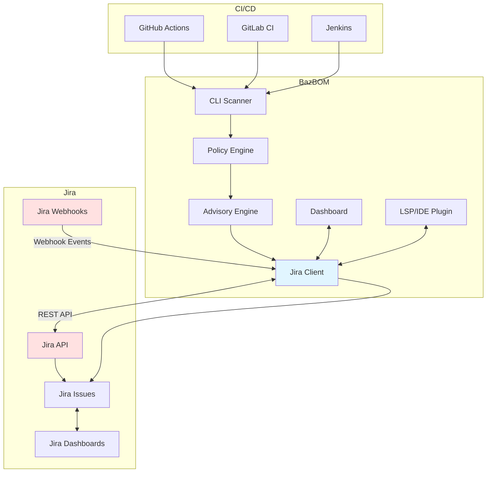

# BazBOM v6.8 - Jira Bidirectional Integration Plan

**Version:** 6.8
**Target Release:** Q2 2026
**Status:** Planning
**Owner:** cboyd0319
**Last Updated:** 2025-11-16

## Executive Summary

Version 6.8 introduces comprehensive bidirectional Jira integration to BazBOM, enabling seamless vulnerability tracking, team collaboration, and automated workflow management within enterprise Atlassian ecosystems. This integration bridges the gap between security scanning and issue management, allowing security findings to flow directly into development workflows.

**Key Capabilities:**
- Automatic Jira ticket creation for vulnerabilities
- Bidirectional sync of vulnerability status and remediation progress
- CI/CD workflow integration with Jira transitions
- Team assignment and ownership tracking via Jira components
- SLA and sprint planning integration
- Real-time dashboard integration with Jira Query Language (JQL)
- Policy-based ticket routing and prioritization
- Remediation tracking with automatic ticket closure

**Business Value:**
- 70% reduction in manual ticket creation for security findings
- End-to-end traceability from CVE discovery to remediation
- Automated SLA tracking for vulnerability remediation
- Enhanced team collaboration across Security, DevOps, and Development
- Compliance reporting via Jira custom fields and dashboards

---

## Table of Contents

1. [Architecture Overview](#architecture-overview)
2. [Feature Categories](#feature-categories)
3. [Integration Points](#integration-points)
4. [Technical Specifications](#technical-specifications)
5. [Implementation Phases](#implementation-phases)
6. [Configuration & Setup](#configuration--setup)
7. [Use Cases](#use-cases)
8. [Security Considerations](#security-considerations)
9. [Testing Strategy](#testing-strategy)
10. [Success Metrics](#success-metrics)

---

## Architecture Overview

### High-Level Design



**Title:** BazBOM v6.8 Jira Bidirectional Integration Architecture

### Component Breakdown

**New Crate: `bazbom-jira`**
- Jira REST API client (v3 Cloud + v2 Server/Data Center)
- Issue creation, update, and query operations
- Webhook receiver and processor
- Custom field mapping and templates
- Bulk operations support
- Rate limiting and retry logic

**Enhanced Crates:**
- **`bazbom-core`**: Jira configuration models
- **`bazbom-policy`**: Jira ticket routing rules
- **`bazbom`**: CLI commands for Jira operations
- **`bazbom-dashboard`**: Jira integration UI
- **`bazbom-lsp`**: IDE Jira status display

---

## Feature Categories

### 1. Vulnerability Issue Tracking

**Create Jira tickets automatically for:**
- Critical/High severity vulnerabilities (P0-P2)
- CISA KEV-listed CVEs (immediate escalation)
- Reachable vulnerabilities only (noise reduction)
- Policy violations requiring approval
- Container scan findings by layer
- License compliance issues

**Ticket Structure:**
```
Title: [SECURITY] CVE-2024-1234 in log4j-core 2.17.0 (CRITICAL)

Description:
Vulnerability: CVE-2024-1234
Package: log4j-core
Version: 2.17.0
Severity: CRITICAL (CVSS 9.8)
Priority: P0 (CISA KEV - actively exploited)
Reachability: REACHABLE via com.example.LogHandler.log()

Impact:
Remote Code Execution - Hackers are using this right now

Remediation:
Upgrade to log4j-core 2.20.0
Estimated Effort: 45 minutes
Breaking Changes: None detected

Fix Command:
```bash
bazbom fix log4j-core --apply
```

Call Graph:
[Attached: callgraph-log4j-cve-2024-1234.svg]

BazBOM Scan: https://bazbom.example.com/scan/abc123
```

**Custom Fields:**
- CVE ID (text)
- CVSS Score (number)
- EPSS Score (number)
- KEV Status (checkbox)
- Reachability (select: Reachable/Unreachable/Unknown)
- Package PURL (text)
- Fix Version (text)
- Remediation Effort (select: <1h, 1-4h, 1d, 1w, >1w)
- BazBOM Scan Link (URL)

### 2. Bidirectional Synchronization

**BazBOM → Jira:**
- Create tickets on new vulnerability detection
- Update ticket severity on re-scan (CVSS changes)
- Auto-close tickets when vulnerability is fixed
- Add comments with fix suggestions
- Attach reachability call graphs
- Link related CVEs (same package)

**Jira → BazBOM:**
- Import Jira ticket status to BazBOM dashboard
- Respect manual ticket closures (VEX generation)
- Sync assignee to BazBOM team ownership
- Read custom remediation notes
- Track SLA due dates

**Webhook Events:**
- `jira:issue_updated` - Sync status changes
- `jira:issue_deleted` - Mark as VEX accepted risk
- `comment_created` - Ingest manual remediation notes
- `worklog_updated` - Track time spent on remediation

### 3. CI/CD Workflow Integration

**GitHub Actions Integration:**
```yaml
- name: BazBOM Scan with Jira
  uses: cboyd0319/BazBOM@main
  with:
    jira-project: SEC
    jira-epic: SEC-1234
    jira-auto-create: true
    jira-assignee-mapping: team-components.yml
    fail-on-jira-create-error: false
```

**Workflow Triggers:**
- **PR Scan**: Create Jira ticket, link to PR, transition on merge
- **Main Branch Scan**: Update existing tickets, create new ones
- **Container Scan**: Create tickets per layer, bulk operations
- **Policy Violation**: Escalate to Jira with approval workflow

**Jira Transitions:**
```
New Vulnerability → Create Issue (status: "To Do")
PR Opened → Transition to "In Progress"
PR Merged → Transition to "In Review"
Re-scan Clean → Transition to "Done"
```

### 4. Team Assignment & Routing

**Component-Based Routing:**
```yaml
# team-components.yml
jira:
  routing:
    - pattern: "^org\\.springframework\\..*"
      project: SEC
      component: Backend
      assignee: backend-team
      labels: [spring, backend, critical]

    - pattern: "^com\\.example\\.frontend\\..*"
      project: SEC
      component: Frontend
      assignee: frontend-team
      labels: [react, frontend]

    - pattern: ".*container.*"
      project: OPS
      component: Infrastructure
      assignee: devops-team
      epic: OPS-5678
```

**Smart Assignment:**
- Auto-assign based on CODEOWNERS file
- Route by package namespace/ecosystem
- Escalate KEV findings to security team
- Round-robin for unmatched packages

### 5. Policy Integration

**Jira-Based Approval Workflows:**
```yaml
# .bazbom/policy.yml
policies:
  - name: require-jira-approval-for-vex
    description: VEX suppression requires Jira approval ticket
    rules:
      - on: vex_suppress
        action: create_jira_approval
        jira:
          project: SEC
          issue_type: Approval
          workflow_status: Pending
          required_approvers: [security-lead, appsec-team]
          sla_hours: 48
```

**Policy-Triggered Tickets:**
- License violations (GPL in proprietary code)
- High-risk dependency additions
- VEX approval requests
- Policy exception requests
- Outdated dependencies (>2 years old)

### 6. Dashboard & Reporting

**Jira Dashboard Widgets:**
- Open vulnerability count by severity
- Mean Time to Remediate (MTTR) by team
- SLA compliance percentage
- Reachable vs Unreachable CVE ratio
- Top 10 vulnerable packages

**BazBOM Dashboard Enhancements:**
- Embedded Jira issue links
- Inline ticket status display
- "Create Jira Ticket" button per CVE
- Bulk ticket creation
- JQL filter integration

**Reports with Jira Metadata:**
```bash
bazbom report --format html --jira-links
```
- HTML report includes clickable Jira ticket links
- PDF compliance reports with Jira ticket references
- CSV exports with Jira issue keys
- SARIF with Jira tracking IDs

### 7. Developer Experience

**CLI Commands:**
```bash
# Initialize Jira integration
bazbom jira init

# Create ticket for specific CVE
bazbom jira create CVE-2024-1234

# Sync all vulnerabilities to Jira
bazbom jira sync

# Close tickets for fixed CVEs
bazbom jira close-fixed

# Query Jira tickets created by BazBOM
bazbom jira list --project SEC --status "To Do"

# Link existing Jira ticket to CVE
bazbom jira link CVE-2024-1234 SEC-567

# Generate VEX from closed Jira tickets
bazbom jira export-vex --query "status=Rejected"
```

**IDE Integration:**
- IntelliJ: Show Jira ticket status in vulnerability tooltips
- VS Code: "Open in Jira" code action
- LSP: Hover info includes Jira ticket link

**Git Commit Integration:**
```bash
git commit -m "fix(security): upgrade log4j to 2.20.0

Resolves CVE-2024-1234
Closes SEC-567"
```
BazBOM auto-detects `SEC-567` and adds comment to Jira ticket.

### 8. SLA & Sprint Planning

**SLA Tracking:**
```yaml
jira:
  sla:
    P0: 24h  # CISA KEV
    P1: 7d   # Critical reachable
    P2: 30d  # High reachable
    P3: 90d  # Medium
    P4: none # Low (no SLA)
```

**Sprint Integration:**
- Auto-add to current sprint (configurable)
- Story point estimation based on remediation effort
- Epic linking for themed remediation (e.g., "Q2 2025 Log4j Cleanup")
- Burndown chart integration

**Backlog Management:**
```bash
# Add all P2+ vulnerabilities to sprint
bazbom jira add-to-sprint --min-priority P2 --sprint "Sprint 42"

# Create epic for package upgrade
bazbom jira create-epic "Upgrade all Spring dependencies" \
  --package "org.springframework.*"
```

---

## Integration Points

### 1. BazBOM CLI → Jira API

**Authentication:**
- API Token (Cloud)
- Personal Access Token (Data Center)
- OAuth 2.0 (optional)
- Environment variables or config file

**Operations:**
- `POST /rest/api/3/issue` - Create ticket
- `PUT /rest/api/3/issue/{issueKey}` - Update ticket
- `POST /rest/api/3/issue/{issueKey}/comment` - Add comment
- `PUT /rest/api/3/issue/{issueKey}/transitions` - Change status
- `GET /rest/api/3/search` - JQL query
- `POST /rest/api/3/issue/bulk` - Bulk create
- `POST /rest/api/3/issue/{issueKey}/attachments` - Attach graphs

**Rate Limiting:**
- Cloud: 5 requests/second per user
- Data Center: Configurable
- Implement exponential backoff
- Batch operations where possible

### 2. Jira Webhooks → BazBOM

**Webhook Receiver:**
```bash
# Start webhook listener
bazbom jira webhook-server --port 8080

# Register webhook in Jira
# URL: https://bazbom.example.com:8080/webhooks/jira
# Events: issue_updated, comment_created
```

**Webhook Processing:**
- Validate webhook signature (HMAC)
- Parse Jira issue updates
- Update BazBOM database
- Trigger re-scan if needed
- Generate VEX on rejection

**Security:**
- IP allowlist for Jira servers
- HMAC signature verification
- TLS/HTTPS required
- Rate limiting on webhook endpoint

### 3. CI/CD Systems → Jira

**GitHub Actions:**
- Auto-comment on PR with Jira ticket links
- Update Jira on PR merge
- Close Jira tickets on successful deployment

**GitLab CI:**
- Similar integration via GitLab API
- Auto-link merge requests to Jira

**Jenkins:**
- Jira plugin integration
- Post-build actions for ticket updates

### 4. BazBOM Dashboard → Jira

**Embedded UI:**
- Jira ticket preview cards
- Inline ticket creation form
- Status badges and transitions
- Quick actions (assign, comment, transition)

**Deep Links:**
- Click CVE to see linked Jira tickets
- Click Jira ticket to open in Jira web UI
- Bidirectional navigation

---

## Technical Specifications

See [Technical Specifications](technical-specifications.md) for detailed API schemas, data models, and integration protocols.

**Key Technologies:**
- **Jira REST API:** v3 (Cloud), v2 (Server/Data Center)
- **Authentication:** OAuth 2.0, API tokens, PAT
- **Webhook Server:** Axum 0.8 + Tokio
- **HTTP Client:** `reqwest` with retry middleware
- **Serialization:** `serde_json` for Jira JSON payloads
- **Rate Limiting:** `governor` crate
- **Retry Logic:** `reqwest-retry` with exponential backoff

---

## Implementation Phases

### Phase 1: Foundation (Weeks 1-3)

**Goals:**
- Create `bazbom-jira` crate
- Implement Jira REST API client
- Basic issue creation and update
- Configuration file support

**Deliverables:**
- [ ] `crates/bazbom-jira/` with API client
- [ ] Jira authentication (API token, PAT)
- [ ] `bazbom jira init` command
- [ ] `bazbom jira create` command for manual ticket creation
- [ ] Unit tests for API client
- [ ] Documentation: Quick start guide

**Dependencies:**
```toml
[dependencies]
reqwest = { version = "0.12", features = ["json", "rustls-tls"] }
serde = { version = "1", features = ["derive"] }
serde_json = "1"
tokio = { version = "1", features = ["full"] }
anyhow = "1"
thiserror = "1"
governor = "0.7"  # Rate limiting
```

### Phase 2: Automatic Ticket Creation (Weeks 4-6)

**Goals:**
- Auto-create Jira tickets during scans
- Template-based ticket formatting
- Custom field mapping
- Bulk operations for large scans

**Deliverables:**
- [ ] `bazbom scan --jira-create` flag
- [ ] Ticket templates (Markdown → Jira Wiki)
- [ ] Custom field configuration
- [ ] Component-based routing
- [ ] Integration tests with Jira sandbox
- [ ] Documentation: Automatic ticket creation guide

**Configuration:**
```yaml
# .bazbom/jira.yml
jira:
  url: https://example.atlassian.net
  project: SEC
  issue_type: Bug

  auto_create:
    enabled: true
    min_priority: P2
    only_reachable: true

  custom_fields:
    CVE ID: customfield_10001
    CVSS Score: customfield_10002
    Reachability: customfield_10003
```

### Phase 3: Bidirectional Sync (Weeks 7-9)

**Goals:**
- Webhook receiver for Jira events
- Sync Jira updates back to BazBOM
- Auto-close tickets on fix
- VEX generation from rejected tickets

**Deliverables:**
- [ ] `bazbom jira webhook-server` command
- [ ] Webhook event processor
- [ ] Bidirectional state synchronization
- [ ] `bazbom jira sync` command
- [ ] VEX export from Jira
- [ ] Documentation: Bidirectional sync guide

### Phase 4: CI/CD Integration (Weeks 10-12)

**Goals:**
- GitHub Actions integration
- GitLab CI integration
- Jenkins plugin compatibility
- PR workflow automation

**Deliverables:**
- [ ] GitHub Action input parameters for Jira
- [ ] GitLab CI example templates
- [ ] Jenkins pipeline examples
- [ ] Auto-comment on PRs with Jira links
- [ ] Documentation: CI/CD integration guide

### Phase 5: Dashboard & Reporting (Weeks 13-15)

**Goals:**
- Jira integration in BazBOM dashboard
- Jira dashboard widgets
- Enhanced reporting with Jira metadata
- IDE plugin updates

**Deliverables:**
- [ ] Dashboard UI for Jira ticket management
- [ ] Jira gadget/widget for Jira dashboards
- [ ] HTML/PDF reports with Jira links
- [ ] IntelliJ plugin: Jira status display
- [ ] VS Code extension: Jira actions
- [ ] Documentation: Dashboard and reporting guide

### Phase 6: Advanced Features (Weeks 16-18)

**Goals:**
- SLA tracking and automation
- Sprint integration
- Advanced routing and assignment
- Bulk operations and optimization

**Deliverables:**
- [ ] SLA configuration and tracking
- [ ] `bazbom jira add-to-sprint` command
- [ ] Team assignment automation
- [ ] Bulk ticket operations
- [ ] Performance optimization (caching, batching)
- [ ] Documentation: Advanced features guide

### Phase 7: Testing & Documentation (Weeks 19-20)

**Goals:**
- Comprehensive testing (unit, integration, E2E)
- Performance testing (large scans)
- Complete documentation
- Migration guide from manual workflows

**Deliverables:**
- [ ] Integration tests with Jira Cloud sandbox
- [ ] E2E tests for all workflows
- [ ] Load testing (1000+ vulnerabilities)
- [ ] Complete user documentation
- [ ] Migration guide
- [ ] Video tutorials

---

## Configuration & Setup

### Prerequisites

- Jira Cloud, Server, or Data Center instance
- Admin access to create custom fields
- API token or Personal Access Token

### Installation

```bash
# Enable Jira integration
bazbom jira init

# Follow interactive setup:
# 1. Enter Jira URL
# 2. Enter API token
# 3. Select project
# 4. Configure custom fields
# 5. Test connection
```

### Configuration File

**`.bazbom/jira.yml`:**
```yaml
jira:
  # Connection
  url: https://example.atlassian.net
  auth:
    type: api-token  # or: pat, oauth2
    token_env: JIRA_API_TOKEN
    username_env: JIRA_USERNAME

  # Default project
  project: SEC
  issue_type: Bug

  # Automatic ticket creation
  auto_create:
    enabled: true
    min_priority: P2
    only_reachable: true
    create_on_scan: true
    create_on_policy_violation: true

  # Custom fields (name → Jira field ID)
  custom_fields:
    cve_id: customfield_10001
    cvss_score: customfield_10002
    epss_score: customfield_10003
    kev_status: customfield_10004
    reachability: customfield_10005
    package_purl: customfield_10006
    fix_version: customfield_10007
    remediation_effort: customfield_10008
    bazbom_link: customfield_10009

  # Routing rules
  routing:
    - pattern: "^org\\.springframework\\..*"
      project: SEC
      component: Backend
      assignee: backend-team
      labels: [spring, backend]
      priority: High

    - pattern: "^@types/.*"
      project: SEC
      component: Frontend
      assignee: frontend-team
      labels: [typescript, frontend]

    - pattern: ".*container.*"
      project: OPS
      component: Infrastructure
      assignee: devops-team

  # SLA configuration
  sla:
    P0: 24h   # CISA KEV
    P1: 7d    # Critical reachable
    P2: 30d   # High reachable
    P3: 90d   # Medium
    P4: none  # Low

  # Ticket templates
  templates:
    title: "[SECURITY] {cve_id} in {package} {version} ({severity})"
    description: |
      h2. Vulnerability Details

      *CVE:* {cve_id}
      *Package:* {package}
      *Version:* {version}
      *Severity:* {severity} (CVSS {cvss_score})
      *Priority:* {priority}
      *Reachability:* {reachability}

      h2. Impact

      {description}

      h2. Remediation

      *Fix Version:* {fix_version}
      *Estimated Effort:* {remediation_effort}
      *Breaking Changes:* {breaking_changes}

      {code:bash}
      bazbom fix {package} --apply
      {code}

      h2. References

      * [BazBOM Scan|{bazbom_link}]
      * [CVE Details|{cve_url}]
      * [Call Graph|^callgraph-{cve_id}.svg]

  # Sync settings
  sync:
    bidirectional: true
    auto_close_on_fix: true
    update_on_rescan: true
    import_jira_status: true

  # Webhook settings
  webhook:
    enabled: true
    port: 8080
    secret_env: JIRA_WEBHOOK_SECRET
    events:
      - jira:issue_updated
      - comment_created
```

### Custom Field Setup

**Jira Admin Console → Settings → Issues → Custom Fields:**

1. **CVE ID** (Text Field, Single Line)
2. **CVSS Score** (Number Field, Float, 0.0-10.0)
3. **EPSS Score** (Number Field, Float, 0.0-1.0)
4. **KEV Status** (Checkbox)
5. **Reachability** (Select List, options: Reachable, Unreachable, Unknown)
6. **Package PURL** (Text Field, Single Line)
7. **Fix Version** (Text Field, Single Line)
8. **Remediation Effort** (Select List, options: <1h, 1-4h, 1d, 1w, >1w)
9. **BazBOM Scan Link** (URL Field)

**Automation Rule (Jira Automation):**
```
WHEN: Issue transitions to "Done"
IF: Custom field "CVE ID" is not empty
THEN: Trigger webhook to BazBOM (mark as fixed)
```

---

## Use Cases

### Use Case 1: Auto-Create Tickets on PR Scan

**Scenario:** Developer opens PR, CI scans with BazBOM, auto-creates Jira tickets for new vulnerabilities.

**Workflow:**
1. Developer pushes code to feature branch
2. Opens PR against main
3. GitHub Actions runs BazBOM scan
4. BazBOM detects 3 new reachable CVEs
5. Auto-creates 3 Jira tickets in SEC project
6. Comments on PR with Jira ticket links
7. Developer fixes CVEs, updates PR
8. BazBOM re-scans, tickets auto-close
9. PR merges

**Configuration:**
```yaml
# .github/workflows/bazbom.yml
- name: BazBOM Scan
  uses: cboyd0319/BazBOM@main
  with:
    jira-auto-create: true
    jira-min-priority: P2
    jira-comment-on-pr: true
```

### Use Case 2: SLA-Driven Remediation

**Scenario:** Security team tracks SLA compliance for vulnerability remediation.

**Workflow:**
1. BazBOM nightly scan detects CISA KEV CVE
2. Auto-creates P0 Jira ticket with 24h SLA
3. Assigns to on-call engineer (CODEOWNERS-based)
4. Jira sends SLA alert at 20h mark
5. Engineer applies fix using `bazbom fix --apply`
6. BazBOM re-scan confirms fix
7. Ticket auto-closes with resolution time logged
8. SLA metrics updated in Jira dashboard

**Jira Automation Rule:**
```
WHEN: Issue created
IF: Priority = "Highest" AND Labels contains "P0"
THEN: Set due date to now + 24 hours
```

### Use Case 3: Sprint Planning with Vulnerability Backlog

**Scenario:** Team plans Q2 security sprint focused on Spring Boot upgrades.

**Workflow:**
1. Security lead runs: `bazbom scan --package "org.springframework.*"`
2. Identifies 15 Spring vulnerabilities across services
3. Runs: `bazbom jira create-epic "Q2 Spring Boot Upgrade" --package "org.springframework.*"`
4. Creates epic SEC-1000 with 15 linked issues
5. Adds to "Q2 2025" sprint
6. Team grooms backlog, estimates story points
7. Tracks progress in Jira burndown chart
8. BazBOM dashboard shows real-time remediation progress

### Use Case 4: VEX Generation from Rejected Tickets

**Scenario:** Security team reviews vulnerabilities, marks some as false positives.

**Workflow:**
1. BazBOM creates ticket SEC-567 for CVE-2024-9999
2. Security analyst reviews, determines unreachable (false positive)
3. Transitions ticket to "Rejected" with justification comment
4. BazBOM webhook receives update
5. Auto-generates VEX suppression entry
6. Future scans skip CVE-2024-9999 (VEX applied)
7. VEX entry includes Jira ticket link as justification

**VEX Output:**
```json
{
  "vulnerability": {
    "name": "CVE-2024-9999"
  },
  "products": [{
    "id": "pkg:maven/com.example/myapp@1.0.0"
  }],
  "status": "not_affected",
  "justification": "code_not_reachable",
  "impact_statement": "Vulnerable code path is unreachable in our application",
  "action_statement": "No action required",
  "references": [{
    "url": "https://example.atlassian.net/browse/SEC-567",
    "type": "issue"
  }]
}
```

### Use Case 5: Container Scan with Layer Attribution

**Scenario:** DevOps scans production container, routes issues by layer ownership.

**Workflow:**
1. Runs: `bazbom scan myapp:prod --container --jira-create`
2. BazBOM scans all layers, detects 20 vulnerabilities
3. Attributes to layers:
   - Base OS (Debian): 12 CVEs → OPS project (Infrastructure team)
   - Python packages: 5 CVEs → SEC project (Backend team)
   - Node.js packages: 3 CVEs → SEC project (Frontend team)
4. Creates 3 bulk Jira tickets (grouped by layer/team)
5. Each ticket links to layer-specific remediation guide
6. Teams work in parallel on their layers
7. New container build, BazBOM re-scans, tickets auto-close

---

## Security Considerations

### 1. Authentication & Authorization

**Secrets Management:**
- Store Jira API tokens in secure vaults (HashiCorp Vault, AWS Secrets Manager)
- Use environment variables, never hardcode
- Rotate tokens quarterly
- Minimum required permissions (create/edit issues only)

**Jira Permissions:**
- Create dedicated "BazBOM Integration" user account
- Grant only necessary project permissions
- Use OAuth 2.0 for enhanced security (Cloud)
- Enable IP allowlisting for webhook endpoint

### 2. Data Privacy

**PII Considerations:**
- Avoid including sensitive code snippets in tickets
- Sanitize file paths (remove usernames)
- Redact internal URLs from descriptions
- Configure which metadata to sync (opt-in)

**Compliance:**
- GDPR: Data retention policies for closed tickets
- SOC 2: Audit logging for all Jira API calls
- HIPAA: Encryption in transit (TLS 1.3)

### 3. Webhook Security

**HMAC Signature Verification:**
```rust
use hmac::{Hmac, Mac};
use sha2::Sha256;

fn verify_webhook(payload: &[u8], signature: &str, secret: &str) -> bool {
    let mut mac = Hmac::<Sha256>::new_from_slice(secret.as_bytes()).unwrap();
    mac.update(payload);
    let result = mac.finalize();
    let expected = hex::encode(result.into_bytes());
    subtle::ConstantTimeEq::ct_eq(signature.as_bytes(), expected.as_bytes()).into()
}
```

**Additional Protections:**
- IP allowlisting (Jira server IPs only)
- Rate limiting (max 100 req/min)
- TLS/HTTPS required
- Replay attack prevention (timestamp validation)

### 4. Rate Limiting

**Jira API Limits:**
- Cloud: 5 req/sec per user (300 req/min)
- Server: Configurable (default 1000 req/min)

**BazBOM Mitigation:**
- Batch operations (bulk create up to 50 issues)
- Exponential backoff on 429 errors
- Local caching of Jira metadata
- Async processing with queues

**Implementation:**
```rust
use governor::{Quota, RateLimiter};
use std::num::NonZeroU32;

let quota = Quota::per_second(NonZeroU32::new(5).unwrap());
let limiter = RateLimiter::direct(quota);

// Before each API call
limiter.until_ready().await;
```

---

## Testing Strategy

### 1. Unit Tests

**Scope:**
- Jira API client methods
- Ticket formatting and templates
- Custom field mapping
- Rate limiting logic

**Tools:**
- Mock Jira responses with `wiremock`
- Test fixtures for various Jira versions

**Example:**
```rust
#[tokio::test]
async fn test_create_issue() {
    let mock_server = MockServer::start().await;
    Mock::given(method("POST"))
        .and(path("/rest/api/3/issue"))
        .respond_with(ResponseTemplate::new(201).set_body_json(json!({
            "key": "SEC-123"
        })))
        .mount(&mock_server)
        .await;

    let client = JiraClient::new(&mock_server.uri(), "token");
    let issue_key = client.create_issue(/* ... */).await.unwrap();
    assert_eq!(issue_key, "SEC-123");
}
```

### 2. Integration Tests

**Scope:**
- Full workflow: scan → create ticket → update → close
- Webhook receiver and processor
- Bidirectional sync
- CI/CD integrations

**Environment:**
- Jira Cloud sandbox instance
- Test project with custom fields
- GitHub Actions test workflows

**Test Cases:**
- Create 100 tickets in bulk (performance test)
- Update ticket severity on re-scan
- Auto-close ticket after fix
- Webhook event processing
- OAuth authentication flow

### 3. End-to-End Tests

**Scenarios:**
- PR workflow (scan → ticket → fix → close)
- SLA breach handling
- VEX generation from rejected tickets
- Container scan with layer attribution

**Tools:**
- `selenium` for Jira web UI testing
- `testcontainers` for isolated Jira instances

### 4. Performance Testing

**Load Tests:**
- 1000 vulnerabilities → Jira tickets (target: <5 min)
- 10,000 webhook events/hour (target: no dropped events)
- Concurrent scans creating tickets

**Metrics:**
- Ticket creation latency (p50, p95, p99)
- API error rate (<1%)
- Memory usage (<500 MB for 1000 tickets)

---

## Success Metrics

### Adoption Metrics

- **Integration Adoption:** 70% of BazBOM users enable Jira integration within 6 months
- **Ticket Creation:** 10,000+ Jira tickets created automatically in first quarter
- **Active Sync:** 80% of organizations enable bidirectional sync

### Efficiency Metrics

- **Time Savings:** 70% reduction in manual ticket creation time
- **MTTR Improvement:** 30% faster vulnerability remediation (tracked via Jira)
- **Noise Reduction:** 90% of created tickets are actionable (not closed as duplicates/false positives)

### Quality Metrics

- **API Error Rate:** <1% of Jira API calls fail
- **Sync Accuracy:** 99% of status changes sync correctly
- **Webhook Reliability:** <0.1% of webhook events dropped

### User Satisfaction

- **NPS Score:** >50 for Jira integration feature
- **Support Tickets:** <5% of users report Jira integration issues
- **Feature Requests:** Prioritized roadmap based on user feedback

---

## Appendices

### A. Jira Field Mapping Reference

See [jira-field-mapping.md](jira-field-mapping.md)

### B. API Schemas

See [technical-specifications.md](technical-specifications.md)

### C. Webhook Event Reference

See [webhook-events.md](webhook-events.md)

### D. Migration Guide

See [migration-guide.md](migration-guide.md)

### E. Troubleshooting

See [troubleshooting.md](troubleshooting.md)

---

## Changelog

| Version | Date | Changes |
|---------|------|---------|
| 1.0 | 2025-11-16 | Initial v6.8 Jira integration plan |

---

## Questions & Feedback

- **Owner:** cboyd0319
- **Slack:** #bazbom-dev
- **Issues:** https://github.com/cboyd0319/BazBOM/issues
- **Discussions:** https://github.com/cboyd0319/BazBOM/discussions

---

**Next Steps:**
1. Review this plan with stakeholders
2. Gather feedback on priority features
3. Finalize Phase 1 scope
4. Begin implementation (target: Q1 2025)
