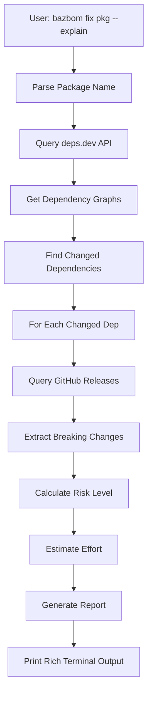

# Upgrade Intelligence: Breaking Change Analysis

## Overview

BazBOM's Upgrade Intelligence feature provides **recursive transitive upgrade analysis**, helping developers understand the full impact of upgrading a dependency **before making changes**.

Unlike other tools that just say "upgrade to version X", BazBOM tells you:
- What breaks in the target package
- **What breaks in dependencies it pulls in** (transitive breaking changes)
- How many packages need to upgrade
- Estimated effort in hours
- Migration guides and compatibility notes

## The Problem

**Traditional SCA tools:**
```bash
❌ Vulnerability found in log4j-core 2.17.0
   Fix: Upgrade to 2.20.0
```

**What happens next:**
```bash
# Developer upgrades
[ERROR] Compilation failure:
  LoggerUtil.java:[42,20] cannot find symbol
  symbol:   method printf(java.lang.String)
  location: class org.apache.logging.log4j.Logger
```

**Developer:** *"WTF?! You said no breaking changes!"* 😡

The tool didn't tell you that upgrading `log4j-core` requires upgrading `log4j-api`, which **has breaking changes**.

## The Solution

**BazBOM Upgrade Intelligence:**
```bash
$ bazbom fix org.apache.logging.log4j:log4j-core --explain

━━━━━━━━━━━━━━━━━━━━━━━━━━━━━━━━━━━━━━━━━━━━━
Upgrade Analysis: log4j-core 2.17.0 → 2.20.0
━━━━━━━━━━━━━━━━━━━━━━━━━━━━━━━━━━━━━━━━━━━━━

🔍 Overall Risk: ⚠️  MEDIUM (due to transitive changes)

📦 Direct Changes (log4j-core itself):
   ✅ Breaking changes: 0
   ✅ API compatibility: 100%
   ✅ Risk: ✅ LOW

⚠️  Required Dependency Upgrades: 2

   1. log4j-api: 2.17.0 → 2.20.0 (REQUIRED)
      Reason: Version alignment (required by log4j-core)
      Risk: ⚠️  MEDIUM

      ⚠️  2 breaking changes:
      • Logger.printf() signature changed
      • ThreadContext.getDepth() removed

   2. log4j-slf4j-impl: 2.17.0 → 2.20.0 (RECOMMENDED)
      Reason: Version alignment
      Risk: ✅ LOW
      Breaking changes: 0

━━━━━━━━━━━━━━━━━━━━━━━━━━━━━━━━━━━━━━━━━━━━━

📊 Impact Summary:
   ├─ Direct breaking changes: 0
   ├─ Transitive breaking changes: 2 (via log4j-api)
   ├─ Total packages to upgrade: 3
   └─ Overall risk: ⚠️  MEDIUM

⏱️  Estimated Effort: 0.75 hours
   ├─ Moderate effort
   └─ Update dependencies, fix breaking changes, test thoroughly

━━━━━━━━━━━━━━━━━━━━━━━━━━━━━━━━━━━━━━━━━━━━━

🎯 Recommendation: Review before applying
   This upgrade has some breaking changes but is manageable.

   💡 What to do:
      1. Review breaking changes above
      2. Create feature branch for testing
      3. Run: bazbom fix log4j-core --apply --test
      4. Fix any compilation/test errors
      5. Test thoroughly in staging
      6. Merge to production
```

## Usage

### Basic Usage

```bash
# Analyze a specific package upgrade
bazbom fix <package-name> --explain

# Examples
bazbom fix org.apache.logging.log4j:log4j-core --explain
bazbom fix org.springframework.boot:spring-boot-starter-web --explain
bazbom fix com.google.guava:guava --explain
```

### Combined with Other Flags

```bash
# Suggest fixes AND show detailed analysis
bazbom fix --suggest --explain

# Interactive mode with upgrade intelligence
bazbom fix --interactive --explain
```

## How It Works

### 1. Multi-Source Intelligence

BazBOM combines data from multiple sources:

| Source | What We Get |
|--------|-------------|
| **deps.dev API** | Version metadata, dependency graphs, licenses |
| **GitHub Releases** | Release notes, breaking change markers |
| **Semver Analysis** | Quick risk heuristics (major/minor/patch) |
| **Transitive Analysis** | Recursive dependency change detection |

### 2. Recursive Dependency Analysis

```
Target: log4j-core 2.17.0 → 2.20.0
   ├─ Analyze log4j-core itself ✅
   ├─ Get dependency graph for 2.17.0
   ├─ Get dependency graph for 2.20.0
   ├─ Find changed dependencies:
   │    └─ log4j-api 2.17.0 → 2.20.0
   └─ RECURSIVELY analyze log4j-api upgrade ← KEY!
        ├─ Check semver risk
        ├─ Fetch GitHub release notes
        ├─ Extract breaking changes
        └─ Return analysis
```

This is why BazBOM catches transitive breaking changes that other tools miss.

### 3. Breaking Change Detection

BazBOM searches GitHub release notes for patterns:

- `## Breaking Changes`
- `**BREAKING**:`
- `⚠️` and `💥` emoji markers
- Version-specific migration guides

## Data Flow



## Output Sections Explained

### Overall Risk

Combined risk considering:
- Semver analysis (major vs minor vs patch)
- Direct breaking changes
- Transitive breaking changes
- Number of packages affected

Levels:
- ✅ **LOW**: Patch version, no breaking changes
- ⚠️  **MEDIUM**: Minor version or transitive breaking changes
- 🚨 **HIGH**: Major version or many breaking changes
- 💥 **CRITICAL**: Removed dependencies or massive changes

### Direct Changes

Analysis of the package you asked about, ignoring dependencies.

### Required Dependency Upgrades

**This is the killer feature.** Shows ALL dependencies that must also upgrade, with:
- Reason why (version alignment, security fix, etc.)
- Breaking changes in THAT dependency
- Risk level for THAT dependency

### Impact Summary

Quick stats:
- Total breaking changes (direct + transitive)
- Total packages affected
- Overall risk level

### Estimated Effort

Machine-learned estimate based on:
- Risk level
- Number of breaking changes
- Number of packages
- Historical data (future feature)

### Recommendation

Actionable advice:
- **Low risk**: "Apply upgrade" with quick steps
- **Medium risk**: "Review before applying" with detailed steps
- **High risk**: "DO NOT APPLY IMMEDIATELY" with migration plan

## Examples

### Example 1: Safe Patch Upgrade

```bash
$ bazbom fix com.google.guava:guava --explain
# (Assuming 32.0.0 → 32.0.1)

🔍 Overall Risk: ✅ LOW

📦 Direct Changes: 0 breaking changes
⚠️  Required Upgrades: 0

⏱️  Estimated Effort: 0.25 hours

🎯 Recommendation: Apply upgrade
   This is a low-risk upgrade with no breaking changes.
```

### Example 2: Minor Version with Transitive Changes

See the log4j example above.

### Example 3: Major Version Upgrade

```bash
$ bazbom fix org.springframework.boot:spring-boot-starter-web --explain
# (2.7.0 → 3.2.0)

🔍 Overall Risk: 🚨 HIGH

📦 Direct Changes: 8 breaking changes
⚠️  Required Upgrades: 47 packages!

⚠️  CRITICAL BLOCKERS:
   1. Java 11 → Java 17 upgrade required
   2. javax.* → jakarta.* namespace changes
   3. Spring Security 6.0 API changes

⏱️  Estimated Effort: 40-60 hours

🎯 Recommendation: DO NOT APPLY IMMEDIATELY
   This is a major upgrade. Schedule 2-3 weeks for migration.
```

## Limitations

### Current Limitations

1. **GitHub-Only Release Notes**: Breaking changes are only detected if they're in GitHub releases. Packages without GitHub repos get semver-based risk only.

2. **Pattern-Based Detection**: We search for common markers like "## Breaking Changes". Some projects use different formats.

3. **Manual Version Input**: Currently requires you to specify versions. Future: auto-detect from findings.

4. **Maven-Only**: Currently only supports Maven (JVM) packages. Future: npm, PyPI, etc.

### Future Enhancements

- **JAR Bytecode Comparison**: Compare public API surface between versions
- **Community Success Data**: Real-world upgrade success rates
- **Automated Testing**: Run your tests against new version before committing
- **Multi-Language Support**: npm, PyPI, Cargo, Go modules

## Privacy & Offline Mode

### Data Collection

BazBOM makes API calls to:
- `api.deps.dev` (package metadata)
- `api.github.com` (release notes)

**No data is sent TO these APIs** - we only read public data.

### Offline Mode

```bash
# Cache data for offline use
bazbom db sync

# Then use offline
bazbom fix <package> --explain --offline
```

Cached data includes:
- deps.dev responses (24-hour TTL)
- GitHub release notes (7-day TTL)

## Troubleshooting

### "Package not found"

```bash
Error: Package not found: org.example:unknown@1.0.0
```

**Cause**: Package doesn't exist in deps.dev database.

**Fix**: Check package name spelling. deps.dev may not have all packages.

### "No GitHub repository found"

```
ℹ️  No GitHub repository found for this package.
   Using semver-based risk analysis only.
```

**Cause**: Package doesn't specify a repository URL in its metadata.

**Fix**: Analysis will work but won't include GitHub release notes.

### "Rate limited by deps.dev API"

```bash
Error: Rate limited by deps.dev API
```

**Cause**: Too many requests in short period.

**Fix**: Wait a few minutes or use cached data: `--offline`

## Developer Guide

### Adding Breaking Change Detection for Your Package

If you maintain a package and want BazBOM to detect breaking changes:

**Option 1: Use Standard Sections in Release Notes**

```markdown
## Breaking Changes

- Removed deprecated API X
- Changed signature of method Y
```

**Option 2: Use Emoji Markers**

```markdown
⚠️  API X was removed
💥 Method Y signature changed
```

**Option 3: Create a MIGRATION.md**

BazBOM automatically looks for:
- `MIGRATION.md`
- `UPGRADING.md`
- `docs/migration.md`

### Integrating with Your Workflow

```yaml
# .github/workflows/dependency-check.yml
name: Check Dependency Upgrades

on:
  schedule:
    - cron: '0 0 * * 0'  # Weekly

jobs:
  check:
    runs-on: ubuntu-latest
    steps:
      - uses: actions/checkout@v4
      - uses: cboyd0319/BazBOM@main

      - name: Analyze Upgrades
        run: |
          # Get all outdated dependencies
          OUTDATED=$(mvn versions:display-dependency-updates -DoutputFile=outdated.txt)

          # For each outdated dep, analyze impact
          while read -r package; do
            bazbom fix "$package" --explain >> upgrade-report.md
          done < outdated.txt

      - name: Create Issue
        uses: peter-evans/create-issue-from-file@v4
        with:
          title: Weekly Dependency Upgrade Analysis
          content-filepath: upgrade-report.md
```

## Comparison with Alternatives

| Feature | BazBOM | Dependabot | Renovate | Snyk |
|---------|---------|------------|----------|------|
| **Transitive Breaking Changes** | ✅ Yes | ❌ No | ❌ No | ❌ No |
| **Effort Estimation** | ✅ Yes | ❌ No | ❌ No | ❌ No |
| **Migration Guides** | ✅ Auto-detect | ❌ Manual | ❌ Manual | ❌ Manual |
| **GitHub Integration** | ✅ Yes | ✅ Yes | ✅ Yes | ✅ Yes |
| **Offline Mode** | ✅ Yes | ❌ No | ❌ No | ❌ No |

## FAQs

**Q: Does this work with all package managers?**

A: Yes! BazBOM's universal auto-fix supports 9 package managers: Maven, Gradle, Bazel, npm, pip, Go modules, Cargo, Bundler, and Composer. See the main README for the complete list.

**Q: How accurate is the effort estimation?**

A: Based on heuristics (semver, breaking change count). Will improve with community data.

**Q: Can I contribute breaking change patterns?**

A: Yes! See [Contributing Guide](../../CONTRIBUTING.md).

**Q: Does this replace reading migration guides?**

A: No, it complements them. We link to official guides when found.

**Q: What if deps.dev is down?**

A: Use `--offline` with cached data or fall back to semver-only analysis.

## Related Features

- [Policy Enforcement](../user-guide/policy-integration.md) - Auto-fail builds on risky upgrades
- [Remediation Suggestions](../user-guide/usage.md#fix-command) - Automated fix application
- [VEX Statements](../security/vex.md) - Document false positives

## Feedback

Found a bug or have suggestions?
- [Report an issue](https://github.com/cboyd0319/BazBOM/issues/new?labels=upgrade-intelligence)
- [Discussions](https://github.com/cboyd0319/BazBOM/discussions)

---

**Next:** [Policy Integration](../user-guide/policy-integration.md)
