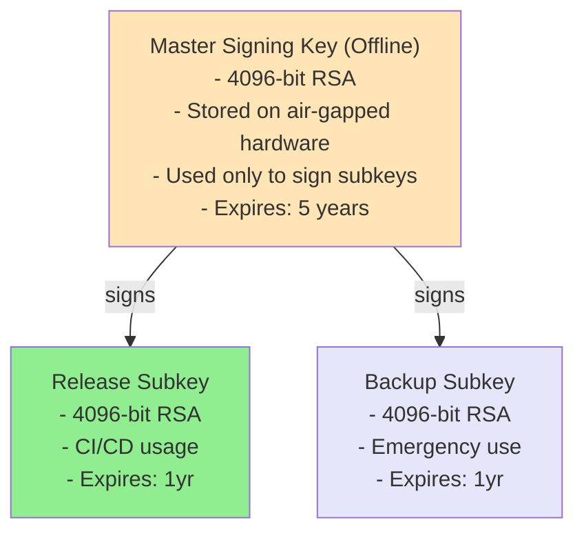

# GPG Key Management for BazBOM Releases

**Status**: 🚧 In Implementation
**Last Updated**: 2025-11-16
**Owner**: Release Engineering

## Overview

BazBOM uses GPG (GNU Privacy Guard) signing for release artifacts to provide cryptographic verification of authenticity and integrity. This document describes GPG key management, generation, signing, and verification procedures.

## Purpose

GPG signing provides:

- ✅ **Authenticity**: Verify artifacts were created by BazBOM maintainers
- ✅ **Integrity**: Detect any tampering or corruption
- ✅ **Non-repudiation**: Cryptographic proof of origin
- ✅ **Trust Chain**: Build trust through key signing and web of trust

## Key Management Strategy

### Organizational Keys

BazBOM uses a hierarchical key structure:



### Key Rotation Schedule

- **Master Key**: Rotate every 5 years
- **Release Subkeys**: Rotate annually
- **Revocation**: Immediate upon compromise

## Generating GPG Keys

### Master Key Generation

```bash
#!/bin/bash
# Generate master GPG signing key for BazBOM

# Set environment
export GNUPGHOME="$(mktemp -d)"

# Generate key (interactive)
gpg --full-generate-key <<EOF
4
4096
5y
BazBOM Release Signing (Master Key)
security@bazbom.io
Master signing key for BazBOM releases - KEEP OFFLINE
EOF

# Get key ID
KEY_ID=$(gpg --list-secret-keys --keyid-format LONG | grep sec | awk '{print $2}' | cut -d'/' -f2)
echo "Master Key ID: $KEY_ID"

# Generate revocation certificate
gpg --output ~/bazbom-master-revoke.asc --gen-revoke $KEY_ID

# Export keys
gpg --armor --export $KEY_ID > ~/bazbom-master-public.asc
gpg --armor --export-secret-keys $KEY_ID > ~/bazbom-master-private.asc

echo "✅ Master key generated"
echo "   Public key: ~/bazbom-master-public.asc"
echo "   Private key: ~/bazbom-master-private.asc (KEEP SECURE!)"
echo "   Revocation cert: ~/bazbom-master-revoke.asc (KEEP SECURE!)"
```

### Release Subkey Generation

```bash
#!/bin/bash
# Generate release subkey from master key

MASTER_KEY_ID="YOUR_MASTER_KEY_ID"

# Add signing subkey
gpg --edit-key $MASTER_KEY_ID <<EOF
addkey
4
4096
1y
save
EOF

# Export subkey for CI/CD
SUBKEY_ID=$(gpg --list-keys --with-subkey-fingerprint $MASTER_KEY_ID | grep -A1 "sub " | tail -1 | awk '{print $1}')
gpg --armor --export-secret-subkeys $SUBKEY_ID! > ~/bazbom-release-subkey.asc

echo "✅ Release subkey generated: $SUBKEY_ID"
```

## Signing Releases

### Manual Signing

```bash
#!/bin/bash
# Sign a release binary

VERSION="v7.0.0"
BINARY="bazbom-linux-amd64"

# Sign binary
gpg --detach-sign --armor --output ${BINARY}.asc ${BINARY}

# Create checksum
sha256sum ${BINARY} > ${BINARY}.sha256

# Sign checksum
gpg --clearsign --output ${BINARY}.sha256.asc ${BINARY}.sha256

echo "✅ Signed: ${BINARY}"
echo "   Signature: ${BINARY}.asc"
echo "   Checksum: ${BINARY}.sha256.asc"
```

### CI/CD Signing (GitHub Actions)

```yaml
name: Sign Release

on:
  release:
    types: [published]

jobs:
  sign:
    runs-on: ubuntu-latest
    steps:
      - name: Import GPG key
        run: |
          echo "${{ secrets.GPG_PRIVATE_KEY }}" | gpg --import
          echo "${{ secrets.GPG_PASSPHRASE }}" | gpg --passphrase-fd 0 --batch --yes --pinentry-mode loopback --sign test.txt

      - name: Sign artifacts
        run: |
          for file in dist/*; do
            gpg --detach-sign --armor --output ${file}.asc ${file}
          done

      - name: Upload signatures
        uses: actions/upload-release-asset@v1
        with:
          upload_url: ${{ github.event.release.upload_url }}
          asset_path: dist/*.asc
```

## Verifying Signatures

### Importing Public Key

```bash
# From file
gpg --import bazbom-public.asc

# From keyserver
gpg --keyserver keys.openpgp.org --recv-keys BAZBOM_KEY_ID

# Verify fingerprint matches official
gpg --fingerprint BAZBOM_KEY_ID
```

### Verifying Release

```bash
#!/bin/bash
# Verify BazBOM release signature

BINARY="bazbom-linux-amd64"
VERSION="v7.0.0"

# Download artifacts
curl -sSfLO "https://github.com/cboyd0319/BazBOM/releases/download/${VERSION}/${BINARY}"
curl -sSfLO "https://github.com/cboyd0319/BazBOM/releases/download/${VERSION}/${BINARY}.asc"

# Verify signature
gpg --verify ${BINARY}.asc ${BINARY}

# Should output:
# gpg: Good signature from "BazBOM Release Signing <security@bazbom.io>"

if [ $? -eq 0 ]; then
  echo "✅ Signature verified - binary is authentic"
else
  echo "❌ Signature verification failed - DO NOT USE"
  exit 1
fi
```

## Key Storage

### Master Key Storage

**NEVER** store the master private key on any networked system.

Recommended storage:
1. **YubiKey / Hardware Token**: Best option
2. **Encrypted USB drive**: In physical safe
3. **Paper backup**: QR code or printout in bank vault

### Subkey Storage for CI/CD

GitHub Actions secrets:
- `GPG_PRIVATE_KEY`: ASCII-armored private subkey
- `GPG_PASSPHRASE`: Passphrase for subkey
- `GPG_KEY_ID`: Key ID for signing

**Security**:
- Subkey can only sign (no certification power)
- If compromised, revoke subkey (not master key)
- Rotate annually

## Key Distribution

### Public Key Distribution Channels

1. **GitHub Release Assets**:
   - `bazbom-public.asc` in every release

2. **Keyservers**:
   - `keys.openpgp.org`
   - `keyserver.ubuntu.com`
   - `pgp.mit.edu`

3. **Website**:
   - https://bazbom.io/pgp-key.asc

4. **Repository**:
   - `docs/security/bazbom-public.asc`

### Publishing to Keyserver

```bash
# Upload public key
gpg --keyserver keys.openpgp.org --send-keys BAZBOM_KEY_ID

# Verify upload
gpg --keyserver keys.openpgp.org --recv-keys BAZBOM_KEY_ID
```

## Key Revocation

### When to Revoke

Revoke a key immediately if:
- ✋ Private key is compromised
- ✋ Private key is lost
- ✋ Key holder leaves organization
- ✋ Cryptographic weakness discovered

### Revocation Procedure

```bash
#!/bin/bash
# Revoke GPG key

KEY_ID="COMPROMISED_KEY_ID"

# Import revocation certificate
gpg --import bazbom-revoke.asc

# Or generate new revocation
gpg --gen-revoke $KEY_ID > revoke.asc

# Publish revocation to keyservers
gpg --keyserver keys.openpgp.org --send-keys $KEY_ID

# Notify users
echo "⚠️  SECURITY NOTICE: Key $KEY_ID has been revoked"
echo "   Reason: [Specify reason]"
echo "   Date: $(date)"
echo "   New key ID: [New key if applicable]"
```

### Post-Revocation

1. **Announce** revocation on all channels
2. **Publish** new public key if replacing
3. **Re-sign** recent releases with new key
4. **Update** documentation with new key ID

## Best Practices

### Key Security

- ✅ **Use strong passphrases**: 20+ characters, random
- ✅ **Enable key expiration**: Forces regular review
- ✅ **Separate master/subkeys**: Limit blast radius
- ✅ **Hardware tokens**: YubiKey for master key
- ✅ **Offline master key**: Never on networked machine

### Signing Practices

- ✅ **Sign all releases**: No exceptions
- ✅ **Sign checksums**: Tamper-evident verification chain
- ✅ **Use detached signatures**: `.asc` files alongside binaries
- ✅ **Timestamp signatures**: Include signature creation time
- ✅ **Document key IDs**: In release notes

### Verification Workflow

```bash
# 1. Import trusted key
gpg --import bazbom-public.asc

# 2. Verify fingerprint (compare with multiple sources)
gpg --fingerprint BAZBOM_KEY_ID

# 3. Download release + signature
curl -sSfLO https://.../bazbom
curl -sSfLO https://.../bazbom.asc

# 4. Verify signature
gpg --verify bazbom.asc bazbom

# 5. Only use if "Good signature" appears
```

## Troubleshooting

### "Can't check signature: No public key"

```bash
# Import public key
gpg --keyserver keys.openpgp.org --recv-keys BAZBOM_KEY_ID
```

### "This key is not certified with a trusted signature"

Normal if you haven't personally verified the key. Check fingerprint:

```bash
# Official fingerprint (published on multiple channels)
gpg --fingerprint BAZBOM_KEY_ID

# Compare with:
# - GitHub repository docs/security/
# - Website https://bazbom.io/pgp-key.txt
# - Release notes
```

### "Signature made with expired key"

Key has expired. Check for new key:

```bash
# Search for new BazBOM keys
gpg --keyserver keys.openpgp.org --search-keys security@bazbom.io
```

## Key Information

### Current Keys

| Key Type | Key ID | Fingerprint | Created | Expires | Status |
|----------|--------|-------------|---------|---------|--------|
| Master   | TBD    | TBD         | TBD     | TBD     | 📋 Pending |
| Release  | TBD    | TBD         | TBD     | TBD     | 📋 Pending |

### Key Fingerprints

Always verify the full fingerprint, not just the short key ID.

**Master Key Fingerprint**:
```
TBD - Will be published after key generation
```

**Release Subkey Fingerprint**:
```
TBD - Will be published after key generation
```

## References

- [GNU Privacy Guard](https://gnupg.org/)
- [OpenPGP Best Practices](https://riseup.net/en/security/message-security/openpgp/best-practices)
- [GitHub Signing Commits](https://docs.github.com/en/authentication/managing-commit-signature-verification)
- [Reproducible Builds with GPG](https://reproducible-builds.org/docs/signatures/)

## Changelog

- **2025-11-16**: Initial GPG key management documentation
- **TBD**: Master key generation
- **TBD**: Release subkey generation
- **TBD**: First signed release

---

**Next Steps**:
1. Generate master GPG key (offline)
2. Generate release subkey
3. Configure CI/CD with subkey
4. Sign v7.0.0 release
5. Publish public key to keyservers
