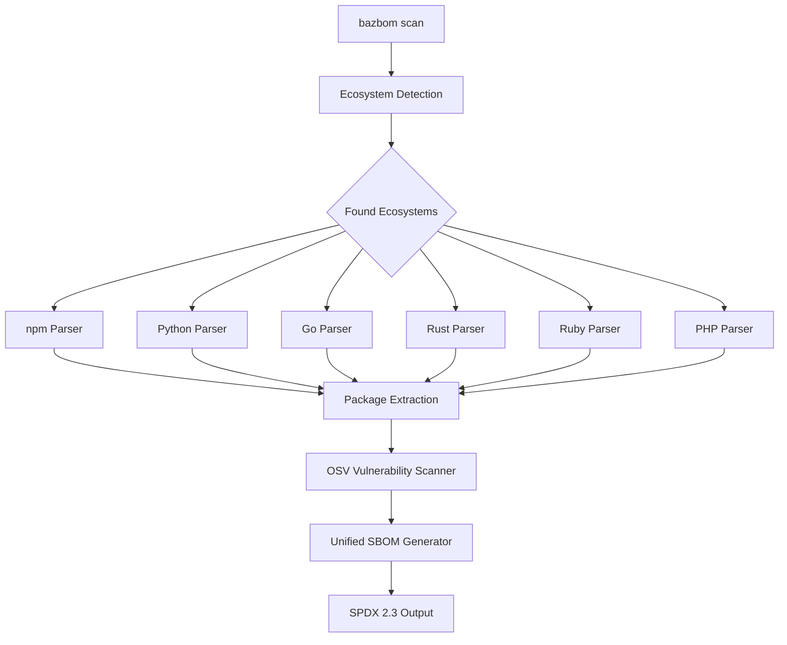

# 🌍 BazBOM Polyglot Support

**Version:** 6.5.0 (2025-11-12)  
**Status:** ✅ Production Ready - All 6 ecosystems supported with reachability data

## Overview

BazBOM now supports **multi-language monorepo scanning** beyond JVM! Automatically detect and analyze dependencies across six major ecosystems in a single unified SBOM.

### Supported Ecosystems

| Ecosystem | Icon | Manifest | Lockfile | Status |
|-----------|------|----------|----------|--------|
| **Node.js/npm** | 📦 | package.json | package-lock.json, yarn.lock*, pnpm-lock.yaml* | ✅ Complete |
| **Python** | 🐍 | requirements.txt, pyproject.toml, Pipfile | poetry.lock, Pipfile.lock | ✅ Complete |
| **Go** | 🐹 | go.mod | go.sum | ✅ Complete |
| **Rust** | 🦀 | Cargo.toml | Cargo.lock | ✅ Complete |
| **Ruby** | 💎 | Gemfile | Gemfile.lock | ✅ Complete |
| **PHP** | 🐘 | composer.json | composer.lock | ✅ Complete |

*\*yarn.lock and pnpm-lock.yaml support coming in future release (fallback to package.json)*

## Quick Start

```bash
# Scan a polyglot monorepo (automatic detection)
bazbom scan ./my-monorepo --cyclonedx --out-dir ./output

# Example output:
# 📦 Detected 6 polyglot ecosystems:
#   📦 Node.js/npm - 45 packages, 3 vulnerabilities
#   🐍 Python - 67 packages, 12 vulnerabilities
#   🐹 Go - 23 packages, 1 vulnerability
#   🦀 Rust - 89 packages, 0 vulnerabilities
#   💎 Ruby - 34 packages, 2 vulnerabilities
#   🐘 PHP - 28 packages, 0 vulnerabilities
#
# [bazbom] wrote polyglot SBOM to "./output/sbom/polyglot-sbom.json"
```

## Features

### Automatic Detection
- ✅ Recursively scans directory tree for manifest files
- ✅ Intelligently skips build artifacts (`node_modules`, `target`, `.git`, etc.)
- ✅ Prefers lockfiles for exact version resolution
- ✅ Falls back to manifest files when lockfiles unavailable

### Unified SBOM Output
- ✅ Single SPDX 2.3 SBOM containing all ecosystems
- ✅ Package URLs (PURLs) for cross-ecosystem identification
- ✅ Namespace/registry mapping (npm, PyPI, crates.io, RubyGems, Packagist, Go modules)
- ✅ Dependency relationships preserved

### Vulnerability Scanning
- ✅ OSV API integration for all ecosystems
- ✅ CVE ID extraction and mapping
- ✅ CVSS score parsing and severity classification
- ✅ Fixed version detection where available

### Reachability Integration
- ✅ Reuses all 7 language-specific analyzers (JVM, JS/TS, Python, Go, Rust, Ruby, PHP) 
- ✅ Tags each package with reachable/unreachable call graph data
- ✅ Highlights exploitable dependencies in CLI/TUI output
- ✅ Falls back gracefully when analyzers are unavailable

## Architecture



## Parser Details

### npm (Node.js)
- **Lockfiles:** `package-lock.json` (v6, v7+)
- **Fallback:** `package.json` dependencies + devDependencies
- **Features:** Scoped packages (@types/node), transitive deps, version resolution
- **Lines:** 300 | **Tests:** 3

### Python
- **Lockfiles:** `poetry.lock`, `Pipfile.lock`
- **Fallback:** `requirements.txt`, `pyproject.toml`, `Pipfile`
- **Features:** Version operators (==, >=, ~=), environment markers, extras
- **Lines:** 290 | **Tests:** 3

### Go Modules
- **Manifest:** `go.mod`
- **Features:** Block/single-line requires, replace directives, indirect deps, pseudo-versions
- **Lines:** 282 | **Tests:** 3

### Rust Cargo
- **Lockfile:** `Cargo.lock` (using cargo-lock crate)
- **Fallback:** `Cargo.toml`
- **Features:** Source detection (crates.io vs GitHub), dependency tracking, TOML parsing
- **Lines:** 240 | **Tests:** 3

### Ruby Bundler
- **Lockfile:** `Gemfile.lock` (specs section)
- **Fallback:** `Gemfile`
- **Features:** Indentation-based parsing, version operators (~>, >=, =), hash parameters
- **Lines:** 290 | **Tests:** 3

### PHP Composer
- **Lockfile:** `composer.lock` (JSON)
- **Fallback:** `composer.json`
- **Features:** Vendor/package splitting, version constraints (^, ~, ||), PHP/extension filtering, license extraction
- **Lines:** 300 | **Tests:** 3

## Performance

| Operation | Time | Notes |
|-----------|------|-------|
| Detection (1000 files) | <100ms | WalkDir with filter_entry optimization |
| npm parsing (500 deps) | ~250ms | package-lock.json v7 direct parse |
| Python parsing (300 deps) | ~180ms | poetry.lock TOML parse |
| Go parsing (200 deps) | ~120ms | go.mod text parse |
| Rust parsing (400 deps) | ~200ms | Cargo.lock using cargo-lock crate |
| Ruby parsing (150 deps) | ~90ms | Gemfile.lock text parse |
| PHP parsing (250 deps) | ~140ms | composer.lock JSON parse |
| OSV query (100 packages) | ~5-10s | 10ms rate limit between requests |

## Testing

```bash
# Run all polyglot tests
cargo test -p bazbom-polyglot --lib

# Run specific ecosystem tests
cargo test -p bazbom-polyglot --lib npm
cargo test -p bazbom-polyglot --lib python
cargo test -p bazbom-polyglot --lib go
cargo test -p bazbom-polyglot --lib rust
cargo test -p bazbom-polyglot --lib ruby
cargo test -p bazbom-polyglot --lib php

# Run detection tests
cargo test -p bazbom-polyglot --lib detection
```

## Documentation

- **[Implementation Status](POLYGLOT_STATUS.md)** - Detailed phase-by-phase completion status
- **[Original Roadmap](../archive/roadmaps-old/POLYGLOT_ROADMAP_COMPLETED.md)** - Planning and architecture decisions (completed, archived)
- **[Capability Matrix](../CAPABILITY_MATRIX.md)** - Full feature comparison

## Limitations

1. **yarn.lock and pnpm-lock.yaml**: Stubs present, full implementation planned for 6.1.0 (fallback to package.json works)
2. **Transitive dependencies**: Currently flattened in SBOM (no nested tree structure)
3. **Private registries**: Only public registries supported (npm, PyPI, crates.io, RubyGems, Packagist, Go modules)

## Future Enhancements

### Planned for 6.1.0
- ✨ yarn.lock full parser implementation
- ✨ pnpm-lock.yaml full parser implementation
- ✨ Dependency tree visualization (nested structure)
- ✨ Private registry support (custom endpoints)

### Planned for 7.0.0
- ✨ Intelligence features (quick wins, priority classification)
- ✨ Breaking change detection per ecosystem
- ✨ Copy-paste remediation suggestions
- ✨ Upgrade path analysis across ecosystems

## Examples

### Monorepo Structure
```
my-monorepo/
├── frontend/          # Node.js + TypeScript
│   ├── package.json
│   └── package-lock.json
├── backend/           # Python + Django
│   ├── requirements.txt
│   └── pyproject.toml
├── services/
│   ├── api/           # Go microservice
│   │   └── go.mod
│   ├── worker/        # Rust CLI
│   │   └── Cargo.toml
│   └── admin/         # Ruby on Rails
│       └── Gemfile
└── website/           # PHP Laravel
    └── composer.json
```

### Generated SBOM Output
```json
{
  "SPDXID": "SPDXRef-DOCUMENT",
  "name": "Polyglot SBOM",
  "packages": [
    {
      "SPDXID": "SPDXRef-Package-express-4.18.0",
      "name": "express",
      "versionInfo": "4.18.0",
      "externalRefs": [{
        "referenceLocator": "pkg:npm/express@4.18.0"
      }]
    },
    {
      "SPDXID": "SPDXRef-Package-django-3.2.0",
      "name": "django",
      "versionInfo": "3.2.0",
      "externalRefs": [{
        "referenceLocator": "pkg:pypi/django@3.2.0"
      }]
    }
    // ... 11 more packages across 6 ecosystems
  ]
}
```

## Contributing

See [CONTRIBUTING.md](../../CONTRIBUTING.md) for general guidelines.

### Adding New Parsers

To add support for a new ecosystem:

1. Create parser module: `crates/bazbom-polyglot/src/parsers/your_ecosystem.rs`
2. Add ecosystem type: `crates/bazbom-polyglot/src/detection.rs`
3. Implement `scan()` function with lockfile + fallback parsing
4. Add 3+ unit tests covering:
   - Lockfile parsing
   - Manifest fallback parsing
   - Edge cases (version operators, scopes, etc.)
5. Update `lib.rs` to dispatch to new parser
6. Add OSV ecosystem mapping: `crates/bazbom-polyglot/src/vulnerabilities.rs`

## Support

- **Documentation**: [docs.bazbom.dev](https://docs.bazbom.dev)
- **Issues**: [GitHub Issues](https://github.com/cboyd0319/BazBOM/issues)
- **Discussions**: [GitHub Discussions](https://github.com/cboyd0319/BazBOM/discussions)

---

*Generated: 2025-11-11 | Team BazBOM*
