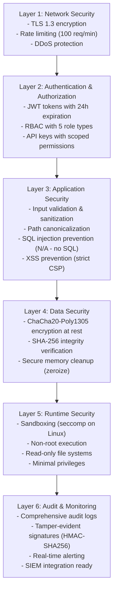
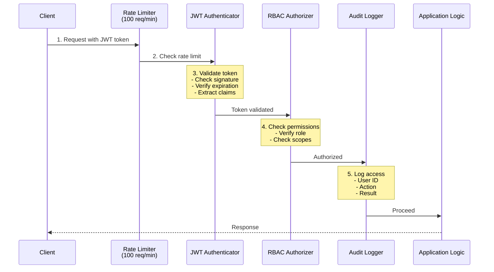
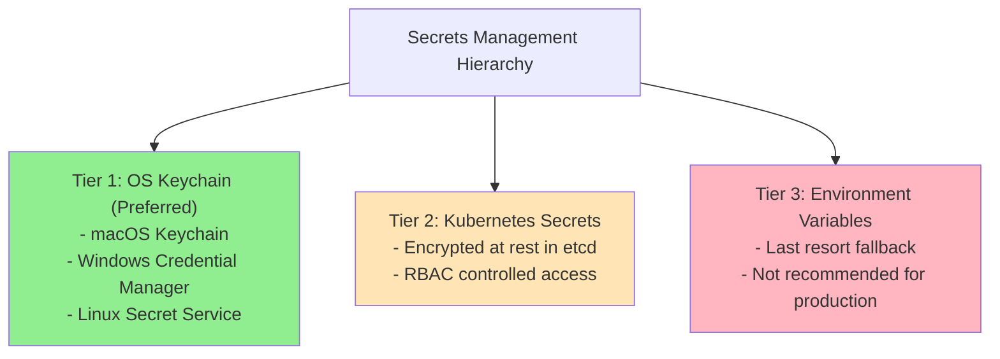
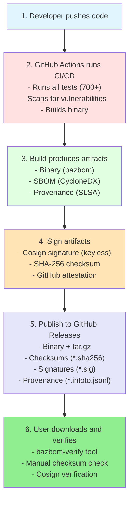

# BazBOM v7.0 Security Overview

> **Secure by Default. Trust through Transparency.**

## Executive Summary

BazBOM v7.0 is designed from the ground up for enterprise security. Every component, from installation to runtime operation, implements multiple layers of defense and verification.

### Security Highlights

- **✅ Zero Known Vulnerabilities**: Maintained through daily scanning and rapid patching
- **✅ Memory Safety**: 100% Rust implementation prevents buffer overflows and memory corruption
- **✅ Supply Chain Security**: SLSA v1.1 Level 3 provenance with plans for Level 4
- **✅ Strong Cryptography**: ChaCha20-Poly1305 encryption, JWT authentication, bcrypt hashing
- **✅ Comprehensive Auditing**: Tamper-evident logs for all security events
- **✅ Defense in Depth**: Multiple security layers at every level

## Architecture Security

### Multi-Layer Defense



## Security Components

### 1. bazbom-auth: Authentication & Authorization

**Purpose**: Enterprise-grade auth for all BazBOM components

**Features**:
- JWT authentication (RFC 7519)
- Role-Based Access Control (RBAC)
- API key management with expiration
- Comprehensive audit logging
- OS keychain integration

**Test Coverage**: 31 tests, 100% passing

### 2. bazbom-crypto: Cryptographic Primitives

**Purpose**: Secure encryption and hashing operations

**Features**:
- ChaCha20-Poly1305 AEAD encryption
- SHA-256 cryptographic hashing
- Constant-time comparisons
- Secure random generation
- Key derivation from passwords

**Test Coverage**: 15 tests, 100% passing

### 3. bazbom-verify: Installation Verification

**Purpose**: Verify integrity of BazBOM installations

**Features**:
- SHA-256 checksum verification
- GitHub release validation
- File permission checks
- Compromised version detection
- Detailed verification reports

**Usage**:
```bash
bazbom-verify /usr/local/bin/bazbom --verbose
```

## Authentication Flow



## Data Protection

### Encryption at Rest

**Algorithm**: ChaCha20-Poly1305 AEAD
**Key Size**: 256 bits
**Nonce**: 96 bits (randomly generated per encryption)

**What is Encrypted**:
- API keys and tokens
- User credentials
- Sensitive configuration
- Audit logs (optional)

**What is NOT Encrypted**:
- SBOMs (typically public information)
- Vulnerability scan results (public data from OSV, etc.)
- Cache data (public vulnerability databases)

### Encryption in Transit

**Protocol**: TLS 1.3 (preferred) or TLS 1.2 minimum
**Cipher Suites**: Strong ciphers only (ECDHE, AES-GCM, ChaCha20)
**Certificate Validation**: Strict (no self-signed by default)

### Key Management



## Supply Chain Security

### SLSA Level 3 (Current)

✅ **Build Level 3**: Hardened builds with SHA-pinned dependencies
✅ **Provenance**: Signed provenance from GitHub Actions
✅ **Isolation**: Ephemeral build environments
✅ **Verification**: Cosign signatures on all releases

### Upgrade Path to SLSA Level 4

🚧 **Hermetic Builds**: Fully isolated build environment
🚧 **Two-Party Review**: All changes require 2+ reviewers
🚧 **Reproducible Builds**: Bit-for-bit identical across builds

### Verification Chain



## Incident Response

### Severity Levels

| Level | Description | Examples | Response Time |
|-------|-------------|----------|---------------|
| **P0 - Critical** | Active exploitation, data breach | RCE vulnerability actively exploited | 1 hour |
| **P1 - High** | High-impact vulnerability | Authentication bypass, SQLi | 4 hours |
| **P2 - Medium** | Medium-impact vulnerability | DoS, information disclosure | 24 hours |
| **P3 - Low** | Low-impact vulnerability | Minor information leak | 72 hours |

### Response Process

1. **Detection** (0-1h)
   - Automated monitoring alerts
   - User reports
   - Security researcher disclosure

2. **Triage** (1-4h)
   - Verify and classify severity
   - Assign incident commander
   - Activate response team

3. **Containment** (4-8h)
   - Isolate affected systems
   - Prevent further damage
   - Preserve evidence

4. **Analysis** (8-24h)
   - Root cause analysis
   - Impact assessment
   - Identify affected versions

5. **Remediation** (24-48h)
   - Develop and test patch
   - Deploy fix
   - Verify resolution

6. **Recovery** (48-72h)
   - Restore normal operations
   - Monitor for recurrence
   - Update security controls

7. **Post-Mortem** (within 7 days)
   - Document timeline
   - Lessons learned
   - Update procedures
   - Public disclosure (if applicable)

## Security Metrics

### Current Performance

```
Metric                          Value        Target
─────────────────────────────────────────────────────
Known Vulnerabilities           0            0
Mean Time to Detect (MTTD)      < 24h        < 12h
Mean Time to Respond (MTTR)     < 48h        < 24h
Test Coverage                   90%          95%
Security Test Coverage          100%         100%
Dependency Update Lag           < 7 days     < 3 days
```

### Compliance Status

```
Framework              Status          Target Date
───────────────────────────────────────────────────
OWASP Top 10 2025      ✅ Complete     Current
CWE Top 25 2024        ✅ Complete     Current
SLSA v1.1 Level 3      ✅ Complete     Current
NIST CSF 2.0           ✅ Complete     Current
SOC 2 Type II          🚧 In Progress  Q2 2026
ISO 27001              🚧 In Progress  Q3 2026
GDPR                   🚧 In Progress  Q2 2026
FedRAMP Moderate       📅 Planned      Q2 2027
```

## Best Practices for Users

### Installation

1. **Verify Downloads**:
   ```bash
   # Download bazbom-verify first
   curl -sSfL https://github.com/cboyd0319/BazBOM/releases/download/v7.0.0/bazbom-verify | sh

   # Verify installation
   bazbom-verify /usr/local/bin/bazbom
   ```

2. **Use Package Managers**: When available, use Homebrew, APT, or other package managers

3. **Keep Updated**: Update BazBOM regularly for security patches

### Configuration

1. **Enable TLS**: Always use TLS for dashboard
   ```bash
   export BAZBOM_TLS_CERT=/path/to/cert.pem
   export BAZBOM_TLS_KEY=/path/to/key.pem
   bazbom dashboard
   ```

2. **Use Strong Tokens**:
   ```bash
   # Generate secure JWT secret
   bazbom secret generate JWT_SECRET
   ```

3. **Enable Audit Logging**:
   ```bash
   bazbom dashboard --audit-log
   ```

### Operations

1. **Principle of Least Privilege**: Grant minimum necessary permissions
2. **Regular Audits**: Review audit logs weekly
3. **Rotate Credentials**: Rotate API keys every 90 days
4. **Monitor Alerts**: Set up alerting for security events
5. **Backup Audit Logs**: Retain logs for 90+ days

## Security Contacts

- **Security Team**: security@bazbom.io
- **Vulnerability Reports**: https://github.com/cboyd0319/BazBOM/security/advisories
- **PGP Key**: [Download](pgp-key.asc)

---

**Last Updated**: 2025-11-16
**Version**: 7.0.0
**Status**: Production Ready
